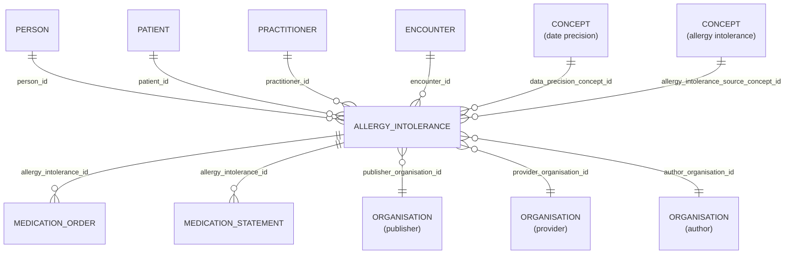

# Allergy Intolerance

- [Allergy Intolerance](#allergy-intolerance)
  - [Overview](#overview)
  - [Columns](#columns)
  - [Entity relationships](#entity-relationships)
  - [Notes](#notes)

## Overview

Linked FHIR resource: [🔥 Allergy Intolerance](https://hl7.org/fhir/allergyintolerance.html)

Risk of harmful or undesirable physiological response which is specific to an individual and associated with exposure to a substance. A record of a clinical assessment of an allergy or intolerance; a propensity, or a potential risk to an individual, to have an adverse reaction on future exposure to the specified substance, or class of substance.

Where a propensity is identified, to record information or evidence about a reaction event that is characterised by any harmful or undesirable physiological response that is specific to the individual and triggered by exposure of an individual to the identified substance or class of substance.

Substances include, but are not limited to: a therapeutic substance administered correctly at an appropriate dosage for the individual; food; material derived from plants or animals; or venom from insect stings.

## Columns

| Column Name | Data Type (Size) | Description | PK/FK | Compass Equivalent |
| --- | --- | --- | --- | --- |
| `ID` | `UUID` | id | PK | `id` |
| `LDS_SOURCE_RECORD_ID` | `UUID` | A unique identifier denoting the originating base-record prior to transform | - | -- |
| `PATIENT_ID` | `UUID` | linked patient identifier | FK -> [PATIENT](Patient.md).ID | `patient_id` |
| `PERSON_ID` | `UUID` | linked person id. | FK -> [PERSON](Person.md).ID | `person_id` |
| `PUBLISHER_ORGANISATION_ID` | `UUID` | linked organisaiton id publisher. see [schema notes: publisher, provider, author](_schema_notes.md#provider-author-publisher-organisation-id) | FK -> [ORANGANISATION](Organisation.md).ID | `organization_id` |
| `PROVIDER_ORGANISATION_ID` | `UUID` | linked organisaiton id provider. see [schema notes: publisher, provider, author](_schema_notes.md#provider-author-publisher-organisation-id) | FK -> [ORANGANISATION](Organisation.md).ID | -- |
| `AUTHOR_ORGANISATION_ID` | `UUID` | linked organisaiton id author. see [schema notes: publisher, provider, author](_schema_notes.md#provider-author-publisher-organisation-id) | FK -> [ORANGANISATION](Organisation.md).ID | -- |
| `PRACTITIONER_ID` | `UUID` | linked practitioner id. | FK -> [PRACTITIONER](Practitioner.md).ID | `practitioner_id` |
| `ENCOUNTER_ID` | `UUID` | linked encounter id. | FK -> [ENCOUNTER](Encounter.md).ID | `encounter_id` |
| `CLINICAL_STATUS` | `VARCHAR` | clinical status. | - | -- |
| `VERIFICATION_STATUS` | `VARCHAR` | verification status. | - | -- |
| `CATEGORY` | `VARCHAR` | category. | - | -- |
| `CLINICAL_EFFECTIVE_DATE` | `DATE` | clinical effective date. | - | `clinical_effective_date` |
| `CLINICAL_EFFECTIVE_DATE_PRECISION_SOURCE_CONCEPT_ID` | `UUID` | lds concept id date precision. | FK -> [CONCEPT](concept.md).ID | `date_precision_concept_id` |
| `IS_REVIEW` | `BOOLEAN` | is review. | - | `is_review` |
| `MEDICATION_NAME` | `VARCHAR` | medication name. | - | -- |
| `MULTI_LEX_ACTION` | `VARCHAR` | multi lex action. | - | -- |
| `ALLERGY_INTOLERANCE_SOURCE_CONCEPT_ID` | `UUID` | allergy intolerance source concept id. | FK -> [CONCEPT](concept.md).ID | `non_core_concept_id` |
| `AGE_AT_EVENT` | `NUMBER` | patient age, in whole years, at clinical effective date of event. | - | `age_at_event` |
| `AGE_AT_EVENT_BABY` | `NUMBER` | patient age, in categorised groups for ages under 1 year, at clinical effective date of event. NULL where patient is over 1 years old. | - | -- |
| `AGE_AT_EVENT_NEONATE` | `NUMBER` | patient age, in days under 27 days old, at clinical effective date. NULL where patient is over 27 days old. | - | -- |
| `DATE_RECORDED` | `TIMESTAMP_NTZ` | date recorded. | - | `date_recorded` |
| `IS_CONFIDENTIAL` | `BOOLEAN` | is confidential. | - | -- |
| `LDS_IS_DELETED` | `BOOLEAN` | standardised representation of soft-deletes. | - | -- |
| `PUBLISHER_ORGANISATION_CODE` | `VARCHAR` | The Organisation Data Service (ODS) code of the organisation who, acting as the data controller, publishes the data. | - | `organization_id` |
| `SOURCE_EXTRACTION_DATE` | `TIMESTAMP_NTZ` | The timestamp when the record was supplied to, or acquired by, LDS. | - | -- |
| `LDS_TRANSFORM_DATETIME` | `TIMESTAMP_NTZ` | The timestamp when the record was transformed by LDS into OLIDS. | - | -- |

## Entity relationships

> [!NOTE]
> Diagrams below are currently indicative. The precise optional/mandatory nature of certain relationships remains to be clarified.

| Related Table | Relationship Type | Local Key | Related Key | Notes |
| --- | --- | --- | --- | --- |
| [Patient](Patient.md) | FK | `PATIENT_ID` | `ID` | links to the patient with the allergy |
| [Person](Person.md) | FK | `PERSON_ID` | `ID` | links to the person with the allergy |
| [Organisation](Organisation.md) | FK | `PUBLISHER_ORGANISATION_ID` | `ID` | the publisher of the record (distributing data controller) |
| [Organisation](Organisation.md) | FK | `PROVIDER_ORGANISATION_ID` | `ID` | the care provider of the patient |
| [Organisation](Organisation.md) | FK | `AUTHOR_ORGANISATION_ID` | `ID` | the author of the record (originating data controller) |
| [Practitioner](Practitioner.md) | FK | `PRACTITIONER_ID` | `ID` | the practitioner who recorded/noted the allergy or intolerance |
| [Encounter](Encounter.md) | FK | `ENCOUNTER_ID` | `ID` | the encounter in which the allergy or intolerance was reported |
| [Concept](Concept.md) | FK | `CLINICAL_EFFECTIVE_DATE_PRECISION_SOURCE_CONCEPT_ID` | `CONCEPT_ID` | the precision of the recorded date |
| [Concept](Concept.md) | FK | `ALLERGY_INTOLERANCE_SOURCE_CONCEPT_ID` | `CONCEPT_ID` | the allergy or intolerance code (as supplied) |

## Notes
