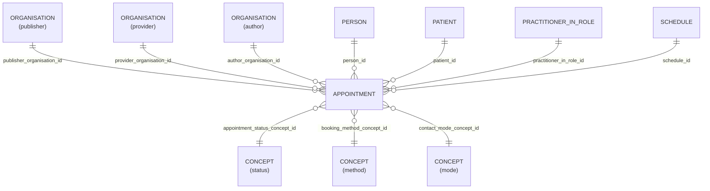

# Appointment

- [Appointment](#appointment)
  - [Overview](#overview)
  - [Columns](#columns)
  - [Entity relationships](#entity-relationships)
  - [Notes](#notes)
    - [Appointments for historical deducted patients](#appointments-for-historical-deducted-patients)

## Overview

Linked FHIR resource: [🔥 Appointment](https://hl7.org/fhir/appointment.html)

A booking of a healthcare event among patient(s), practitioner(s), related person(s) and/or device(s) for a specific date/time. This may result in one or more Encounter(s).

Appointment resources are used to provide information about a planned meeting that may be in the future or past. The resource only describes a single meeting, a series of repeating visits would require multiple appointment resources to be created for each instance. Examples include a scheduled surgery, a follow-up for a clinical visit, a scheduled conference call between clinicians to discuss a case (where the patient is a subject, but not a participant), the reservation of a piece of diagnostic equipment for a particular use, etc. The visit scheduled by an appointment may be in person or remote (by phone, video conference, etc.) All that matters is that the time and usage of one or more individuals, locations and/or pieces of equipment is being fully or partially reserved for a designated period of time.

This definition takes the concepts of appointments in a clinical setting and also extends them to be relevant in the community healthcare space, and to ease exposure to other appointment / calendar standards widely used outside of healthcare.

> [!IMPORTANT]
> The LDS now correctly ignores vacant appointment slots supplied by EMIS.
> Slots as an entity is not currently surfaced within OLIDS but may be added in future.

## Columns

| Column Name | Data Type (Size) | Description | PK/FK | Compass Equivalent |
| --- | --- | --- | --- | --- |
| `ID` | `VARCHAR` | id. | PK | `id` |
| `LDS_SOURCE_RECORD_ID` | `VARCHAR` | lds record id. |  | -- |
| `PATIENT_ID` | `UUID` | patient id. | FK -> [Patient](Patient.md).ID | `patient_id` |
| `PERSON_ID` | `UUID` | person id. | FK -> [Person](Person.md).ID | `person_id` |
| `PUBLISHER_ORGANISATION_ID` | `UUID` | linked organisaiton id publisher. see [schema notes: publisher, provider, author](_schema_notes.md#provider-author-publisher-organisation-id). | FK -> [Organisation](Organisation.md).ID | `organization_id` |
| `PROVIDER_ORGANISATION_ID` | `UUID` | linked organisaiton id provider. see [schema notes: publisher, provider, author](_schema_notes.md#provider-author-publisher-organisation-id) | FK -> [ORANGANISATION](Organisation.md).ID | `organization_id` |
| `AUTHOR_ORGANISATION_ID` | `UUID` | linked organisation id. see [schema notes: publisher, provider, author](_schema_notes.md#provider-author-publisher-organisation-id) | FK -> [ORANGANISATION](Organisation.md).ID | -- |
| `SLOT_ID` | `UUID` | linked identifier for the slot | <not yet linked> | -- |
| `PRACTITIONER_IN_ROLE_ID` | `UUID` | practitioner in role id. | FK -> [Practitioner_In_Role](Practitioner_In_Role.md).ID | `practitioner_id` |
| `SCHEDULE_ID` | `UUID` | schedule id. | FK -> [Schedule](Schedule.md).ID | `schedule_id` |
| `START_DATE` | `TIMESTAMP` | start date. | | `start_date` |
| `PLANNED_DURATION_MINS` | `NUMBER` | planned duration. | | `planned_duration` |
| `ACTUAL_DURATION_MINS` | `NUMBER` | actual duration. | | `actual_duration` |
| `APPOINTMENT_STATUS_SOURCE_CONCEPT_ID` | `UUID` | appointment status concept id. | FK -> [CONCEPT](concept.md).ID| `appointment_status_concept_id` |
| `PATIENT_WAIT_MINS` | `NUMBER` | patient wait. | | `patient_wait` |
| `PATIENT_DELAY_MINS` | `NUMBER` | patient delay. | | `patient_delay` |
| `DATETIME_BOOKED` | `TIMESTAMP_NTZ` | date time booked. | | -- |
| `DATETIME_SENT_IN` | `TIMESTAMP_NTZ` | date time sent in. | | `date_time_sent_in` |
| `DATETIME_LEFT` | `TIMESTAMP_NTZ` | date time left. | | `date_time_left` |
| `CANCELLED_DATE` | `VARCHAR` (SHOULD BE DATE) | cancelled date. | | `cancelled_date` |
| `APPOINTMENT_TYPE` | `VARCHAR` | type of appointment. | | -- |
| `AGE_AT_EVENT` | `NUMBER` | patient age, in whole years, at date of event. | | -- |
| `AGE_AT_EVENT_BABY` | `NUMBER` | patient age, in categorised groups for ages under 1 year, at date of event. NULL where patient is over 1 years old. | | -- |
| `AGE_AT_EVENT_NEONATE` | `NUMBER` | patient age, in days under 27 days old, at date of event. NULL where patient is over 27 days old. | | -- |
| `BOOKING_METHOD_SOURCE_CONCEPT_ID` | `UUID` | booking method concept id. | FK -> [CONCEPT](concept.md).ID| -- |
| `CONTACT_MODE_SOURCE_CONCEPT_ID` | `UUID` | contact mode concept id. | FK -> [CONCEPT](concept.md).ID| -- |
| `IS_BLOCKED` | `BOOLEAN` | is blocked. | | -- |
| `NATIONAL_SLOT_CATEGORY_NAME` | `VARCHAR` | national slot category name. | | -- |
| `CONTEXT_TYPE` | `VARCHAR` | context type. | | -- |
| `SERVICE_SETTING` | `VARCHAR` | service setting. | | -- |
| `NATIONAL_SLOT_CATEGORY_DESCRIPTION` | `VARCHAR` | national slot category description. | | -- |
| `CSDS_CARE_CONTACT_IDENTIFIER` | `VARCHAR` | csds care contact identifier. | | -- |
| `LDS_IS_DELETED` | `BOOLEAN` | lds is deleted. | | -- |
| `PUBLISHER_ORGANISATION_CODE` | `VARCHAR` | The Organisation Data Service (ODS) code of the organisation who, acting as the data controller, publishes th data. |  | `organization_id` |
| `SOURCE_EXTRACTION_DATE` | `TIMESTAMP` | source extraction date. | | -- |
| `LDS_TRANSFORM_DATETIME` | `TIMESTAMP_LTZ` | lds transform date time. | | -- |

## Entity relationships

> [!NOTE]
> Diagrams below are currently indicative. The precise optional/mandatory nature of certain relationships remains to be clarified.



| Related Table | Relationship Type | Local Key | Related Key | Notes |
| --- | --- | --- | --- | --- |
| [Organisation](Organisation.md) | Join | LDS_BUSINESS_ID_ORGANISATION | ID | |
| [Patient](Patient.md) | Join | LDS_BUSINESS_ID_PATIENT | ID | |
| [Patient_Person](Patient_Person.md) | Join | LDS_BUSINESS_ID_PATIENT | PATIENT_ID | |
| [Person](Person.md) | FK | PERSON_ID | ID | |
| [Patient](Patient.md) | FK | PATIENT_ID | ID | |
| [Practitioner_In_Role](Practitioner_In_Role.md) | FK | PRACTITIONER_IN_ROLE_ID | ID | |
| [Organisation](Organisation.md) | FK | ORGANISATION_ID | ID | |
| [Schedule](Schedule.md) | FK | SCHEDULE_ID | ID | |

## Notes

### Appointments for historical deducted patients

Please note that due to the manner in which EMIS data is supplied, appointments will exist for patients that have been deducted well before the 'look back' period included in the initial bulk with the practice (five years).

As a result users will see appointments that will include a `PATIENT_ID` that does not exist in the `PATIENT` table.

Users should not expect all `PATIENT_ID` values contained in the `APPOINTMENT` table to exist in the `PATIENT` table.

- Users should expect all appointments **within five years of the initial practice bulk** to relate to `PATIENT_ID` values that are present within the `PATIENT` table.
- Users should expect appointments five or more years prior to the initial bulk may contain `PATIENT_ID` values that do not exist in the `PATIENT` table.

The query below is shown as a guide to visualising the impact of this issue:

```sql
SELECT
  YEAR(START_DATE) AS APPOINTMENT_YEAR
, MONTH(START_DATE) AS APPOINTMENT_MONTH
, COUNT_IF(P.ID IS NULL) AS UNMATCHED_COUNT
, COUNT_IF(P.ID IS NOT NULL) AS MATCHED_COUNT
, COUNT(A.PATIENT_ID) AS PATIENT_COUNT

FROM OLIDS_PSEUDO.APPOINTMENT AS A
LEFT JOIN OLIDS_PSEUDO.PATIENT AS P
    ON A.PATIENT_ID = P.ID

GROUP BY 
  YEAR(START_DATE)
, MONTH(START_DATE)
ORDER BY APPOINTMENT_YEAR DESC, APPOINTMENT_MONTH DESC;
```

Users will see the number of `UNMATCHED_COUNT` results increase significantly around five years prior to the commencement of services depending upon when practices signed up to the service (therefore anytime between 2020 and 2021).
