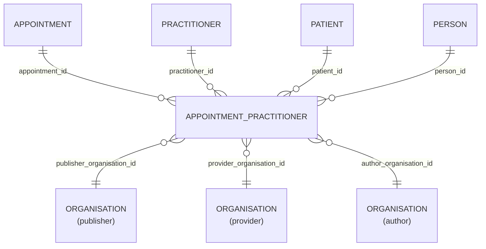

# Appointment_Practitioner

- [Appointment\_Practitioner](#appointment_practitioner)
  - [Overview](#overview)
  - [Columns](#columns)
  - [Entity relationship](#entity-relationship)
  - [Related tables](#related-tables)
  - [Notes](#notes)

## Overview

List of practitioner participants involved in an appointment.

> [!NOTE]
> This table has been added to OLIDS to allow for one-to-many cardinality between appointments and practitioners which was permitted in some source datasets

## Columns

| Column Name | Data Type (Size) | Description | PK/FK |
| --- | --- | --- | --- |
| `ID` | `UUID` | unique and consistent identifier for the entity | PK |
| `LDS_SOURCE_RECORD_ID` | `UUID` | A unique identifier denoting the originating base-record prior to transform. | |
| `PATIENT_ID` | `UUID` | linked patient identifier | FK -> [Patient](Patient.md).ID |
| `PERSON_ID` | `UUID` | linked person identifier | FK -> [Person](Person.md).ID |
| `PUBLISHER_ORGANISATION_ID` | `UUID` | linked organisaiton id publisher. see [schema notes: publisher, provider, author](_schema_notes.md#provider-author-publisher-organisation-id) | FK -> [ORANGANISATION](Organisation.md).ID |
| `PROVIDER_ORGANISATION_ID` | `UUID` | linked organisaiton id provider. see [schema notes: publisher, provider, author](_schema_notes.md#provider-author-publisher-organisation-id) | FK -> [ORANGANISATION](Organisation.md).ID |
| `AUTHOR_ORGANISATION_ID` | `UUID` | linked organisaiton id author. see [schema notes: publisher, provider, author](_schema_notes.md#provider-author-publisher-organisation-id) | FK -> [ORANGANISATION](Organisation.md).ID |
| `APPOINTMENT_ID` | `UUID` | linked appointment id. | FK -> [Appointment](Appointment.md).ID |
| `PRACTITIONER_ID` | `UUID` | linked practitioner id. | FK -> [Practitioner](Practitioner.md).ID |
| `LDS_SOURCE_RECORD_ID_PRACTITIONER` | `UUID` | A unique identifier denoting the originating base-record prior to transform. | |
| `LDS_IS_DELETED` | `BOOLEAN` | standardised representation of soft-deletes. | |
| `PUBLISHER_ORGANISATION_CODE` | `VARCHAR` | The Organisation Data Service (ODS) code of the organisation who, acting as the data controller, publishes the data | |
| `SOURCE_EXTRACTION_DATE` | `TIMESTAMP_NTZ` | The timestamp when the record was supplied to, or acquired by, LDS. | |
| `LDS_TRANSFORM_DATETIME` | `TIMESTAMP_LTZ` | LDS transform date time. | |

## Entity relationship

> [!NOTE]
> Diagrams below are currently indicative. The precise optional/mandatory nature of certain relationships remains to be clarified.

| Related Table                   | Relationship Type | Local Key                 | Related Key | Notes |
| ------------------------------- | ----------------- | ------------------------- | ----------- | ----- |
| [Practitioner](Practitioner.md) | FK                | PRACTITIONER_ID           | ID          |       |
| [Appointment](Appointment.md)   | FK                | APPOINTMENT_ID            | ID          |       |
| [Patient](Patient.md)           | FK                | PATIENT_ID                | ID          |       |
| [Person](Person.md)             | FK                | PERSON_ID                 | ID          |       |
| [Organisation](Organisation.md) | FK                | PUBLISHER_ORGANISATION_ID | ID          |       |
| [Organisation](Organisation.md) | FK                | PROVIDER_ORGANISATION_ID  | ID          |       |
| [Organisation](Organisation.md) | FK                | AUTHOR_ORGANISATION_ID    | ID          |       |

## Related tables

- [Practitioner](Practitioner.md)
- [Appointment](Appointment.md)
- [Patient](Patient.md)
- [Person](Person.md)
- [Organisation](Organisation.md)

## Notes
