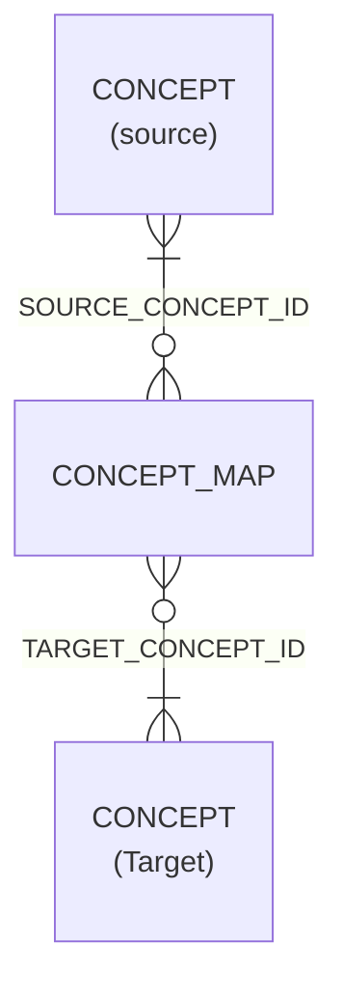

# Concept Map

- [Concept Map](#concept-map)
  - [Overview](#overview)
  - [Columns](#columns)
  - [Equivalence](#equivalence)
  - [Entity Relationships](#entity-relationships)

## Overview

Linked FHIR resource: [🔥 ConceptMap](https://hl7.org/fhir/conceptmap.html)

A concept map defines a mapping from a set of concepts defined in a code system (commonly referred to as the "system") to one or more concepts defined in other code systems.

In the mapping context, a system can be a typical code system based on a recognised standard or local terminology (in any of its forms), or in some cases it may be an "implicit" code system that is not based on a recognised terminology but still represents a set of "concepts" that can be usefully mapped. Mappings are one way - from the source to the target system. In many cases, the reverse mappings are valid, but this cannot be assumed to be the case.

Mappings between code system concepts are only intended to be defined in the context of a particular business usage. The business use case is normally defined by the specification of the source and target value sets. The mappings may be useful in other contexts, but this must be determined based on the context of use and meaning; it cannot be taken for granted automatically.

Mappings in a data analysis context would be targeted for an appropriate classification (often at a higher level), whereas in the another context there may be specific requirements to be met (e.g. leaf level codes only) that could result in multiple mappings for a single source concept and then require additional information beyond the source concept itself in order to select the correct final mapping.

## Columns

| Column Name | Data Type (Size) | Description | PK/FK | Masking Policy | Compass Equivalent |
| --- | --- | --- | --- | --- | --- |
| `CONCEPT_MAP_NAME` | `VARCHAR` | the name of the concept map. | | | |
| `SOURCE_CONCEPT_ID` | `UUID` | the source concept id from which the mapping is applied to | FK --> [Concept](Concept.md).ID | | |
| `SOURCE_SYSTEM` | `VARCHAR` | the source concept code system | | | |
| `SOURCE_CODE` | `VARCHAR` | the encoding of the concept that is mapped | | | |
|`SOURCE_DISPLAY` | `VARCHAR` | the description or display value associated to the code within the source system | | | |
| `TARGET_CONCEPT_ID` | `UUID` | the target concept id - the concept that the source concept is mapped to | FK --> [Concept](Concept.md).ID | | |
| `TARGET_SYSTEM` | `VARCHAR` | the target concept code system | | | |
| `TARGET_CODE` | `VARCHAR` | the encoding of the target concept within its code system | | | |
|`TARGET_DISPLAY` | `VARCHAR` | the description or display value associated to the code within the target system | | | |
| `EQUIVALENCE` | `VARCHAR` | an enumerated lit of descriptors for the accuracy of the mapping (see below) | | | |
| `EQUIVALENCE_RANK` | `NUMBER` | an ordering of the equivalences. Used to support single mapping selection | | | |
| `IS_PRIMARY` | `BOOLEAN` | true where the mapping from source-to-target is the primary recommended mapping for this system-to-system map | | | |

## Equivalence

The following enumerated values exist within the concept map "equivalence" column:

(_source: [Equivalence reference](https://pathling.csiro.au/docs/r/reference/Equivalence.html)_)

| value | meaning |
| --- | --- |
| `EQUAL` | The definitions of the concepts are exactly the same (i.e. only grammatical differences) and structural implications of meaning are identical or irrelevant (i.e. intentionally identical). |
| `EQUIVALENT` | The definitions of the concepts mean the same thing (including when structural implications of meaning are considered) (i.e. extensionally identical). |
| `INEXACT` | There is some similarity between the concepts, but the exact relationship is not known. |
| `NARROWER` | The target mapping is narrower in meaning than the source concept. The sense in which the mapping is narrower SHALL be described in the comments in this case, and applications should be careful when attempting to use these mappings operationally. |
| `RELATEDTO` | The concepts are related to each other, and have at least some overlap in meaning, but the exact relationship is not known. |
| `SPECIALIZES` | The target mapping specializes the meaning of the source concept (e.g. the target is-a source). |
| `SUBSUMES` | The target mapping subsumes the meaning of the source concept (e.g. the source is-a target). |
| `UNMATCHED` | This is an explicit assertion that there is no mapping between the source and target concept. |
| `WIDER` | The target mapping is wider in meaning than the source concept. |
| `DISJOINT` | This is an explicit assertion that the target concept is not in any way related to the source concept. |

## Entity Relationships

| Related Table | Relationship Type | Local Key | Related Key | Notes |
| --- | --- | --- | --- | --- |
| [Concept](Concept.md) | FK | SOURCE_CONCEPT_ID | CONCEPT_ID | |
| [Concept](Concept.md) | FK | TARGET_CONCEPT_ID | CONCEPT_ID | |
