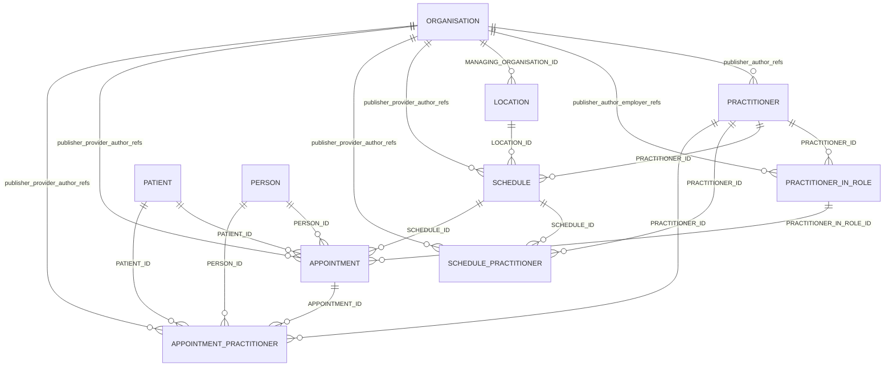

# OLIDS Database Diagram

This page consolidates the foreign-key relationships documented across the schema markdown files in this folder.

> [!NOTE]
> The diagrams below are derived from the documented `PK/FK` columns in each table page. They reflect the current documentation, including indicative relationships where the source pages note that optionality is still being clarified.

## Static exports

These files are intended for export into documents, slides, and tickets where Mermaid rendering may not be available:

| Diagram | Mermaid source | SVG | PNG |
| --- | --- | --- | --- |
| Core patient and clinical flow | [exports/database-diagram-core.mmd](exports/database-diagram-core.mmd) | [exports/database-diagram-core.svg](exports/database-diagram-core.svg) | [exports/database-diagram-core.png](exports/database-diagram-core.png) |
| Scheduling and workforce | [exports/database-diagram-scheduling.mmd](exports/database-diagram-scheduling.mmd) | [exports/database-diagram-scheduling.svg](exports/database-diagram-scheduling.svg) | [exports/database-diagram-scheduling.png](exports/database-diagram-scheduling.png) |
| Reference and hierarchy | [exports/database-diagram-reference.mmd](exports/database-diagram-reference.mmd) | [exports/database-diagram-reference.svg](exports/database-diagram-reference.svg) | [exports/database-diagram-reference.png](exports/database-diagram-reference.png) |

## Core patient and clinical flow

```mermaid
erDiagram
    PERSON ||--o{ PATIENT : PERSON_ID
    PATIENT ||--|| PATIENT_PERSON : PATIENT_ID
    PERSON ||--o{ PATIENT_PERSON : PERSON_ID
    PATIENT ||--o{ PATIENT_ADDRESS : PATIENT_ID
    PERSON ||--o{ PATIENT_ADDRESS : PERSON_ID
    PATIENT_ADDRESS ||--|| PATIENT_UPRN : PATIENT_ADDRESS_ID
    PATIENT ||--o{ PATIENT_CONTACT : PATIENT_ID
    PERSON ||--o{ PATIENT_CONTACT : PERSON_ID
    PATIENT ||--|| PATIENT_AGE_FLAGS : ID
    PATIENT ||--o{ NATIONAL_DATA_OPT_OUT : alternate_patient_keys

    PATIENT ||--o{ EPISODE_OF_CARE : PATIENT_ID
    PERSON ||--o{ EPISODE_OF_CARE : PERSON_ID
    PRACTITIONER_IN_ROLE ||--o{ EPISODE_OF_CARE : USUAL_GP_PRACTITIONER_IN_ROLE_ID

    EPISODE_OF_CARE ||--o{ ENCOUNTER : EPISODE_OF_CARE_ID
    APPOINTMENT ||--o{ ENCOUNTER : APPOINTMENT_ID
    PATIENT ||--o{ ENCOUNTER : PATIENT_ID
    PERSON ||--o{ ENCOUNTER : PERSON_ID
    PRACTITIONER ||--o{ ENCOUNTER : PRACTITIONER_ID

    PATIENT ||--o{ OBSERVATION : PATIENT_ID
    PERSON ||--o{ OBSERVATION : PERSON_ID
    ENCOUNTER ||--o{ OBSERVATION : ENCOUNTER_ID
    PRACTITIONER ||--o{ OBSERVATION : PRACTITIONER_ID
    OBSERVATION ||--o{ OBSERVATION : PARENT_OBSERVATION_ID

    PATIENT ||--o{ ALLERGY_INTOLERANCE : PATIENT_ID
    PERSON ||--o{ ALLERGY_INTOLERANCE : PERSON_ID
    ENCOUNTER ||--o{ ALLERGY_INTOLERANCE : ENCOUNTER_ID
    PRACTITIONER ||--o{ ALLERGY_INTOLERANCE : PRACTITIONER_ID

    PATIENT ||--o{ DIAGNOSTIC_ORDER : PATIENT_ID
    PERSON ||--o{ DIAGNOSTIC_ORDER : PERSON_ID
    ENCOUNTER ||--o{ DIAGNOSTIC_ORDER : ENCOUNTER_ID
    PRACTITIONER ||--o{ DIAGNOSTIC_ORDER : PRACTITIONER_ID
    OBSERVATION ||--o{ DIAGNOSTIC_ORDER : PARENT_OBSERVATION_ID

    PATIENT ||--o{ PROCEDURE_REQUEST : PATIENT_ID
    PERSON ||--o{ PROCEDURE_REQUEST : PERSON_ID
    ENCOUNTER ||--o{ PROCEDURE_REQUEST : ENCOUNTER_ID
    PRACTITIONER ||--o{ PROCEDURE_REQUEST : PRACTITIONER_ID

    PATIENT ||--o{ REFERRAL_REQUEST : PATIENT_ID
    PERSON ||--o{ REFERRAL_REQUEST : PERSON_ID
    ENCOUNTER ||--o{ REFERRAL_REQUEST : ENCOUNTER_ID
    PRACTITIONER ||--o{ REFERRAL_REQUEST : PRACTITIONER_ID

    PATIENT ||--o{ MEDICATION_STATEMENT : PATIENT_ID
    PERSON ||--o{ MEDICATION_STATEMENT : PERSON_ID
    ENCOUNTER ||--o{ MEDICATION_STATEMENT : ENCOUNTER_ID
    PRACTITIONER ||--o{ MEDICATION_STATEMENT : PRACTITIONER_ID
    OBSERVATION ||--o{ MEDICATION_STATEMENT : OBSERVATION_ID
    ALLERGY_INTOLERANCE ||--o{ MEDICATION_STATEMENT : ALLERGY_INTOLERANCE_ID
    DIAGNOSTIC_ORDER ||--o{ MEDICATION_STATEMENT : DIAGNOSTIC_ORDER_ID
    REFERRAL_REQUEST ||--o{ MEDICATION_STATEMENT : REFERRAL_REQUEST_ID

    MEDICATION_STATEMENT ||--o{ MEDICATION_ORDER : MEDICATION_STATEMENT_ID
    PATIENT ||--o{ MEDICATION_ORDER : PATIENT_ID
    PERSON ||--o{ MEDICATION_ORDER : PERSON_ID
    ENCOUNTER ||--o{ MEDICATION_ORDER : ENCOUNTER_ID
    PRACTITIONER ||--o{ MEDICATION_ORDER : PRACTITIONER_ID
    OBSERVATION ||--o{ MEDICATION_ORDER : OBSERVATION_ID
    ALLERGY_INTOLERANCE ||--o{ MEDICATION_ORDER : ALLERGY_INTOLERANCE_ID
    DIAGNOSTIC_ORDER ||--o{ MEDICATION_ORDER : DIAGNOSTIC_ORDER_ID
    REFERRAL_REQUEST ||--o{ MEDICATION_ORDER : REFERRAL_REQUEST_ID
```

## Scheduling and workforce

## Reference and hierarchy tables

```mermaid
erDiagram
    CONCEPT ||--o{ CONCEPT_MAP : SOURCE_CONCEPT_ID
    CONCEPT ||--o{ CONCEPT_MAP : TARGET_CONCEPT_ID
    CONCEPT ||--o{ PATIENT : GENDER_SOURCE_CONCEPT_ID
    CONCEPT ||--o{ PATIENT_ADDRESS : ADDRESS_TYPE_SOURCE_CONCEPT_ID
    CONCEPT ||--o{ PATIENT_CONTACT : CONTACT_TYPE_SOURCE_CONCEPT_ID
    CONCEPT ||--o{ ORGANISATION : PRIMARY_LOCATION_TYPE_SOURCE_CONCEPT_ID
    CONCEPT ||--o{ LOCATION : LOCATION_TYPE_SOURCE_CONCEPT_ID
    CONCEPT ||--o{ APPOINTMENT : status_booking_contact_refs
    CONCEPT ||--o{ ENCOUNTER : source_and_date_precision_refs
    CONCEPT ||--o{ EPISODE_OF_CARE : type_and_status_refs
    CONCEPT ||--o{ OBSERVATION : clinical_result_and_type_refs
    CONCEPT ||--o{ ALLERGY_INTOLERANCE : date_precision_and_type_refs
    CONCEPT ||--o{ MEDICATION_STATEMENT : date_authorisation_type_refs
    CONCEPT ||--o{ MEDICATION_ORDER : date_precision_and_type_refs
    CONCEPT ||--o{ REFERRAL_REQUEST : date_priority_type_specialty_refs

    ORGANISATION ||--o{ ORGANISATION : PARENT_ORGANISATION_ID
    ORGANISATION ||--o{ PATIENT : publisher_provider_author_registered_practice_refs
    ORGANISATION ||--o{ EPISODE_OF_CARE : publisher_managing_author_refs
    ORGANISATION ||--o{ ENCOUNTER : publisher_provider_author_refs
    ORGANISATION ||--o{ OBSERVATION : publisher_provider_author_refs
    ORGANISATION ||--o{ ALLERGY_INTOLERANCE : publisher_provider_author_refs
    ORGANISATION ||--o{ DIAGNOSTIC_ORDER : publisher_provider_author_refs
    ORGANISATION ||--o{ PROCEDURE_REQUEST : publisher_provider_author_refs
    ORGANISATION ||--o{ REFERRAL_REQUEST : publisher_author_refs
    ORGANISATION ||--o{ MEDICATION_STATEMENT : publisher_provider_author_refs
    ORGANISATION ||--o{ MEDICATION_ORDER : publisher_provider_author_refs
```

## Notes

- [Flag](Flag.md) is not shown because its schema page does not yet document columns or foreign-key relationships.
- [National_Data_Opt_Out](National_Data_Opt_Out.md) links to [Patient](Patient.md) through alternate patient keys (`SK_PATIENT_ID` or `NHS_NUMBER`) rather than the standard `ID` column.
- Repeated `Organisation` and `Concept` references are grouped in the diagram labels to keep the schema-wide view readable. The individual table pages remain the source of truth for exact FK column names.