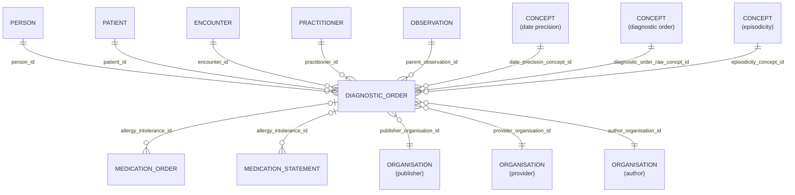

# Diagnostic_Order

- [Diagnostic\_Order](#diagnostic_order)
  - [Overview](#overview)
  - [Columns](#columns)
  - [Entity relations](#entity-relations)
  - [Notes](#notes)

## Overview

Linked FHIR resource: [🔥 Service Request](https://hl7.org/fhir/servicerequest.html)

A record of a request for service such as diagnostic investigations, treatments, or operations to be performed.

This represents an order or proposal or plan to perform a diagnostic or other service on or for a patient. It represents a proposal or plan or order for a service to be performed that would result in a Procedure or Diagnostic Report, which in turn may reference one or more Observations, which summarize the performance of the procedures and associated documentation such as observations, images, findings that are relevant to the treatment/management of the subject. This resource may be used to share relevant information required to support a referral or a transfer of care request from one practitioner or organization to another when a patient is required to be referred to another provider for a consultation /second opinion and/or for short term or longer term management of one or more health issues or problems.

The resource allows requesting only a single procedure. If a workflow requires requesting multiple procedures simultaneously, this is done using multiple instances of this resource.

## Columns

| Column Name | Data Type (Size) | Description | PK/FK | Compass Equivalent |
| --- | --- | --- | --- | --- |
| `ID` | `UUID` | Unique business identifier for the diagnostic order record. | PK | `id` |
| `LDS_SOURCE_RECORD_ID` | `UUID` | A unique identifier denoting the originating base-record prior to transform | | -- |
| `PATIENT_ID` | `UUID` | patient id. | FK -> [Patient](Patient.md).ID | `patient_id` |
| `PERSON_ID` | `UUID` | person id. | FK -> [Person](Person.md).ID | `person_id` |
| `PUBLISHER_ORGANISATION_ID` | `UUID` | linked organisaiton id publisher. see [schema notes: publisher, provider, author](_schema_notes.md#provider-author-publisher-organisation-id). | FK -> [Organisation](Organisation.md).ID | `organization_id` |
| `PROVIDER_ORGANISATION_ID` | `UUID` | linked organisaiton id provider. see [schema notes: publisher, provider, author](_schema_notes.md#provider-author-publisher-organisation-id) | FK -> [ORANGANISATION](Organisation.md).ID | -- |
| `AUTHOR_ORGANISATION_ID` | `UUID` | linked organisation id. see [schema notes: publisher, provider, author](_schema_notes.md#provider-author-publisher-organisation-id) | FK -> [ORANGANISATION](Organisation.md).ID | -- |
| `ENCOUNTER_ID` | `UUID` | encounter id. | FK -> [Encounter](Encounter.md).ID | `encounter_id` |
| `PRACTITIONER_ID` | `UUID` | practitioner id. | FK -> [Practitioner](Practitioner.md).ID | `practitioner_id` |
| `PARENT_OBSERVATION_ID` | `UUID` | parent observation id. | FK -> [OBSERVATION](Observation.md).ID | `parent_observation_id` |
| `CLINICAL_EFFECTIVE_DATE` | `DATE` | clinical effective date. | | `clinical_effective_date` |
| `DATE_PRECISION_RAW` | `VARCHAR` | date precision raw. | | -- |
| `CLINICAL_EFFECTIVE_DATE_PRECISION_SOURCE_CONCEPT_ID` | `UUID` | source concept id for date precision. | [CONCEPT](Concept.md).ID | `date_precision_concept_id` |
| `RESULT_VALUE` | `DOUBLE` | result value. | | `result_value` |
| `RESULT_MEASUREMENT_UNITS_SOURCE_CONCEPT_ID` | `UUID` | source concept id for result measurementunits. | [CONCEPT](Concept.md).ID | `result_value_units` |
| `RESULT_DATE` | `DATE` | result date. | | `result_date` |
| `RESULT_TEXT` | `INTEGER` | result text. | | `result_text` |
| `IS_PROBLEM` | `BOOLEAN` | is problem. | | `is_problem` |
| `IS_REVIEW` | `BOOLEAN` | is review. | | `is_review` |
| `PROBLEM_END_DATE` | `DATE` | problem end date. | | `problem_end_date` |
| `DIAGNOSTIC_ORDER_SOURCE_CONCEPT_ID` | `UUID` | source concept id for the diagnostic order. | [CONCEPT](Concept.md).ID | `non_core_concept_id` |
| `AGE_AT_EVENT` | `NUMBER` | patient age, in whole years, at clinical effective date of event. | | `age_at_event` |
| `AGE_AT_EVENT_BABY` | `NUMBER` | patient age, in categorised groups for ages under 1 year, at clinical effective date of event. NULL where patient is over 1 years old. | | -- |
| `AGE_AT_EVENT_NEONATE` | `NUMBER` | patient age, in days under 27 days old, at clinical effective date. NULL where patient is over 27 days old. | | -- |
| `EPISODICITY_SOURCE_CONCEPT_ID` | `UUID` | source concept id for episodicity. | [CONCEPT](Concept.md).ID | `episodicity_concept_id` |
| `IS_PRIMARY` | `BOOLEAN` | is primary. | | `is_primary` |
| `DATE_RECORDED` | `TIMESTAMP` | date recorded. | | `date_recorded` |
| `LDS_IS_DELETED` | `BOOLEAN` | standardised representation of soft-deletes. | | -- |
| `PUBLISHER_ORGANISATION_CODE` | `VARCHAR` | The Organisation Data Service (ODS) code of the organisation who, acting as the data controller, publishes the data. | | `organization_id` |
| `SOURCE_EXTRACTION_DATE` | `TIMESTAMP` | The timestamp when the record was supplied to, or acquired by, LDS. | | -- |
| `LDS_TRANSFORM_DATETIME` | `TIMESTAMP_LTZ` | lds transform date time. | | -- |

## Entity relations

> [!NOTE]
> Diagrams below are currently indicative. The precise optional/mandatory nature of certain relationships remains to be clarified.

| Related Table | Relationship Type | Local Key | Related Key | Notes |
| --- | --- | --- | --- | --- |
| [Person](Person.md) | FK | PERSON_ID | ID | |
| [Patient](Patient.md) | FK | PATIENT_ID | ID | |
| [Encounter](Encounter.md) | FK | ENCOUNTER_ID | ID | |
| [Practitioner](Practitioner.md) | FK | PRACTITIONER_ID | ID | |
| [Observation](Observation.md) | FK | PARENT_OBSERVATION_ID | ID | |
| [Concept](Concept.md) | FK | CLINICAL_EFFECTIVE_DATE_PRECISION_SOURCE_CONCEPT_ID | ID | |
| [Concept](Concept.md) | FK | PARENT_RESULT_MEASUREMENT_UNITS_SOURCE_CONCEPT_IDOBSERVATION_ID | ID | |
| [Concept](Concept.md) | FK | DIAGNOSTIC_ORDER_SOURCE_CONCEPT_ID | ID | |
| [Concept](Concept.md) | FK | EPISODICITY_SOURCE_CONCEPT_ID | ID | |
| [Medication_Order](Medication_Order.md) | FK | ID | DIAGNOSTIC_ORDER_ID | |
| [Medication_Statement](Medication_Statement.md) | FK | ID | DIAGNOSTIC_ORDER_ID | |
| [Organisation]

## Notes
