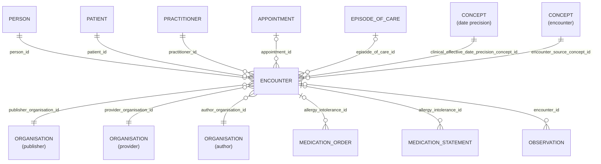

# Encounter

## Overview

An interaction between a patient and healthcare provider(s) for the purpose of providing healthcare service(s) or assessing the health status of a patient.

A patient encounter is further characterized by the setting in which it takes place. Amongst them are ambulatory, emergency, home health, inpatient and virtual encounters. An Encounter encompasses the lifecycle from pre-admission, the actual encounter (for ambulatory encounters), and admission, stay and discharge (for inpatient encounters). During the encounter the patient may move from practitioner to practitioner and location to location.

## Columns
| Column Name | Data Type (Size) | Description | PK/FK |
|---|---|---|---|
| `ID` | `UUID` | Unique business identifier for the entity. | PK |
| `LDS_SOURCE_RECORD_ID` | `UUID` | A unique identifier denoting the originating base-record prior to transform | <MISSING> |
| `PATIENT_ID` | `VARCHAR` | patient id. | FK -> [Patient](Patient.md).ID |
| `PERSON_ID` | `VARCHAR` | person id. | FK -> [Person](Person.md).ID |
| `PUBLISHER_ORGANISATION_ID` | `UUID` | linked organisaiton id publisher. see [schema notes: publisher, provider, author](_schema_notes.md#provider-author-publisher-organisation-id). | FK -> [Organisation](Organisation.md).ID |
| `PROVIDER_ORGANISATION_ID` | `UUID` | linked organisaiton id provider. see [schema notes: publisher, provider, author](_schema_notes.md#provider-author-publisher-organisation-id) | FK -> [ORANGANISATION](Organisation.md).ID |
| `AUTHOR_ORGANISATION_ID` | `UUID` | linked organisation id. see [schema notes: publisher, provider, author](_schema_notes.md#provider-author-publisher-organisation-id) | FK -> [ORANGANISATION](Organisation.md).ID |
| `EPISODE_OF_CARE_ID` | `UUID` | episode of care id. | FK -> [Episode_Of_Care](Episode_Of_Care.md).ID |
| `APPOINTMENT_ID` | `VARCHAR` | appointment id. | FK -> [Appointment](Appointment.md).ID |
| `PRACTITIONER_ID` | `VARCHAR` | practitioner id. | FK -> [Practitioner](Practitioner.md).ID |
| `LOCATION` | `VARCHAR` | location. |  |
| `ENCOUNTER_SOURCE_CONCEPT_ID` | `UUID` | encounter source concept id. | FK -> [Concept](Concept.md).ID |
| `CLINICAL_EFFECTIVE_DATE_PRECISION_SOURCE_CONCEPT_ID` | `UUID` | date precision concept id. | FK -> [Concept](Concept.md).ID |
| `CONSULTATION_TYPE` | `VARCHAR` | consultation type. |  |
| `CLINICAL_EFFECTIVE_DATE` | `DATE` | clinical effective date. |  |
| `DATE_RECORDED` | `TIMESTAMP` | date recorded. |  |
| `IS_CONFIDENTIAL` | `BOOLEAN` | is confidential. |  |
| `AGE_AT_EVENT` | `NUMBER` | patient age, in whole years, at clinical effective date of event. |  |
| `AGE_AT_EVENT_BABY` | `NUMBER` | patient age, in categorised groups for ages under 1 year, at clinical effective date of event. NULL where patient is over 1 years old. |  |
| `AGE_AT_EVENT_NEONATE` | `NUMBER` | patient age, in days under 27 days old, at clinical effective date. NULL where patient is over 27 days old. |  |
| `TYPE` | `INTEGER` | type. |  |
| `SUBTYPE` | `INTEGER` | subtype. |  |
| `ADMISSION_METHOD` | `INTEGER` | admission method. |  |
| `LDS_IS_DELETED` | `BOOLEAN` | lds is deleted. |  |
| `PUBLISHER_ORGANISATION_CODE` | `VARCHAR` | The Organisation Data Service (ODS) code of the organisation who, acting as the data controller, publishes the data. |  |
| `SOURCE_EXTRACTION_DATE` | `TIMESTAMP` | source extraction date. |  |
| `LDS_TRANSFORM_DATETIME` | `TIMESTAMP_LTZ` | lds transform date time. |  |

## Entity relationship

## Immediate Entity Relationships
| Related Table | Relationship Type | Local Key | Related Key | Notes |
|---|---|---|---|---|
| [Patient](Patient.md) | FK | PATIENT_ID | ID |  |
| [Person](Person.md) | FK | PERSON_ID | ID |  |
| [Organisation](Organisation.md) | FK | PUBLISHER_ORGANISATION_ID | ID | |
| [Organisation](Organisation.md) | FK | PROVIDER_ORGANISATION_ID | ID | |
| [Organisation](Organisation.md) | FK | AUTHOR_ORGANISATION_ID | ID | |
| [Episode_Of_Care](Episode_Of_Care.md) | FK | EPISODE_OF_CARE_ID | ID |  |
| [Practitioner](Practitioner.md) | FK | PRACTITIONER_ID | ID |  |
| [Appointment](Appointment.md) | FK | APPOINTMENT_ID | ID |  |

## Notes
