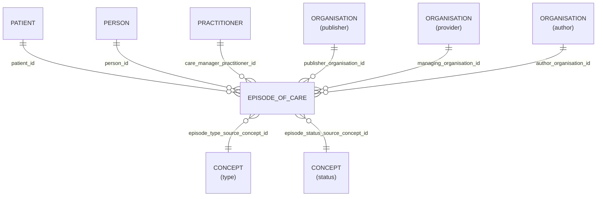

# Episode_Of_Care

- [Episode\_Of\_Care](#episode_of_care)
  - [Overview](#overview)
  - [Columns](#columns)
  - [Entity relationships](#entity-relationships)
  - [Notes](#notes)

## Overview

An association between a patient and an organisation / healthcare provider(s) during which time encounters may occur. The managing organisation assumes a level of responsibility for the patient during this time.

## Columns

| Column Name | Data Type (Size) | Description | PK/FK | Compass Equivalent |
| --- | --- | --- | --- | --- |
| `ID` | `UUID` | Unique business identifier for the entity. | PK | `id` |
| `LDS_SOURCE_RECORD_ID` | `UUID` | lds record id. | | -- |
| `PATIENT_ID` | `UUID` | patient id. | FK -> [Patient](Patient.md).ID | `patient_id` |
| `PERSON_ID` | `UUID` | person id. | FK -> [Person](Person.md).ID | `person_id` |
| `PUBLISHER_ORGANISATION_ID` | `UUID` | linked organisaiton id publisher. see [schema notes: publisher, provider, author](_schema_notes.md#provider-author-publisher-organisation-id). | FK -> [Organisation](Organisation.md).ID | `organization_id` |
| `MANAGING_ORGANISATION_ID` | `UUID` | linked organisaiton id provider. see [schema notes: publisher, provider, author](_schema_notes.md#provider-author-publisher-organisation-id) | FK -> [ORANGANISATION](Organisation.md).ID | -- |
| `AUTHOR_ORGANISATION_ID` | `UUID` | linked organisation id. see [schema notes: publisher, provider, author](_schema_notes.md#provider-author-publisher-organisation-id) | FK -> [ORANGANISATION](Organisation.md).ID | -- |
| `MANAGING_ORGANISATION_CODE` | `VARCHAR` | The Organisation Data Service (ODS) code of the organisation who is responsible for care delivery within the episode of care. | | -- |
| `USUAL_GP_PRACTITIONER_IN_ROLE_ID` | `UUID` | usual gp practitioner in role id. | FK -> [Practitioner_In_Role](Practitioner_In_Role.md).ID | `usual_gp_practitioner_id` |
| `EPISODE_OF_CARE_START_DATE` | `DATE` | episode of care start date. | | `date_registered` |
| `EPISODE_OF_CARE_END_DATE` | `DATE` | episode of care end date. | | `date_registered_end` |
| `TYPE` | `VARCHAR` | type. | <to be removed> | -- |
| `EPISODE_TYPE_SOURCE_CONCEPT_ID` | `UUID` | episode type source concept id. | FK -> [Concept](Concept.md).ID | `registration_type_concept_id` |
| `STATUS` | `VARCHAR` | status. | <to be removed> | -- |
| `EPISODE_STATUS_SOURCE_CONCEPT_ID` | `UUID` | episode status source concept id. | FK -> [Concept](Concept.md).ID | `registration_status_concept_id` |
| `LDS_IS_DELETED` | `BOOLEAN` | lds is deleted. | | -- |
| `PUBLISHER_ORGANISATION_CODE` | `VARCHAR` | The Organisation Data Service (ODS) code of the organisation who, acting as the data controller, publishes the data. | | `organization_id` |
| `SOURCE_EXTRACTION_DATE` | `TIMESTAMP` | source extraction date. | | -- |
| `LDS_TRANSFORM_DATETIME` | `TIMESTAMP_LTZ` | lds transform date time. | | -- |

## Entity relationships

> [!NOTE]
> Diagrams below are currently indicative. The precise optional/mandatory nature of certain relationships remains to be clarified.

| Related Table | Relationship Type | Local Key | Related Key | Notes |
| --- | --- | --- | --- | --- |
| [Patient](Patient.md) | FK | PATIENT_ID | ID | |
| [Person](Person.md) | FK | PERSON_ID | ID | |
| [Organisation](Organisation.md) | FK | PUBLISHER_ORGANISATION_ID | ID | |
| [Organisation](Organisation.md) | FK | MANAGING_ORGANISATION_ID | ID | |
| [Organisation](Organisation.md) | FK | AUTHOR_ORGANISATION_ID | ID | |
| [Concept](Concept.md) | FK | EPISODE_TYPE_SOURCE_CONCEPT_ID | ID | |
| [Concept](Concept.md) | FK | EPISODE_STATUS_SOURCE_CONCEPT_ID | ID | |
| [Practitioner_In_Role](Practitioner_In_Role.md) | FK | USUAL_GP_PRACTITIONER_IN_ROLE_ID | ID | |

## Notes
