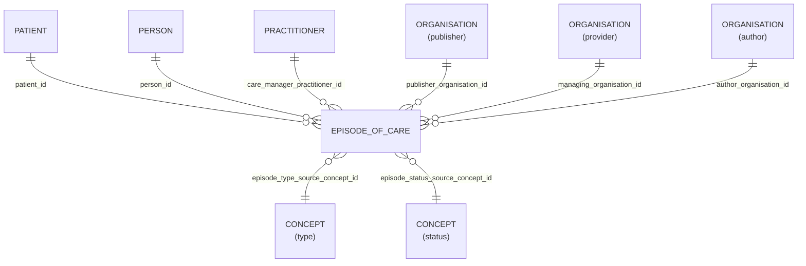

# Episode_Of_Care

- [Episode\_Of\_Care](#episode_of_care)
  - [Overview](#overview)
  - [Columns](#columns)
  - [Entity relationships](#entity-relationships)
  - [Notes](#notes)
    - [Episode of Care History](#episode-of-care-history)
      - [Questions on Episode of Care History](#questions-on-episode-of-care-history)
        - [Does this change affect historic clinical events?](#does-this-change-affect-historic-clinical-events)
        - [How does this change affect population count comparissons?](#how-does-this-change-affect-population-count-comparissons)

## Overview

Linked FHIR resource: [🔥 Episode of Care](https://hl7.org/fhir/episodeofcare.html)

An association between a patient and an organisation / healthcare provider(s) during which time encounters may occur. The managing organisation assumes a level of responsibility for the patient during this time.

## Columns

> [!NOTE]
> Table schema is identical across pseudonynmised ('pseudo') and identifiable ('PID') schema

| Column Name | Data Type (Size) | Description | PK/FK | Compass Equivalent |
| --- | --- | --- | --- | --- |
| `ID` | `UUID` | Unique business identifier for the entity. | PK | `id` |
| `LDS_SOURCE_RECORD_ID` | `UUID` | lds record id. | | -- |
| `PATIENT_ID` | `UUID` | patient id. | FK -> [Patient](Patient.md).ID | `patient_id` |
| `PERSON_ID` | `UUID` | person id. | FK -> [Person](Person.md).ID | `person_id` |
| `PUBLISHER_ORGANISATION_ID` | `UUID` | linked organisaiton id publisher. see [schema notes: publisher, provider, author](_schema_notes.md#provider-author-publisher-organisation-id). | FK -> [Organisation](Organisation.md).ID | `organization_id` |
| `MANAGING_ORGANISATION_ID` | `UUID` | linked organisaiton id provider. see [schema notes: publisher, provider, author](_schema_notes.md#provider-author-publisher-organisation-id) | FK -> [ORANGANISATION](Organisation.md).ID | -- |
| `AUTHOR_ORGANISATION_ID` | `UUID` | linked organisation id. see [schema notes: publisher, provider, author](_schema_notes.md#provider-author-publisher-organisation-id) | FK -> [ORANGANISATION](Organisation.md).ID | -- |
| `MANAGING_ORGANISATION_CODE` | `VARCHAR` | The Organisation Data Service (ODS) code of the organisation who is responsible for care delivery within the episode of care. | | -- |
| `USUAL_GP_PRACTITIONER_IN_ROLE_ID` | `UUID` | usual gp practitioner in role id. | FK -> [Practitioner_In_Role](Practitioner_In_Role.md).ID | `usual_gp_practitioner_id` |
| `EPISODE_OF_CARE_START_DATE` | `DATE` | episode of care start date. | | `date_registered` |
| `EPISODE_OF_CARE_END_DATE` | `DATE` | episode of care end date. | | `date_registered_end` |
| `TYPE` | `VARCHAR` | type. | <to be removed> | -- |
| `EPISODE_TYPE_SOURCE_CONCEPT_ID` | `UUID` | episode type source concept id. | FK -> [Concept](Concept.md).ID | `registration_type_concept_id` |
| `STATUS` | `VARCHAR` | status. | <to be removed> | -- |
| `EPISODE_STATUS_SOURCE_CONCEPT_ID` | `UUID` | episode status source concept id. | FK -> [Concept](Concept.md).ID | `registration_status_concept_id` |
| `LDS_IS_DELETED` | `BOOLEAN` | lds is deleted. | | -- |
| `PUBLISHER_ORGANISATION_CODE` | `VARCHAR` | The Organisation Data Service (ODS) code of the organisation who, acting as the data controller, publishes the data. | | `organization_id` |
| `SOURCE_EXTRACTION_DATE` | `TIMESTAMP` | source extraction date. | | -- |
| `LDS_SOURCE_DATASET` | `VARCHAR` | The name of the source dataset (or system) that the record is obtained from | - | -- |
| `LDS_TRANSFORM_DATETIME` | `TIMESTAMP_LTZ` | lds transform date time. | | -- |

## Entity relationships

> [!NOTE]
> Diagrams below are currently indicative. The precise optional/mandatory nature of certain relationships remains to be clarified.

```mermaid
erDiagram

    ORG_PUB["ORGANISATION<br>(publisher)"]{}
    ORG_PROV["ORGANISATION<br>(provider)"]{}
    ORG_AUTH["ORGANISATION<br>(author)"]{}
    
    CONCEPT_TYPE["CONCEPT<br>(type)"]
    CONCEPT_STATUS["CONCEPT<br>(status)"]

    PATIENT ||--o{ EPISODE_OF_CARE: patient_id
    PERSON ||--o{ EPISODE_OF_CARE: person_id
    PRACTITIONER ||--o{ EPISODE_OF_CARE: care_manager_practitioner_id

    ORG_PUB ||--o{ EPISODE_OF_CARE: publisher_organisation_id
    ORG_PROV ||--o{ EPISODE_OF_CARE: managing_organisation_id
    ORG_AUTH ||--o{ EPISODE_OF_CARE: author_organisation_id

    EPISODE_OF_CARE }o--|| CONCEPT_TYPE : episode_type_source_concept_id
    EPISODE_OF_CARE }o--|| CONCEPT_STATUS: episode_status_source_concept_id
```

| Related Table | Relationship Type | Local Key | Related Key | Notes |
| --- | --- | --- | --- | --- |
| [Patient](Patient.md) | FK | PATIENT_ID | ID | |
| [Person](Person.md) | FK | PERSON_ID | ID | |
| [Organisation](Organisation.md) | FK | PUBLISHER_ORGANISATION_ID | ID | |
| [Organisation](Organisation.md) | FK | MANAGING_ORGANISATION_ID | ID | |
| [Organisation](Organisation.md) | FK | AUTHOR_ORGANISATION_ID | ID | |
| [Concept](Concept.md) | FK | EPISODE_TYPE_SOURCE_CONCEPT_ID | ID | |
| [Concept](Concept.md) | FK | EPISODE_STATUS_SOURCE_CONCEPT_ID | ID | |
| [Practitioner_In_Role](Practitioner_In_Role.md) | FK | USUAL_GP_PRACTITIONER_IN_ROLE_ID | ID | |

## Notes

### Episode of Care History

As of [v3.0.1](../../Release-notes/3_OLIDS_Enrichment/v3.0.1.md), the episode of care (`EPISODE_OF_CARE_V2`) table incorporates historic registration data available from the EMIS source object `admin_patient_history`.

The inclusion of this data allows us to close a gap whereby patients who left and rejoined a practice one or more times prior to the first bulk ever taken from the practice would only have their most recent registration period noted within the Episode of Care table. This led to a small variance in the number of registered patients when looking for registered population counts prior to the first bulk, a variance which grew in size the further back prior to the first bulk you looked.

The fix will close the gap up to the maximum limit of five (5) years prior to the first bulk date, as patients who were deducted more than five (5) years prior to the first bulk are not possible to include in the EMIS IM1 extracts.

Users will still see a variance between referenced population when counting the total population as of a date that is more than 5 years prior to the first bulk (typically around 2020/2021).

#### Questions on Episode of Care History

##### Does this change affect historic clinical events?

No. this change only impacts the count of episodes of care.

Clinical event data such as medications, observations, referrals, and allergies are unaffected by this change. These will continue to hold all records for patients who are currently registered, or were registered within the preceeding five (5) years prior to the first bulk date of the practice.

##### How does this change affect population count comparissons?

This change will increase the number of registered regular patients for periods that are up to five (5) years prior to the date of the first bulk from the practice
