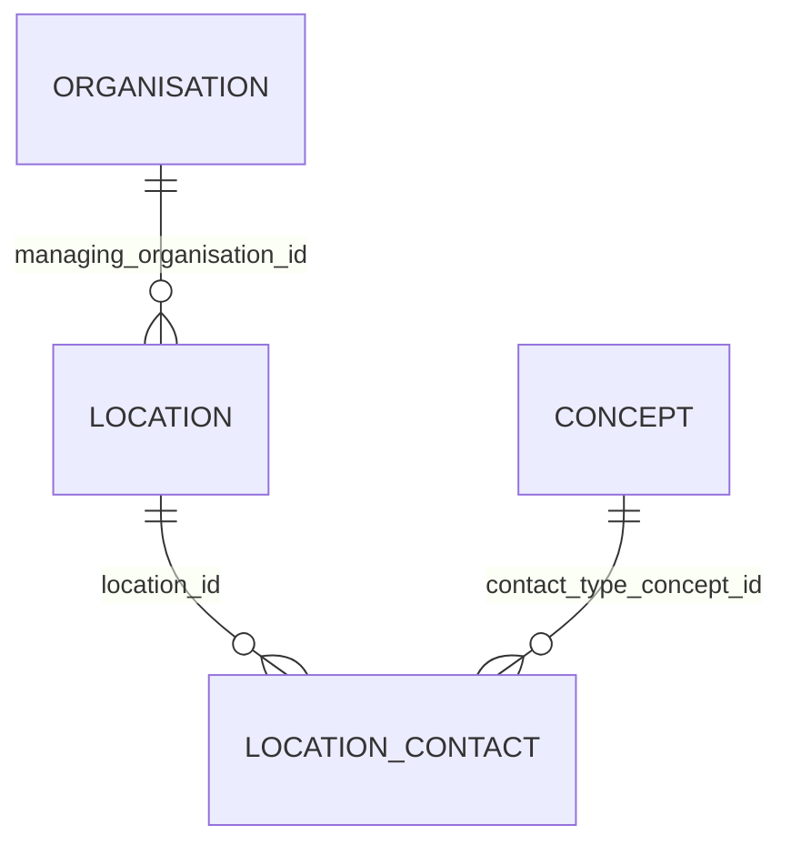

# Location

- [Location](#location)
  - [Overview](#overview)
  - [Columns](#columns)
  - [Entity Relationships](#entity-relationships)
  - [Notes](#notes)

## Overview

Details and position information for a place where services are provided and resources and participants may be stored, found, contained, or accommodated.

A Location includes both incidental locations (a place which is used for healthcare without prior designation or authorization) and dedicated, formally appointed locations. Locations may be private, public, mobile or fixed and scale from small freezers to full hospital buildings or parking garages.

## Columns

| Column Name | Data Type (Size) | Description | PK/FK | Compass Equivalent |
| --- | --- | --- | --- | --- |
| `ID` | `UUID` | id. | PK | `id` |
| `LDS_SOURCE_RECORD_ID` | `UUID` | Unique record identifier including file row number for deduplication. | | -- |
| `NAME` | `VARCHAR` | name. | | `name` |
| `LOCATION_TYPE_SOURCE_CONCEPT_ID` | `UUID` | type code. | FK -> [Concept](Concept.md).ID | `type_code` |
| `TYPE_DESCRIPTION` | `VARCHAR` | type description. | | `type_desc` |
| `IS_PRIMARY_LOCATION` | `BOOLEAN` | is primary location. | | -- |
| `HOUSE_NAME` | `VARCHAR` | house name. | | -- |
| `HOUSE_NUMBER` | `VARCHAR` | house number. | | -- |
| `HOUSE_NAME_FLAT_NUMBER` | `VARCHAR` | house name flat number. | | -- |
| `STREET` | `VARCHAR` | street. | | -- |
| `ADDRESS_LINE_1` | `VARCHAR` | address line 1. | | -- |
| `ADDRESS_LINE_2` | `VARCHAR` | address line 2. | | -- |
| `ADDRESS_LINE_3` | `VARCHAR` | address line 3. | | -- |
| `ADDRESS_LINE_4` | `VARCHAR` | address line 4. | | -- |
| `POSTCODE` | `VARCHAR` | postcode. | | `postcode` |
| `MANAGING_ORGANISATION_ID` | `UUID` | managing organisation id. | FK -> [Organisation](Organisation.md).ID | `managing_organization_id` |
| `OPEN_DATE` | `DATE` | open date. | | -- |
| `CLOSE_DATE` | `DATE` | close date. | | -- |
| `IS_OBSOLETE` | `BOOLEAN` | is obsolete. | | -- |
| `LDS_IS_DELETED` | `BOOLEAN` | lds is deleted. | | -- |
| `SOURCE_EXTRACTION_DATE` | `TIMESTAMP_NTZ` | source extraction date. | | -- |
| `LDS_TRANSFORM_DATETIME` | `TIMESTAMP_LTZ` | lds transform date time. | | -- |

## Entity Relationships

> [!NOTE]
> Diagrams below are currently indicative. The precise optional/mandatory nature of certain relationships remains to be clarified.

| Related Table | Relationship Type | Local Key | Related Key | Notes |
| --- | --- | --- | --- | --- |
| [Organisation](Organisation.md) | FK | MANAGING_ORGANISATION_ID | ID | |
| [Concept](Concept.md) | FK | LOCATION_TYPE_SOURCE_CONCEPT_ID | CONCEPT_ID | |
| [Location_Contact](Location_Contact.md) | JOIN | ID | LOCATION_ID | <Location contact to be added> |

## Notes

Table is provided by some suppliers (including both EMIS/Optum and TPP) as an 'unowned' reference dimension. As such it is not possible to allocate records to a specific recipient and instead the records are surfaced to consumers without row-access policies applied. There is no patient related data contained in this object and therefore no risk to sharing.
