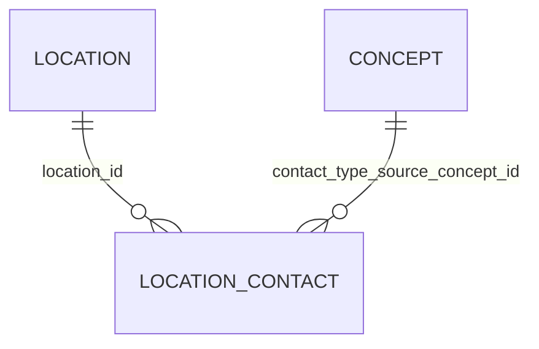

# Location Contact

- [Location Contact](#location-contact)
  - [Overview](#overview)
  - [Columns](#columns)
  - [Entity Relationships](#entity-relationships)
  - [Notes](#notes)

## Overview

Linked FHIR resource: [🔥 Location](https://hl7.org/fhir/location.html)

Details and position information for a place where services are provided and resources and participants may be stored, found, contained, or accommodated.

A Location includes both incidental locations (a place which is used for healthcare without prior designation or authorization) and dedicated, formally appointed locations. Locations may be private, public, mobile or fixed and scale from small freezers to full hospital buildings or parking garages.

## Columns

| Column Name | Data Type (Size) | Description | PK/FK | Compass Equivalent |
| --- | --- | --- | --- | --- |
| `ID` | `UUID` | id. | PK | `id` |
| `LDS_SOURCE_RECORD_ID` | `UUID` | Unique record identifier including file row number for deduplication. | | -- |
| `LOCATION_ID` | `UUID` | the id of the linked location for this contact | FK -> [`LOCATION`](Location.md).`ID` | |
| `IS_PRIMARY_CONTACT` | `BOOLEAN` | True where the contact is noted as the primary contact for the location. False where not. Not all locations will denote a primary contact. | | |
| `CONTACT_TYPE_SOURCE_CONCEPT_ID` | `UUID` | The Concept ID for the type of contact (phone/email etc) | FK -> [`CONCEPT`](Concept.md).`CONCEPT_ID` | |
| `CONTACT_TYPE` | `VARCHAR` | The type of contact (phone / email etc) | | |
| `VALUE` | `VARCHAR` | The contact number/information | | |
| `SOURCE_EXTRACTION_DATE` | `TIMESTAMP_NTZ` | source extraction date. | | -- |
| `LDS_SOURCE_DATASET` | `VARCHAR` | The name of the source dataset (or system) that the record is obtained from | - | -- |
| `LDS_TRANSFORM_DATETIME` | `TIMESTAMP_LTZ` | lds transform date time. | | -- |

## Entity Relationships

> [!NOTE]
> Diagrams below are currently indicative. The precise optional/mandatory nature of certain relationships remains to be clarified.

| Related Table | Relationship Type | Local Key | Related Key | Notes |
| --- | --- | --- | --- | --- |
| [Location](Location.md) | FK | LOCATION_ID | ID | |
| [Concept](Concept.md) | FK | CONTACT_TYPE_SOURCE_CONCEPT_ID | CONCEPT_ID | |

## Notes
