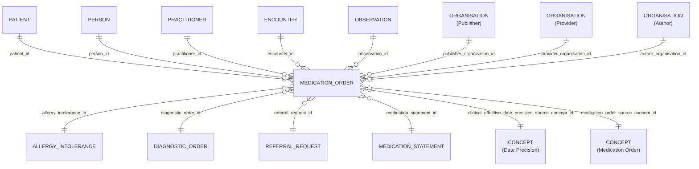

# Medication_Order

- [Medication\_Order](#medication_order)
  - [Overview](#overview)
  - [Columns](#columns)
  - [Entity Relationships](#entity-relationships)
  - [Notes](#notes)

## Overview

Linked FHIR resource: [🔥 Medication Request](https://build.fhir.org/medicationrequest.html)

This resource covers all type of orders for medications for a patient. This includes inpatient medication orders as well as community orders (whether filled by the prescriber or by a pharmacy). It also includes orders for over-the-counter medications (e.g., Aspirin), total parenteral nutrition and diet/vitamin supplements. It may be used to support the order of medication-related devices e.g., prefilled syringes such as patient-controlled analgesia (PCA) syringes, or syringes used to administer other types of medications. e.g., insulin, narcotics. It can can also be used to order medication or substances NOT be taken.

This resource would **not** be used when ordering a device(s) that may have a medication coating e.g. heparin coated stints, or similar types of devices. These types of devices would be ordered using the Device Request or the SupplyRequest resources.

It is not intended for use in prescribing particular diets, or for ordering non-medication-related items (eyeglasses, supplies, etc.). In addition, the MedicationRequest may be used to report orders/request from external systems that have been reported for informational purposes and are not authoritative and are not expected to be acted upon (e.g. dispensed or administered).

The MedicationRequest resource is a "request" resource from a FHIR workflow perspective - see Workflow Request.

The MedicationRequest resource allows requesting only a single medication. If a workflow requires requesting multiple items simultaneously, this is done using multiple instances of this resource. These instances can be linked in different ways, depending on the needs of the workflow. For guidance, refer to the Request pattern.

## Columns

| Column Name | Data Type (Size) | Description | PK/FK |
| --- | --- | --- | --- |
| `ID` | `UUID` | id. | PK |
| `LDS_SOURCE_RECORD_ID` | `UUID` | lds record id. | |
| `PATIENT_ID` | `UUID` | patient id. | FK -> [Patient](Patient.md).ID |
| `PERSON_ID` | `UUID` | person id. | FK -> [Person](Person.md).ID |
| `PUBLISHER_ORGANISATION_ID` | `UUID` | organisation id of the record publisher^1^. | FK -> [Organisation](Organisation.md).ID |
| `PROVIDER_ORGANISATION_ID` | `UUID` | organisation id of the care provider^1^. | FK -> [Organisation](Organisation.md).ID |
| `AUTHOR_ORGANISATION_ID` | `UUID` | organisation id record author^1^. | FK -> [Organisation](Organisation.md).ID |
| `MEDICATION_STATEMENT_ID` | `UUID` | medication statement id. | FK -> [Medication_Statement](Medication_Statement.md).ID |
| `ENCOUNTER_ID` | `UUID` | encounter id. | FK -> [Encounter](Encounter.md).ID |
| `PRACTITIONER_ID` | `UUID` | practitioner id. | FK -> [Practitioner](Practitioner.md).ID |
| `OBSERVATION_ID` | `UUID` | observation id. | FK -> [Observation](Observation.md).ID |
| `ALLERGY_INTOLERANCE_ID` | `UUID` | allergy intolerance id. | FK -> [Allergy_Intolerance](Allergy_Intolerance.md).ID |
| `DIAGNOSTIC_ORDER_ID` | `UUID` | diagnostic order id. | FK -> [Diagnostic_Order](Diagnostic_Order.md).ID |
| `REFERRAL_REQUEST_ID` | `UUID` | referral request id. | FK -> [Referral_Request](Referral_Request.md).ID |
| `CLINICAL_EFFECTIVE_DATE` | `DATE` | clinical effective date. | |
| `CLINICAL_EFFECTIVE_DATE_PRECISION_SOURCE_CONCEPT_ID` | `UUID` | date precision concept id. | FK -> [Concept](Concept.md).ID |
| `DOSE` | `VARCHAR` | dose. | |
| `QUANTITY_VALUE` | `FLOAT` | quantity value. | |
| `QUANTITY_VALUE_DESCRIPTION` | `VARCHAR` | quantity value description. | |
| `QUANTITY_UNIT` | `VARCHAR` | quantity unit. | |
| `DURATION_DAYS` | `NUMBER` | duration days. | |
| `ESTIMATED_COST` | `NUMBER` | estimated cost. | |
| `MEDICATION_NAME` | `VARCHAR` | medication name. | |
| `MEDICATION_ORDER_SOURCE_CONCEPT_ID` | `UUID` | medication order source concept id. | FK -> [Concept](Concept.md).ID |
| `BNF_REFERENCE` | `VARCHAR` | bnf reference. | |
| `AGE_AT_EVENT` | `NUMBER` | patient age, in whole years, at clinical effective date of event. | |
| `AGE_AT_EVENT_BABY` | `NUMBER` | patient age, in categorised groups for ages under 1 year, at clinical effective date of event. NULL where patient is over 1 years old. | |
| `AGE_AT_EVENT_NEONATE` | `NUMBER` | patient age, in days under 27 days old, at clinical effective date. NULL where patient is over 27 days old. | |
| `ISSUE_METHOD` | `VARCHAR` | issue method. | |
| `DATE_RECORDED` | `TIMESTAMP_NTZ` | date recorded. | |
| `IS_CONFIDENTIAL` | `BOOLEAN` | is confidential. | |
| `ISSUE_METHOD_DESCRIPTION` | `VARCHAR` | issue method description. | |
| `LDS_IS_DELETED` | `BOOLEAN` | lds is deleted. | |
| `PUBLISHER_ORGANISATION_CODE` | `VARCHAR` | The Organisation Data Service (ODS) code of the organisation who, acting as the data controller, publishes the data. | |
| `SOURCE_EXTRACTION_DATE` | `TIMESTAMP` | source extraction date. | |
| `LDS_TRANSFORM_DATETIME` | `TIMESTAMP_LTZ` | lds transform date time. | |

1. See the [schema notes section on publisher, provider, author organisation definitions](_schema_notes.md#provider-author-publisher-organisation-id)

## Entity Relationships

> [!NOTE]
> Diagrams below are currently indicative. The precise optional/mandatory nature of certain relationships remains to be clarified.

| Related Table | Relationship Type | Local Key | Related Key | Notes |
| --- | --- | --- | --- | --- |
| [Patient](Patient.md) | FK | PATIENT_ID | ID | |
| [Person](Person.md) | FK | PERSON_ID | ID | |
| [Practitioner](Practitioner.md) | FK | PRACTITIONER_ID | ID | |
| [Medication_Statement](Medication_Statement.md) | FK | MEDICATION_STATEMENT_ID | ID | |
| [Encounter](Encounter.md) | FK | ENCOUNTER_ID | ID | |
| [Organisation](Organisation.md) | FK | PUBLISHER_ORGANISATION_ID | ID |
| [Organisation](Organisation.md) | FK | PROVIDER_ORGANISATION_ID | ID |
| [Organisation](Organisation.md) | FK | AUTHOR_ORGANISATION_ID | ID |
| [Observation](Observation.md) | FK | OBSERVATION_ID | ID | |
| [Allergy_Intolerance](Allergy_Intolerance.md) | FK | ALLERGY_INTOLERANCE_ID | ID | |
| [Diagnostic_Order](Diagnostic_Order.md) | FK | DIAGNOSTIC_ORDER_ID | ID | |
| [Referral_Request](Referral_Request.md) | FK | REFERRAL_REQUEST_ID | ID | |

## Notes
