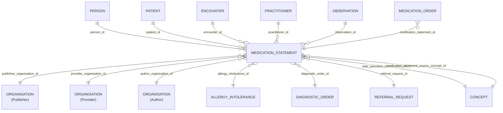

# Medication_Statement

- [Medication\_Statement](#medication_statement)
  - [Overview](#overview)
  - [Columns](#columns)
  - [Entity Relationships](#entity-relationships)
  - [Notes](#notes)

## Overview

Linked FHIR resource: [🔥 Medication Statement](https://build.fhir.org/medicationstatement.html)

A record of a medication that is being consumed by a patient. A MedicationStatement may indicate that the patient may be taking the medication now or has taken the medication in the past or will be taking the medication in the future. The source of this information can be the patient, significant other (such as a family member or spouse), or a clinician. A common scenario where this information is captured is during the history taking process during a patient visit or stay. The medication information may come from sources such as the patient's memory, from a prescription bottle, or from a list of medications the patient, clinician or other party maintains.

The primary difference between a medicationstatement and a medicationadministration is that the medication administration has complete administration information and is based on actual administration information from the person who administered the medication. A medicationstatement is often, if not always, less specific. There is no required date/time when the medication was administered, in fact we only know that a source has reported the patient is taking this medication, where details such as time, quantity, or rate or even medication product may be incomplete or missing or less precise. As stated earlier, the Medication Statement information may come from the patient's memory, from a prescription bottle or from a list of medications the patient, clinician or other party maintains. Medication administration is more formal and is not missing detailed information

## Columns

| Column Name | Data Type (Size) | Description | PK/FK | Compass Equivalent |
| --- | --- | --- | --- | --- |
| `ID` | `UUID` | id. | PK | `id` |
| `LDS_SOURCE_RECORD_ID` | `UUID` | lds record id. | | -- |
| `PATIENT_ID` | `UUID` | patient id. | FK -> [Patient](Patient.md).ID | `patient_id` |
| `PERSON_ID` | `UUID` | person id. | FK -> [Person](Person.md).ID | `person_id` |
| `PUBLISHER_ORGANISATION_ID` | `UUID` | organisation id of the record publisher^1^. | FK -> [Organisation](Organisation.md).ID | `organization_id` |
| `PROVIDER_ORGANISATION_ID` | `UUID` | organisation id of the care provider^1^. | FK -> [Organisation](Organisation.md).ID | `organization_id` |
| `AUTHOR_ORGANISATION_ID` | `UUID` | organisation id record author^1^. | FK -> [Organisation](Organisation.md).ID | `organization_id` |
| `PRACTITIONER_ID` | `UUID` | practitioner id. | FK -> [Practitioner](Practitioner.md).ID | `practitioner_id` |
| `ENCOUNTER_ID` | `UUID` | encounter id. | FK -> [Encounter](Encounter.md).ID | `encounter_id` |
| `OBSERVATION_ID` | `UUID` | observation id. | FK -> [Observation](Observation.md).ID | -- |
| `ALLERGY_INTOLERANCE_ID` | `UUID` | allergy intolerance id. | FK -> [Allergy_Intolerance](Allergy_Intolerance.md).ID | -- |
| `DIAGNOSTIC_ORDER_ID` | `UUID` | diagnostic order id. | FK -> [Diagnostic_Order](Diagnostic_Order.md).ID | -- |
| `REFERRAL_REQUEST_ID` | `UUID` | referral request id. | FK -> [Referral_Request](Referral_Request.md).ID | -- |
| `CLINICAL_EFFECTIVE_DATE` | `DATE` | clinical effective date. | | `clinical_effective_date` |
| `CLINICAL_EFFECTIVE_DATE_PRECISION_SOURCE_CONCEPT_ID` | `UUID` | date precision concept id. | FK -> [Concept](Concept.md).ID | `date_precision_concept_id` |
| `CANCELLATION_DATE` | `DATE` | cancellation date. | | `cancellation_date` |
| `DOSE` | `VARCHAR` | dose. | | `dose` |
| `QUANTITY_VALUE_DESCRIPTION` | `VARCHAR` | quantity value description. | | -- |
| `QUANTITY_VALUE` | `DOUBLE` | quantity value. | | `quantity_value` |
| `QUANTITY_UNIT` | `VARCHAR` | quantity unit. | | `quantity_unit` |
| `AUTHORISATION_TYPE_SOURCE_CONCEPT_ID` | `UUID` | authorisation type concept id. | FK -> [Concept](Concept.md).ID | `authorisation_type_concept_id` |
| `MEDICATION_NAME` | `VARCHAR` | medication name. | | -- |
| `MEDICATION_STATEMENT_SOURCE_CONCEPT_ID` | `UUID` | medication statement source concept id. | FK -> [Concept](Concept.md).ID | `non_core_concept_id` |
| `BNF_REFERENCE` | `VARCHAR` | bnf reference. | | `bnf_reference` |
| `AGE_AT_EVENT` | `NUMBER` | patient age, in whole years, at clinical effective date of event. | | `age_at_event` |
| `AGE_AT_EVENT_BABY` | `NUMBER` | patient age, in categorised groups for ages under 1 year, at clinical effective date of event. NULL where patient is over 1 years old. | | -- |
| `AGE_AT_EVENT_NEONATE` | `NUMBER` | patient age, in days under 27 days old, at clinical effective date. NULL where patient is over 27 days old. | | -- |
| `ISSUE_METHOD` | `VARCHAR` | issue method. | | `issue_method` |
| `DATE_RECORDED` | `TIMESTAMP` | date recorded. | | `date_recorded` |
| `IS_ACTIVE` | `BOOLEAN` | is active. | | -- |
| `IS_CONFIDENTIAL` | `BOOLEAN` | is confidential. | | -- |
| `EXPIRY_DATE` | `DATE` | expiry date. | | -- |
| `LDS_IS_DELETED` | `BOOLEAN` | lds is deleted. | | -- |
| `PUBLISHER_ORGANISATION_CODE` | `VARCHAR` | The Organisation Data Service (ODS) code of the organisation who, acting as the data controller, publishes the data. | | `organization_id` |
| `SOURCE_EXTRACTION_DATE` | `TIMESTAMP` | source extraction date. | | -- |
| `LDS_TRANSFORM_DATETIME` | `TIMESTAMP_LTZ` | lds transform date time. | | -- |

1. See the [schema notes section on publisher, provider, author organisation definitions](_schema_notes.md#provider-author-publisher-organisation-id)

## Entity Relationships

> [!NOTE]
> Diagrams below are currently indicative. The precise optional/mandatory nature of certain relationships remains to be clarified.

| Related Table | Relationship Type | Local Key | Related Key | Notes |
| --- | --- | --- | --- | --- |
| [Practitioner](Practitioner.md) | FK | PRACTITIONER_ID | ID | |
| [Encounter](Encounter.md) | FK | ENCOUNTER_ID | ID | |
| [Observation](Observation.md) | FK | OBSERVATION_ID | ID | |
| [Patient](Patient.md) | FK | PATIENT_ID | ID | |
| [Practitioner](Practitioner.md) | FK | PRACTITIONER_ID | ID | |
| [Diagnostic_Order](Diagnostic_Order.md) | FK | DIAGNOSTIC_ORDER_ID | ID | |
| [Person](Person.md) | FK | PERSON_ID | ID | |
| [Organisation](Organisation.md) | FK | PUBLISHER_ORGANISATION_ID | ID | |
| [Organisation](Organisation.md) | FK | PROVIDER_ORGANISATION_ID | ID | |
| [Organisation](Organisation.md) | FK | AUTHOR_ORGANISATION_ID | ID | |
| [Referral_Request](Referral_Request.md) | FK | REFERRAL_REQUEST_ID | ID | |
| [Allergy_Intolerance](Allergy_Intolerance.md) | FK | ALLERGY_INTOLERANCE_ID | ID | |

## Notes
