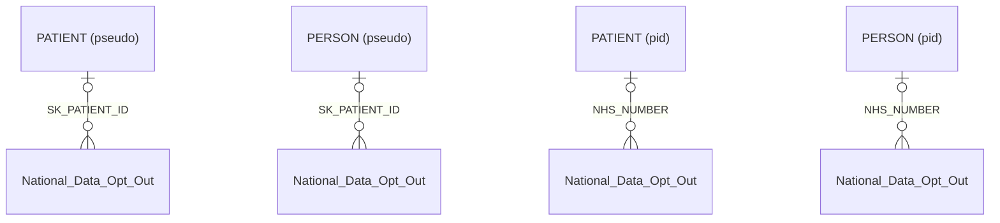

# National Data Opt Out

- [National Data Opt Out](#national-data-opt-out)
  - [Overview](#overview)
  - [Columns](#columns)
    - [Preference Type](#preference-type)
    - [Preference Status](#preference-status)
  - [Entity relationships](#entity-relationships)
  - [Using the opt-out register](#using-the-opt-out-register)
  - [Notes](#notes)
    - [Caching](#caching)
    - [Scope](#scope)
    - [Filtering](#filtering)

> [!NOTE]
> This table currently holds only the patient data sharing data choices for the National Data Opt-Out **only** - hence its current name.
>  It is anticipated that this table will be extended to include the Local Data Opt-Out, at which point an object name change will be required.
>  Candidate names under consideration are:
>
> - patient_sharing_choices
> - patient_opt_outs
> - patient_privacy_choices

> [!WARNING]
> The records in this table are presented as a status over time, similar to a type-2 slowly changing dimension, allowing for a fully auditable picture of the patients opt-out choices.
>  **For the purposes of applying opt-outs you must only use the latest status of a patients choice** (using `IS_LATEST=true`)
>  The history is provided to faciliate audit checks on what was disclosed to an onward consumer on a given date only.

## Overview

> [!NOTE]
> Please see related articles on the National Data OPt-Out and its application for your use case:
>
> - [National Data Opt Out (NHS Digital)](https://digital.nhs.uk/services/national-data-opt-out)
> - [Operational Policy Guidance (NHS Digital)](https://digital.nhs.uk/services/national-data-opt-out/operational-policy-guidance-document)
> - [Understanding the national data opt-out](https://digital.nhs.uk/services/national-data-opt-out/understanding-the-national-data-opt-out)
> - [Opt-out dashboard (NHS Digital)](https://digital.nhs.uk/dashboards/national-data-opt-out-open-data)
> - [Information for GP practice (NHS Digital)](https://digital.nhs.uk/services/national-data-opt-out/information-for-gp-practices)
> - [Compliance with the national data opt out (NHS Digital)](https://digital.nhs.uk/services/national-data-opt-out/compliance-with-the-national-data-opt-out)

The national data opt-out applies to the disclosure of confidential patient information for purposes beyond individual care across the health and adult social care system in England.

The national data opt-out is aligned with the authorisation used for sharing a patient’s data in accordance with the common law duty of confidentiality (CLDC). In broad terms the national data opt-out applies unless there is a mandatory legal requirement or an overriding public interest for the data to be shared.

The opt-out does **not apply** when:

- the individual has consented to the sharing of their data
- **or** where the data is anonymised in line with the Information Commissioner’s Office (ICO) Code of Practice on Anonymisation (including some pseudonymisation strategies)

The national data opt-out **does not apply** to information that is anonymised in line with the Information Commissioner’s Office (ICO) Code of Practice (CoP) on Anonymisation or is aggregate or count type data.  It should be noted that the ICO Code of Practice covers a range of anonymised data including aggregate data for publication to the world at large through to de-identified data for limited access.  De-identified data for limited access requires a suite of additional organisational and technical control measures to ensure that the risk of re-identification is remote, for example access controls, purpose limitation, staff confidentiality agreements, contractual controls etc.
 *(source: NHS Digital operational policy guidance: section 2.4)*

A national data opt-out continues to be maintained and applied for an individual after they have died. Health and adult social care organisations are expected to continue to apply opt-outs for deceased patients and their opt-out will continue to be held on the Spine repository

## Columns

| Column Name | Data Type (Size) | Description | PK/FK | masking policy | Compass equivalent |
| --- | --- | --- | --- | --- | --- |
| `LDS_BUSINESS_ID` | `UUID` | unique identifier | PK | | |
| `LDS_RECORD_ID` | `UUID` | source record identifier | | | |
| `SK_PATIENT_ID` | `NUMBER` | NHS number pseudonym | FK -> [Patient](Patient.md).SK_PATIENT_ID | visible for pseudo views only | |
| `NHS_NUMBER` | `NUMBER` | patients NHS number | FK -> [Patient](Patient.md).NHS_NUMBER | visible for pid views only | |
| `PREFERENCE_TYPE` | `VARCHAR` | The category / type of data opt-out or sharing exclusion | | | |
| `PREFERENCE_STATUS` | `VARCHAR` | The patient selected choice within that opt-out choice / exclusion | | | |
| `LDS_IS_DELETED` | `BOOLEAN` | true where records is soft-deleted | | | |
| `EFFECTIVE_FROM` | `TIMESTAMP_NTZ` | The datetime from which this patients choice is known to be effective from | | | |
| `EFFECTIVE_TO` | `TIMESTAMP_NTZ` | The datetime from which this patients choice is known to be effective to (replaced/altered) | | | |
| `IS_LATEST` | `BOOLEAN` | true where this status is the latest for the patient and preference type | | | |

### Preference Type

At present this will only contain a single value: `National Data Opt-Out`

### Preference Status

This will contain one of the two values below:

| status | meaning |
| --- | --- |
| `Opt-Out` | The patient has an active Opt-Out in this time period and their data must not be disclosed except where consenting or in-line with the ICO policy on anonymisation |
| `Opt-In` | The patient has rescinded an Opt-Out and their data can now be disclosed in identifiable form for secondary use purposes |

## Entity relationships

## Using the opt-out register

> [!TIP]
> Please review the national guidance on the National Data Opt-Out and seek local IG advise for your specific use case. The advise below is highly generalised and will not reflect your local nuances.

The national data opt-out applies at the point of disclosure of data to another purpose, or to another entity. The other entity does not need to be a different organisation, but may have access to other datasets or would apply other processes or operations to the data than the disclosing party.

The patients status at the time of disclosure is the defining attribute. When determnining which patients should be excluded from disclosures, users are advised to only consider the `IS_LATEST=true` set as of the date of disclosure - **and not of the date of the recorded event being disclosed**

## Notes

### Caching

Please note that this table represents a cached copy of the National Data Opt-Out status for patients across London, the cache will be kept up to date and within the permitted cache latency (7 days).

Users must not retain their own cache of this data for onward use, nor share the contents of this data.

### Scope

The list of patients within the National Data Opt Out table represents registered patients across london from participating practices within the LDS GP data extraction service.

It will **not** include:

- Patients recieving secondary care within the London service who are registered outside of London
- Patients registered with London GP Practices who are not supplying data to the GP data processing services
- Patients within London who are unregistered

Any use of this register against datasets beyond the GP data sources will risk inappropriately including patients who have a national data opt-out but are not contained or tracked within this register.

An example of this could be using this NDOO register against a commissioning data set such as secondary-user-services emergency care data set (SUS - ECDS) which would include patients from out of area under the care of London providers - these patients are not tracked for NDOO status.

### Filtering

The national opt out data is supplied to consumers as a declared state without filtering by consuming commissioner.

The accepted rationale is that this preference should be applied (where appropriate and required) to any record, whereever that record may reside, and if commissioners are in receipt of a record relating to this patient - for whatever reason - the patient choice should be honored.
