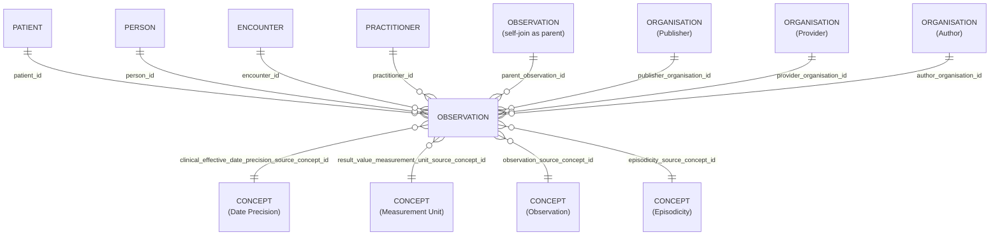

# Observation

## Overview

Measurements and simple assertions made about a patient, device or other subject

Observations are a central element in healthcare, used to support diagnosis, monitor progress, determine baselines and patterns and even capture demographic characteristics, as well as capture results of tests performed on products, substances, and environments. Most observations are simple name/value pair assertions with some metadata, but some observations group other observations together logically, or even are multi-component observations. Note that the DiagnosticReport resource provides a clinical or workflow context for a set of observations and the Observation resource is referenced by DiagnosticReport to represent laboratory, imaging, and other clinical and diagnostic data to form a complete report.

Uses for the Observation resource include:

- Vital signs such as body weight, blood pressure, and temperature
- Laboratory Data like blood glucose, or an estimated GFR
- Imaging results like bone density or fetal measurements
- Clinical Findings1 such as abdominal tenderness
- Device measurements such as EKG data
- Device Settings such as mechanical ventilator parameters.
- Clinical assessment tools such as APGAR or a Glasgow Coma Score
- Personal characteristics: such as eye-color
- Social history like tobacco use, family support, or cognitive status
- Core characteristics like pregnancy status, or a death assertion
- Product quality tests such as pH, Assay, Microbial limits, etc. on product, substance, or an environment.
  
1_The boundaries between clinical findings and disorders remain a challenge in medical ontology._

## Columns
| Column Name | Data Type (Size) | Description | PK/FK | Compass Equivalent |
| --- | --- | --- | --- | --- |
| `ID` | `UUID` | id. | PK | `id` |
| `LDS_SOURCE_RECORD_ID` | `UUID` | lds record id. | | -- |
| `PATIENT_ID` | `UUID` | patient id. | FK -> [Patient](Patient.md).ID | `patient_id` |
| `PERSON_ID` | `UUID` | person id. | FK -> [Person](Person.md).ID | `person_id` |
| `PUBLISHER_ORGANISATION_ID` | `UUID` | organisation id of the record publisher1. | FK -> [Organisation](Organisation.md).ID | `organization_id` |
| `PROVIDER_ORGANISATION_ID` | `UUID` | organisation id of the care provider1. | FK -> [Organisation](Organisation.md).ID | `organization_id` |
| `AUTHOR_ORGANISATION_ID` | `UUID` | organisation id record author1. | FK -> [Organisation](Organisation.md).ID | `organization_id` |
| `ENCOUNTER_ID` | `UUID` | encounter id. | FK -> [Encounter](Encounter.md).ID | `encounter_id` |
| `PRACTITIONER_ID` | `UUID` | practitioner id. | FK -> [Practitioner](Practitioner.md).ID | `practitioner_id` |
| `PARENT_OBSERVATION_ID` | `UUID` | parent observation id. | FK --> [Observation](Observation.md).ID | `parent_observation_id` |
| `CLINICAL_EFFECTIVE_DATE` | `DATE` | clinical effective date. | | `clinical_effective_date` |
| `CLINICAL_EFFECTIVE_DATE_PRECISION_SOURCE_CONCEPT_ID` | `UUID` | date precision concept id. | FK --> [Concept](Concept.md).ID | `date_precision_concept_id` |
| `RESULT_VALUE` | `FLOAT` | result value. | | `result_value` |
| `RESULT_VALUE_UNITS_SOURCE_CONCEPT_ID` | `UUID` | result value unit concept id. | FK --> [Concept](Concept.md).ID | `result_value_units_concept_id` |
| `RESULT_DATE` | `DATE` | result date. | | `result_date` |
| `RESULT_TEXT` | `VARCHAR` | result text. | | `result_text` |
| `IS_PROBLEM` | `BOOLEAN` | is problem. | | `is_problem` |
| `IS_REVIEW` | `BOOLEAN` | is review. | | `is_review` |
| `PROBLEM_END_DATE` | `DATE` | problem end date. | | `problem_end_date` |
| `OBSERVATION_SOURCE_CONCEPT_ID` | `UUID` | observation source concept id. | FK --> [Concept](Concept.md).ID | `non_core_concept_id` |
| `AGE_AT_EVENT` | `NUMBER` | patient age, in whole years, at clinical effective date of event. | | `age_at_event` |
| `AGE_AT_EVENT_BABY` | `NUMBER` | patient age, in categorised groups for ages under 1 year, at clinical effective date of event.2 | | -- |
| `AGE_AT_EVENT_NEONATE` | `NUMBER` | patient age, in days under 27 days old, at clinical effective date.2 | | `age_at_event_neonate` |
| `EPISODICITY_SOURCE_CONCEPT_ID` | `UUID` | episodicity concept id. | FK --> [Concept](Concept.md).ID | `episodicity_concept_id` |
| `IS_PRIMARY` | `BOOLEAN` | is primary. | | `is_primary` |
| `DATE_RECORDED` | `TIMESTAMP_NTZ` | date recorded. | | `date_recorded` |
| `IS_PROBLEM_DELETED` | `BOOLEAN` | is problem deleted. | | -- |
| `IS_CONFIDENTIAL` | `BOOLEAN` | is confidential. | | -- |
| `LDS_IS_DELETED` | `BOOLEAN` | lds is deleted. | | -- |
| `PUBLISHER_ORGANISATION_CODE` | `VARCHAR` | The Organisation Data Service (ODS) code of the organisation who, acting as the data controller, publishes the data. | | `organization_id` |
| `SOURCE_EXTRACTION_DATE` | `TIMESTAMP` | source extraction date. | | -- |
| `LDS_TRANSFORM_DATETIME` | `TIMESTAMP_LTZ` | lds transform date time. | | -- |

1. See the [schema notes section on publisher, provider, author organisation definitions](_schema_notes.md#provider-author-publisher-organisation-id)
1. Baby and Neonatal ages are null where patient age is byeond scope (older than) upper limit.

## Entity Relationships

> [!NOTE]
> Diagrams below are currently indicative. The precise optional/mandatory nature of certain relationships remains to be clarified.

| Related Table | Relationship Type | Local Key | Related Key | Notes |
| --- | --- | --- | --- | --- |
| [Patient](Patient.md) | FK | PATIENT_ID | ID | |
| [Person](Person.md) | FK | PERSON_ID | ID | |
| [Practitioner](Practitioner.md) | FK | PRACTITIONER_ID | ID | |
| [Encounter](Encounter.md) | FK | ENCOUNTER_ID | ID | |
| [Observation](Observation.md) | SELF | PARENT_OBSERVATION_ID | ID | self-join as parent in hierarchy |
| [Organisation](Organisation.md) | FK | PUBLISHER_ORGANISATION_ID | ID | |
| [Organisation](Organisation.md) | FK | PROVIDER_ORGANISATION_ID | ID | |
| [Organisation](Organisation.md) | FK | AUTHOR_ORGANISATION_ID | ID | |
| [Concept](Concept.md) | FK | CLINICAL_EFFECTIVE_DATE_PRECISION_SOURCE_CONCEPT_ID | ID | |
| [Concept](Concept.md) | FK | RESULT_VALUE_UNIT_CONCEPT_ID | ID | |
| [Concept](Concept.md) | FK | OBSERVATION_SOURCE_CONCEPT_ID | ID | |
| [Concept](Concept.md) | FK | EPISODICITY_CONCEPT_ID | ID | |

## Notes
