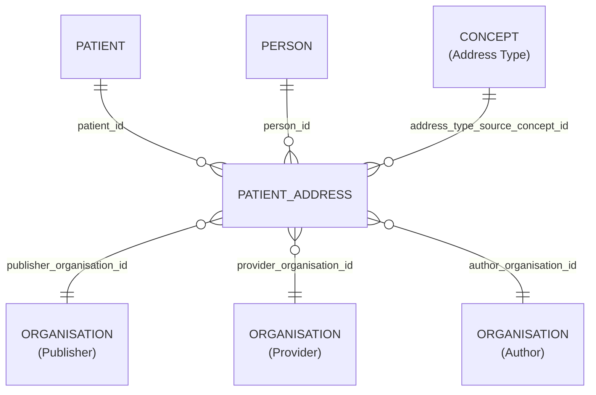

# Patient_Address

- [Patient\_Address](#patient_address)
  - [Overview](#overview)
  - [Columns](#columns)
    - [pseudo view](#pseudo-view)
  - [Entity Relationships](#entity-relationships)
  - [Notes](#notes)

## Overview

Related FHIR resource: [🔥 Patient.address](https://build.fhir.org/patient-definitions.html#Patient.address)

Patient addresses with different uses or applicable periods.

## Columns

### pseudo view

| Column Name | Data Type (Size) | Description | PK/FK | Masking Policy | Compass Equivalent |
| --- | --- | --- | --- | --- | --- |
| `ID` | `UUID` | id. | | | `id` |
| `LDS_SOURCE_RECORD_ID` | `UUID` | Unique record identifier including file row number for deduplication. | | | -- |
| `PATIENT_ID` | `UUID` | patient id. | FK -> [Patient](Patient.md).ID | | `patient_id` |
| `PERSON_ID` | `UUID` | person id. | FK -> [Person](Person.md).ID | | `person_id` |
| `PUBLISHER_ORGANISATION_ID` | `UUID` | organisation id of the record publisher^1^. | FK -> [Organisation](Organisation.md).ID | | `organization_id` |
| `PROVIDER_ORGANISATION_ID` | `UUID` | organisation id of the care provider^1^. | FK -> [Organisation](Organisation.md).ID | | `organization_id` |
| `AUTHOR_ORGANISATION_ID` | `UUID` | organisation id record author^1^. | FK -> [Organisation](Organisation.md).ID | | `organization_id` |
| `IS_HOME_ADDRESS` | `BOOLEAN` | is home address. | | | -- |
| `ADDRESS_TYPE_SOURCE_CONCEPT_ID` | `UUID` | address type source concept id. | FK -> [Concept](Concept.md).ID | | `use_concept_id` |
| `ADDRESS_LINE_1` | `VARCHAR` | address line 1. | | ❌column removed | `address_line_1` |
| `ADDRESS_LINE_2` | `VARCHAR` | address line 2. | | ❌column removed | `address_line_2` |
| `ADDRESS_LINE_3` | `VARCHAR` | address line 3. | | ❌column removed | `address_line_3` |
| `ADDRESS_LINE_4` | `VARCHAR` | address line 4. | | ❌column removed | `address_line_4` |
| `CITY` | `VARCHAR` | city. | | ❌column removed | `city` |
| `POSTCODE` | `VARCHAR` | patient address postcode. | | #️⃣hashed | `postcode` |
| `START_DATE` | `DATE` | start date. | | | `start_date` |
| `END_DATE` | `DATE` | end date. | | | `end_date` |
| `LDS_IS_DELETED` | `BOOLEAN` | True if the record has been marked as deleted. | | | -- |
| `PUBLISHER_ORGANISATION_CODE` | `VARCHAR` | ODS code of the organisation who, acting as the data controller, permitted the release of data. | | | `organization_id` |
| `SOURCE_EXTRACTION_DATE` | `TIMESTAMP` | Timestamp extracted from source file name indicating extraction time. | | | -- |
| `LDS_TRANSFORM_DATETIME` | `TIMESTAMP` WITH TIME ZONE | lds transform date time. | | | -- |

## Entity Relationships

> [!NOTE]
> Diagrams below are currently indicative. The precise optional/mandatory nature of certain relationships remains to be clarified.

| Related Table | Relationship Type | Local Key | Related Key | Notes |
| --- | --- | --- | --- | --- |
| [Patient](Patient.md) | FK | PATIENT_ID | ID | |
| [Person](Person.md) | FK | PERSON_ID | ID | |
| [Organisation](Organisation.md) | FK | PUBLISHER_ORGANISATION_ID | ID | |
| [Organisation](Organisation.md) | FK | PROVIDER_ORGANISATION_ID | ID | |
| [Organisation](Organisation.md) | FK | AUTHOR_ORGANISATION_ID | ID | |
| [Concept](Concept.md) | FK | ADDRESS_TYPE_SOURCE_CONCEPT_ID | ID | |

## Notes
