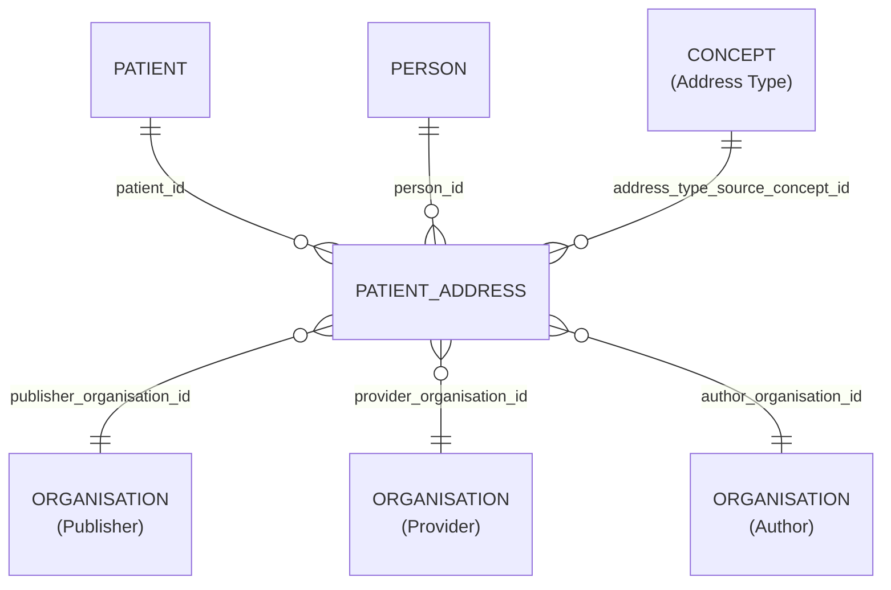

# Patient_Address

## Overview
Transformed model for Patient_Address. Includes transformed fields and lineage columns from Versioned models.

## Columns 

### pseudo view

| Column Name | Data Type (Size) | Description | PK/FK | Note |
|---|---|---|---|---|
| `ID` | `UUID` | id. |  |
| `LDS_SOURCE_RECORD_ID` | `UUID` | Unique record identifier including file row number for deduplication. |  |
| `PATIENT_ID` | `UUID` | patient id. | FK -> [Patient](Patient.md).ID |
| `PERSON_ID` | `UUID` | person id. | FK -> [Person](Person.md).ID |
| `PUBLISHER_ORGANISATION_ID` | `UUID` | organisation id of the record publisher^1^. | FK -> [Organisation](Organisation.md).ID |
| `PROVIDER_ORGANISATION_ID` | `UUID` | organisation id of the care provider^1^. | FK -> [Organisation](Organisation.md).ID |
| `AUTHOR_ORGANISATION_ID` | `UUID` | organisation id record author^1^. | FK -> [Organisation](Organisation.md).ID |
| `IS_HOME_ADDRESS` | `BOOLEAN` | is home address. |  |
| `ADDRESS_TYPE_SOURCE_CONCEPT_ID` | `UUID` | address type source concept id. | FK -> [Concept](Concept.md).ID |
| `ADDRESS_LINE_1` | `VARCHAR` | address line 1. |  | only available in PCD view |
| `ADDRESS_LINE_2` | `VARCHAR` | address line 2. |  | only available in PCD view |
| `ADDRESS_LINE_3` | `VARCHAR` | address line 3. |  | only available in PCD view |
| `ADDRESS_LINE_4` | `VARCHAR` | address line 4. |  | Honly available in PCD view |
| `CITY` | `VARCHAR` | city. |  | only available in PCD view |
| `POSTCODE` | `VARCHAR` | patient address postcode. |  |
| `START_DATE` | `DATE` | start date. |  |
| `END_DATE` | `DATE` | end date. |  |
| `LDS_IS_DELETED` | `BOOLEAN` | True if the record has been marked as deleted. |  |
| `PUBLISHER_ORGANISATION_CODE` | `VARCHAR` | ODS code of the organisation who, acting as the data controller, permitted the release of data. |  |
| `SOURCE_EXTRACTION_DATE` | `TIMESTAMP` | Timestamp extracted from source file name indicating extraction time. |  |
| `LDS_TRANSFORM_DATETIME` | `TIMESTAMP` WITH TIME ZONE | lds transform date time. |  |

## Entity Relationships

| Related Table | Relationship Type | Local Key | Related Key | Notes |
|---|---|---|---|---|
| [Patient](Patient.md) | FK | PATIENT_ID | ID |  |
| [Person](Person.md) | FK | PERSON_ID | ID |  |
| [Organisation](Organisation.md) | FK | PUBLISHER_ORGANISATION_ID | ID |  |
| [Organisation](Organisation.md) | FK | PROVIDER_ORGANISATION_ID | ID |  |
| [Organisation](Organisation.md) | FK | AUTHOR_ORGANISATION_ID | ID |  |
| [Concept](Concept.md) | FK | ADDRESS_TYPE_SOURCE_CONCEPT_ID | ID | |

## Notes

