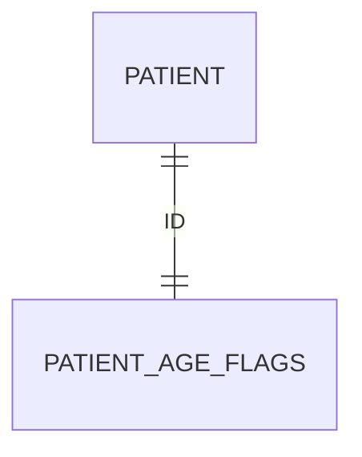

# Patient_Age_Flags

- [Patient\_Age\_Flags](#patient_age_flags)
  - [Overview](#overview)
  - [Columns](#columns)
  - [Entity Relationships](#entity-relationships)

## Overview

Related FHIR resource: _not applicable_

This table allows for the service to provide specific age related flags. These flags can be used by pseudonymised access users to determine if the patient is within age eligibility criteria for specific treatments or pathways.

## Columns

| Column Name | Data Type (Size) | Description | PK/FK | Masking Policy | Compass Equivalent |
| --- | --- | --- | --- | --- | --- |
| `ID` | `UUID` | The Patient ID | FK ->[PATIENT](Patient.md).ID | - | - |
| `PUBLISHER_ORGANISATION_CODE` | `VARCHAR` | record owner organisation code. | - | - | - |
| `IS_LESS_THAN_8_WEEKS_OLD` | `BOOLEAN` | Is the patient under 8 weeks of age today | - | - | - |
| `IS_LESS_THAN_12_WEEKS_OLD` | `BOOLEAN` | Is the patient under 12 weeks of age today | - | - | - |
| `IS_LESS_THAN_15_WEEKS_OLD` | `BOOLEAN` | Is the patient under 15 weeks of age today | - | - | - |
| `IS_LESS_THAN_16_WEEKS_OLD` | `BOOLEAN` | Is the patient under 16 weeks of age today | - | - | - |
| `IS_LESS_THAN_24_WEEKS_OLD` | `BOOLEAN` | Is the patient under 24 weeks of age today | - | - | - |
| `IS_LESS_THAN_6_MONTHS_OLD` | `BOOLEAN` | Is the patient under 6 months of age today | - | - | - |
| `IS_LESS_THAN_8_MONTHS_OLD` | `BOOLEAN` | Is the patient under 8 months of age today | - | - | - |
| `IS_LESS_THAN_12_MONTHS_OLD` | `BOOLEAN` | Is the patient under 12 months of age today | - | - | - |
| `IS_LESS_THAN_18_MONTHS_OLD` | `BOOLEAN` | Is the patient under 18 months of age today | - | - | - |
| `IS_LESS_THAN_1000_DAYS_OLD` | `BOOLEAN` | Is the patient under 1000 days of age today | - | - | - |
| `IS_BETWEEN_1_TO_18_MONTHS_OLD` | `BOOLEAN` | Is the patient between 1 to 18 months of age today | - | - | - |
| `IS_LESS_THAN_2_YEARS_OLD` | `BOOLEAN` | Is the patient under 2 years of age today | - | - | - |
| `IS_BETWEEN_3_TO_4_YEARS_OLD` | `BOOLEAN` | Is the patient between 3 to 4 years of age today | - | - | - |
| `IS_LESS_THAN_5_YEARS_OLD` | `BOOLEAN` | Is the patient under 5 years of age today | - | - | - |
| `IS_BETWEEN_11_TO_18_YEARS_OLD` | `BOOLEAN` | Is the patient between 11 to 18 years of age today | - | - | - |

## Entity Relationships

> [!NOTE]
> Diagrams below are currently indicative. The precise optional/mandatory nature of certain relationships remains to be clarified.

| Related Table | Relationship Type | Local Key | Related Key | Notes |
| --- | --- | --- | --- | --- |
| [Patient](Patient.md) | FK | ID | ID | one-to-one relation |
