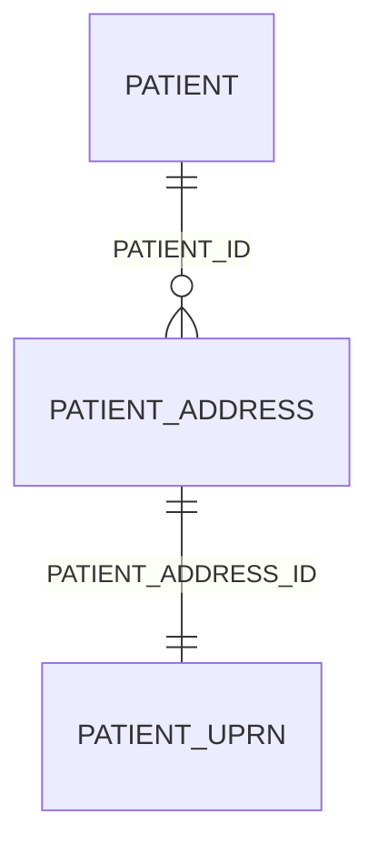

# Patient_UPRN

## Overview

Provides a resolved Unique Property Reference Number (or pseudonym thereof) against the patient address.

## Columns

| Column Name | Data Type (Size) | Description | PK/FK | masking policy | Compass equivalent |
| --- | --- | --- | --- | --- | --- |
| `PATIENT_ADDRESS_ID` | `UUID` | the patient address id | FK ->[Patient_Address](Patient_Address).ID | | `patient_address.id` |
| `STATUS` | `VARCHAR` | (Success/Null) Whether the attempt to match the uprn was a success (does not indicate whether the match to a uprn was a success, only the attempt) | | | `status`1 |
| `MATCHED` | `VARCHAR` | (True/False) Whether a UPRN match was found | | | |
| `UPRN` | `VARCHAR` | The unique property reference number | | #️⃣ hashed | `uprn`1 |
| `POSTCODE_QUALITY` | `VARCHAR` | The quality of the postcode within the supplied input address | | | |
| `QUALIFIER` | `VARCHAR` | AddressBase Premiums encoding for the type of matched address (residential, child) | | | `qualifier`1 |
| `CLASSIFICATION` | `VARCHAR` | AddressBase Premium encoding for the property classification2 | | | `uprn_property_classification`1 |
| `ALGORITHM` | `VARCHAR` | the algorithm used to achieve the best address match | | | `match_rule`1 |
| `MATCH_PATTERN` | `VARCHAR` | the matched pattern structure | | | `match_pattern...`3 |
| `ERROR_MESSAGE` | `VARCHAR` | errors reported back from the matching process | | | |
| `PUBLISHER_ORGANISATION_CODE` | `VARCHAR` | The publisher of the linked patient address record | | | |

1. Compass equivalent table `patient_address_match`
1. For address clasification codes see: [OS Docs, Address Classification Code Value](https://docs.os.uk/osngd/code-lists/code-lists-overview/addressclassificationcodevalue)
1. `MATCH_PATTERN` contains json construction of assign `match_pattern_` prefixed columns

## Entity Relations

| Related Table | Relationship Type | Local Key | Related Key | Notes |
| --- | --- | --- | --- | --- |
| [Patient_Address](Patient_Address.md) | FK | PATIENT_ADDRESS_ID | ID | |

## Notes

- the `MATCHED` column may be re-typed for a boolean and labelled as `IS_MATCHED`
