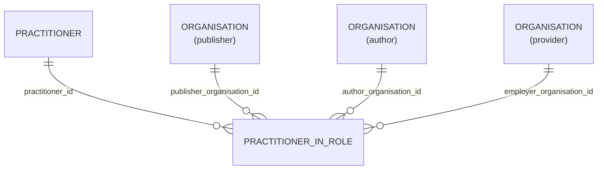

# Practitioner_In_Role

- [Practitioner\_In\_Role](#practitioner_in_role)
  - [Overview](#overview)
  - [Columns](#columns)
  - [Entity Relationships](#entity-relationships)
  - [Notes](#notes)

## Overview

Linked FHIR resource [🔥 PractitionerRole](https://build.fhir.org/practitionerrole.html)

A specific set of Roles/Locations/specialties/services that a practitioner may perform at an organisation for a period of time

The PractitionerRole describes the types of services that practitioners provide for an organisation at specific location(s).

The PractitionerRole resource can be used in multiple contexts including:

Provider Registries where it indicates what a practitioner can perform for an organisation (may indicate multiple healthcareservices, locations, and roles)
In a Clinical system where it indicates the role, healthcareservice and location details associated with a practitioner that are applicable to the healthcare event (e.g. Observation, Appointment, Condition, CarePlan)

In a Clinical system as a point of reference rather than an event, such as a patient's preferred general practitioner (at a specific clinic)
The code, specialty, location, contact and healthcareService properties can be repeated if required in other instances of the PractitionerRole. Some systems record a collection of service values for a single location, others record the single service and the list of locations it is available. Both are acceptable options for representing this data.

Where availability, telecom, or other details are not the same across all healthcareservices, or locations a separate PractitionerRole instance should be created.

Many resource types have a choice of a reference to either a Practitioner resource or a PractitionerRole resource. The latter provides organisational context for the practitioners participation when it is required, otherwise a direct reference to the practitioner may be used.

Many implementations may choose to profile the PractitionerRole to a single location/role/healthcareservice for their specific usage.

As the property that references a PractitionerRole typically has a specific context, the code on the PractitionerRole having duplicate code values is not a big concern (and is used for discovery where required).

e.g. These references are all very context specific: Patient.GeneralPractitioner, CarePlan.reported, CarePlan.contributor, Appointment.participant (through the participant.role), Immunization.informationSource, Immunization.performer (through the performer.function property)

For use cases where an organisation has activities where a practitioner is not defined/pre-allocated for a specific role (e.g. an un-named surgeon at XYZ Hospital), a PractitionerRole resource can be used with an empty Practitioner property, and the other relevant role properties populated - i.e. code, organisation.

## Columns

| Column Name | Data Type (Size) | Description | PK/FK |
| --- | --- | --- | --- |
| `ID` | `VARCHAR` | id. | |
| `LDS_SOURCE_RECORD_ID` | `UUID` | Unique record identifier including file row number for deduplication. | |
| `PUBLISHER_ORGANISATION_ID` | `UUID` | organisation id of the record publisher1. | FK -> [Organisation](Organisation.md).ID |
| `AUTHOR_ORGANISATION_ID` | `UUID` | organisation id record author1. | FK -> [Organisation](Organisation.md).ID |
| `PRACTITIONER_ID` | `UUID` | practitioner id. | FK -> [Practitioner](Practitioner.md).ID |
| `EMPLOYER_ORGANISATION_ID` | `UUID` | organisation id of the employing organisation for this record. | FK -> [Organisation](Organisation.md).ID |
| `ROLE_CODE` | `VARCHAR` | role code. | |
| `ROLE` | `VARCHAR` | role. | |
| `DATE_EMPLOYMENT_START` | `DATE` | date employment start. | |
| `DATE_EMPLOYMENT_END` | `DATE` | date employment end. | |
| `LDS_IS_DELETED` | `BOOLEAN` | True if the record has been marked as deleted. | |
| `PUBLISHER_ORGANISATION_CODE` | `VARCHAR` | ODS code of the owning organisation for this record. | |
| `SOURCE_EXTRACTION_DATE` | `TIMESTAMP` | Timestamp extracted from source file name indicating extraction time. | |
| `LDS_TRANSFORM_DATETIME` | `TIMESTAMP_LTZ` | lds transform date time. | |

## Entity Relationships

| Related Table | Relationship Type | Local Key | Related Key | Notes |
| --- | --- | --- | --- | --- |
| [Organisation](Organisation.md) | FK | PUBLISHER_ORGANISATION_ID | ID | |
| [Organisation](Organisation.md) | FK | PROVIDER_ORGANISATION_ID | ID | |
| [Organisation](Organisation.md) | FK | EMPLOYER_ORGANISATION_ID | ID | |
| [Practitioner](Practitioner.md) | FK | PRACTITIONER_ID | ID | |

## Notes
