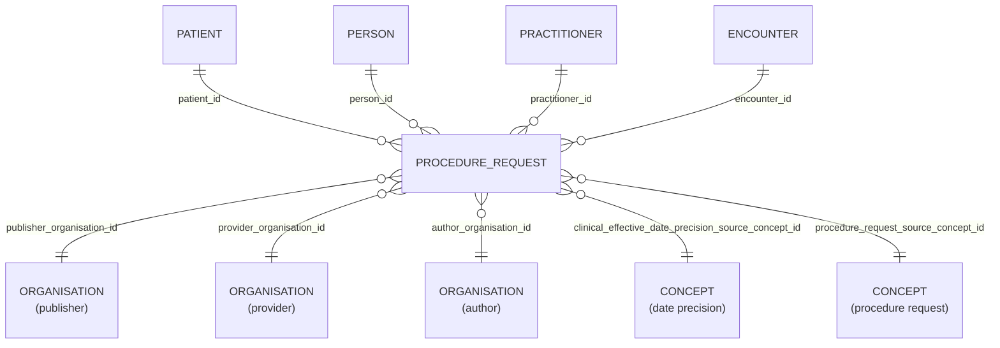

# Procedure_Request

- [Procedure\_Request](#procedure_request)
  - [Overview](#overview)
  - [Columns](#columns)
  - [Entity relationships](#entity-relationships)
  - [Notes](#notes)

## Overview

Linked FHIR resource: [Procedure Request](https://hl7.org/fhir/STU3/procedurerequest.html)

> [!WARNING]
> The linked FHIR resource is from FHIR Release 3, which is now deprecated.
>  HL7 International consolidated all procedure requests, diagnostic orders, and service requests into a single, unified resource called `ServiceRequest`
>  See [ServiceRequest](https://hl7.org/fhir/servicerequest.html)

ProcedureRequest is a record of a request for a procedure to be planned, proposed, or performed, as distinguished by the ProcedureRequest.intent field value, with or on a patient. Examples of procedures include diagnostic tests/studies, endoscopic procedures, counseling, biopsies, therapies (e.g., physio-, social-, psychological-), (exploratory) surgeries or procedures, exercises, and other clinical interventions. Procedures may be performed by a healthcare professional, a friend or relative or in some cases by the patient themselves. The procedure will lead to either a Procedure or DiagnosticReport, that in turn may reference one or more Observations, that summarizes the performance of the procedures and associated documentation such as observations, images, findings that are relevant to the treatment/management of the subject.

The principal intention of ProcedureRequest is to support ordering procedures for one patient (which includes non-human patients in veterinary medicine). However, in many contexts, healthcare related processes include performing diagnostic investigations on groups of subjects, devices involved in the provision of healthcare, and even environmental locations such as ducts, bodies of water, etc. ProcedureRequest supports all these usages. The procedure request may represent an order that is entered by a practitioner in a CPOE system as well as a proposal made by a clinical decision support (CDS) system based on a patient's clinical record and context of care. Planned procedures referenced by a CarePlan may also be represented by this resource.

The general work flow that this resource facilitates is that a clinical system creates a procedure request. The procedure request is then accessed by or exchanged with a system, perhaps via intermediaries, that represents an organisation (e.g., diagnostic or imaging service, surgical team, physical therapy department) that can perform the procedure. The organisation receiving the procedure request will, after it accepts the request, update the request as the work is performed, and then finally issue a report that references the requests that it fulfilled.

The ProcedureRequest resource allows requesting only a single procedure. If a workflow requires requesting multiple procedures simultaneously, this is done using multiple instances of this resource. These instances can be linked in different ways, depending on the needs of the workflow. For guidance, refer to the Request pattern

## Columns

| Column Name | Data Type (Size) | Description | PK/FK |
| --- | --- | --- | --- |
| `ID` | `UUID` | id. | PK |
| `LDS_SOURCE_RECORD_ID` | `UUID` | lds record id. | - |
| `PATIENT_ID` | `UUID` | patient id. | FK -> [Patient](Patient.md).ID |
| `PERSON_ID` | `UUID` | person id. | FK -> [Person](Person.md).ID |
| `PUBLISHER_ORGANISATION_ID` | `UUID` | linked organisation id publisher. see [schema notes: publisher, provider, author](_schema_notes.md#provider-author-publisher-organisation-id) | FK -> [ORANGANISATION](Organisation.md).ID |
| `PROVIDER_ORGANISATION_ID` | `UUID` | linked organisation id provider. see [schema notes: publisher, provider, author](_schema_notes.md#provider-author-publisher-organisation-id) | FK -> [ORANGANISATION](Organisation.md).ID |
| `AUTHOR_ORGANISATION_ID` | `UUID` | linked organisation id author. see [schema notes: publisher, provider, author](_schema_notes.md#provider-author-publisher-organisation-id) | FK -> [ORANGANISATION](Organisation.md).ID |
| `PRACTITIONER_ID` | `UUID` | practitioner id. | FK -> [Practitioner](Practitioner.md).ID |
| `ENCOUNTER_ID` | `UUID` | encounter id. | FK -> [Encounter](Encounter.md).ID |
| `CLINICAL_EFFECTIVE_DATE` | `DATE` | clinical effective date. | - |
| `CLINICAL_EFFECTIVE_DATE_PRECISION_SOURCE_CONCEPT_ID` | `UUID` | date precision concept id. | [Concept](Concept.md).CONCEPT_ID |
| `DATE_RECORDED` | `TIMESTAMP` | date recorded. | - |
| `DESCRIPTION` | `VARCHAR` | description. | - |
| `PROCEDURE_REQUEST_SOURCE_CONCEPT_ID` | `UUID` | procedure request source concept id. | [Concept](Concept.md).CONCEPT_ID |
| `AGE_AT_EVENT` | `NUMBER` | patient age, in whole years, at clinical effective date of event. | - |
| `AGE_AT_EVENT_BABY` | `NUMBER` | patient age, in categorised groups for ages under 1 year, at clinical effective date of event. NULL where patient is over 1 years old. | - |
| `AGE_AT_EVENT_NEONATE` | `NUMBER` | patient age, in days under 27 days old, at clinical effective date. NULL where patient is over 27 days old. | - |
| `IS_CONFIDENTIAL` | `BOOLEAN` | is confidential. | - |
| `LDS_IS_DELETED` | `BOOLEAN` | standardised representation of soft-deletes. | - |
| `PUBLISHER_ORGANISATION_CODE` | `VARCHAR` | The Organisation Data Service (ODS) code of the organisation who, acting as the data controller, publishes the data. | - |
| `SOURCE_EXTRACTION_DATE` | `TIMESTAMP_NTZ` | The timestamp when the record was supplied to, or acquired by, LDS. | - |
| `LDS_TRANSFORM_DATETIME` | `TIMESTAMP_NTZ` | The timestamp when the record was transformed by LDS into OLIDS. | - |

## Entity relationships

> [!NOTE]
> Diagrams below are currently indicative. The precise optional/mandatory nature of certain relationships remains to be clarified.

| Related Table | Relationship Type | Local Key | Related Key | Notes |
| --- | --- | --- | --- | --- |
| [Patient](Patient.md) | FK | PATIENT_ID | ID | - |
| [Person](Person.md) | FK | PERSON_ID | ID | - |
| [Practitioner](Practitioner.md) | FK | PRACTITIONER_ID | ID | - |
| [Encounter](Encounter.md) | FK | ENCOUNTER_ID | ID | - |
| [Organisation](Organisation.md) | FK | PUBLISHER_ORGANISATION_ID | ID | - |
| [Organisation](Organisation.md) | FK | PROVIDER_ORGANISATION_ID | ID | - |
| [Organisation](Organisation.md) | FK | AUTHOR_ORGANISATION_ID | ID | - |
| [Concept](Concept.md) | FK | CLINICAL_EFFECTIVE_DATE_PRECISION_SOURCE_CONCEPT_ID | CONCEPT_ID | - |
| [Concept](Concept.md) | FK | PROCEDURE_REQUEST_SOURCE_CONCEPT_ID | CONCEPT_ID | - |

## Notes
