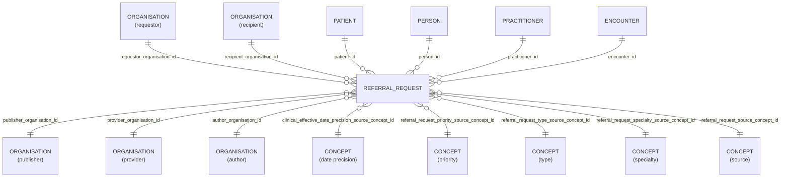

# Referral_Request

- [Referral\_Request](#referral_request)
  - [Overview](#overview)
  - [Columns](#columns)
  - [Entity Relationships](#entity-relationships)
  - [Notes](#notes)

## Overview

Linked FHIR resource: [Referral Request](https://hl7.org/fhir/STU3/referralrequest.html)

> [!WARNING]
> The linked FHIR resource is from FHIR Release 3, which is now deprecated.
>  HL7 International consolidated all procedure requests, diagnostic orders, and service requests into a single, unified resource called `ServiceRequest`
>  See [ServiceRequest](https://hl7.org/fhir/servicerequest.html)

ReferralRequest is one of the request resources in the FHIR workflow specification.

This resource is used to share relevant information required to support a referral request or a transfer of care request from one practitioner or organisation to another. It is intended for use when a patient is required to be referred to another provider for a consultation/second opinion and/or for short term or longer term management of one or more health issues or problems.

Examples include:

- Request for a consultation from a specialist
- Referral for support from community services
- District nursing services referral
- Request for aged care placement assessment
- Request for a pharmacist medication review
- Referral for physiotherapy or occupational therapy

ReferralRequest is also intended for use when there is a complete and more permanent transfer of care responsibility from one practitioner/organisation to another (for example, as in the case of requesting the transfer of care for a patient from an acute care setting to rehabilitation, aged care, or a skilled nursing facility).

## Columns

| Column Name | Data Type (Size) | Description | PK/FK |
| --- | --- | --- | --- |
| `ID` | `UUID` | id. | PK |
| `LDS_SOURCE_RECORD_ID` | `UUID` | lds record id. | - |
| `PATIENT_ID` | `UUID` | patient id. | FK -> [Patient](Patient.md).ID |
| `PERSON_ID` | `UUID` | person id. | FK -> [Person](Person.md).ID |
| `PUBLISHER_ORGANISATION_ID` | `UUID` | linked organisaiton id publisher. see [schema notes: publisher, provider, author](_schema_notes.md#provider-author-publisher-organisation-id) | FK -> [ORANGANISATION](Organisation.md).ID |
| `PROVIDER_ORGANISATION_ID` | `UUID` | linked organisaiton id provider. see [schema notes: publisher, provider, author](_schema_notes.md#provider-author-publisher-organisation-id) | FK -> [ORANGANISATION](Organisation.md).ID |
| `AUTHOR_ORGANISATION_ID` | `UUID` | linked organisaiton id author. see [schema notes: publisher, provider, author](_schema_notes.md#provider-author-publisher-organisation-id) | FK -> [ORANGANISATION](Organisation.md).ID |
| `ENCOUNTER_ID` | `UUID` | encounter id. | FK -> [Encounter](Encounter.md).ID |
| `PRACTITIONER_ID` | `UUID` | practitioner id. | FK -> [Practitioner](Practitioner.md).ID |
| `UNIQUE_BOOKING_REFERENCE_NUMBER` | `VARCHAR` | unique booking reference number. | |
| `CLINICAL_EFFECTIVE_DATE` | `DATE` | clinical effective date. | |
| `CLINICAL_EFFECTIVE_DATE_PRECISION_SOURCE_CONCEPT_ID` | `UUID` | date precision concept id. | FK->[Concept](Concept.md).CONCEPT_ID |
| `REQUESTER_ORGANISATION_ID` | `UUID` | requester organisation id. | [ORANGANISATION](Organisation.md).ID |
| `RECIPIENT_ORGANISATION_ID` | `UUID` | recipient organisation id. | [ORANGANISATION](Organisation.md).ID |
| `REFERRAL_REQUEST_PRIORITY_SOURCE_CONCEPT_ID` | `UUID` | referral request priority concept id. | FK->[Concept](Concept.md).CONCEPT_ID |
| `REFERRAL_REQUEST_TYPE_SOURCE_CONCEPT_ID` | `UUID` | referral request type concept id. | FK->[Concept](Concept.md).CONCEPT_ID |
| `REFERRAL_REQUEST_SPECIALTY_SOURCE_CONCEPT_ID` | `UUID` | referral request specialty concept id. | FK->[Concept](Concept.md).CONCEPT_ID |
| `MODE` | `VARCHAR` | mode. | |
| `IS_OUTGOING_REFERRAL` | `BOOLEAN` | is outgoing referral. | |
| `IS_REVIEW` | `BOOLEAN` | is review. | |
| `REFERRAL_REQUEST_SOURCE_CONCEPT_ID` | `UUID` | referral request source concept id. | FK->[Concept](Concept.md).CONCEPT_ID |
| `AGE_AT_EVENT` | `NUMBER` | age at event. | |
| `AGE_AT_EVENT_BABY` | `NUMBER` | age at event baby. | |
| `AGE_AT_EVENT_NEONATE` | `NUMBER` | age at event neonate. | |
| `RECORDED_DATE` | `TIMESTAMP` | recorded date. | |
| `LDS_IS_DELETED` | `BOOLEAN` | lds is deleted. | |
| `PUBLISHER_ORGANISATION_CODE` | `VARCHAR` | record owner organisation code. | |
| `SOURCE_EXTRACTION_DATE` | `TIMESTAMP` | source extraction date. | |
| `LDS_TRANSFORM_DATETIME` | `TIMESTAMP_NTZ` | The timestamp when the record was transformed by LDS into OLIDS. | - |
| `VALUE` | `DOUBLE` | value. | |
| `CODE_ID` | `VARCHAR` | code id. | |

## Entity Relationships

> [!NOTE]
> Diagrams below are currently indicative. The precise optional/mandatory nature of certain relationships remains to be clarified.

| Related Table | Relationship Type | Local Key | Related Key | Notes |
| --- | --- | --- | --- | --- |
| [Patient](Patient.md) | FK | PATIENT_ID | ID | |
| [Person](Person.md) | FK | PERSON_ID | ID | |
| [Practitioner](Practitioner.md) | FK | PRACTITIONER_ID | ID | |
| [Encounter](Encounter.md) | FK | ENCOUNTER_ID | ID | |
| [Organisation](Organisation.md) | FK | PUBLISHER_ORGANISATION_ID | ID | - |
| [Organisation](Organisation.md) | FK | PROVIDER_ORGANISATION_ID | ID | - |
| [Organisation](Organisation.md) | FK | AUTHOR_ORGANISATION_ID | ID | - |
| [Concept](Concept.md) | FK | CLINICAL_EFFECTIVE_DATE_PRECISION_SOURCE_CONCEPT_ID | CONCEPT_ID | - |
| [Concept](Concept.md) | FK | REFERRAL_REQUEST_SOURCE_CONCEPT_ID | CONCEPT_ID | - |
| [Concept](Concept.md) | FK | REFERRAL_REQUEST_PRIORITY_SOURCE_CONCEPT_ID | CONCEPT_ID | - |
| [Concept](Concept.md) | FK | REFERRAL_REQUEST_TYPE_SOURCE_CONCEPT_ID | CONCEPT_ID | - |
| [Concept](Concept.md) | FK | REFERRAL_REQUEST_SOURCE_CONCEPT_ID | CONCEPT_ID | - |

## Notes
