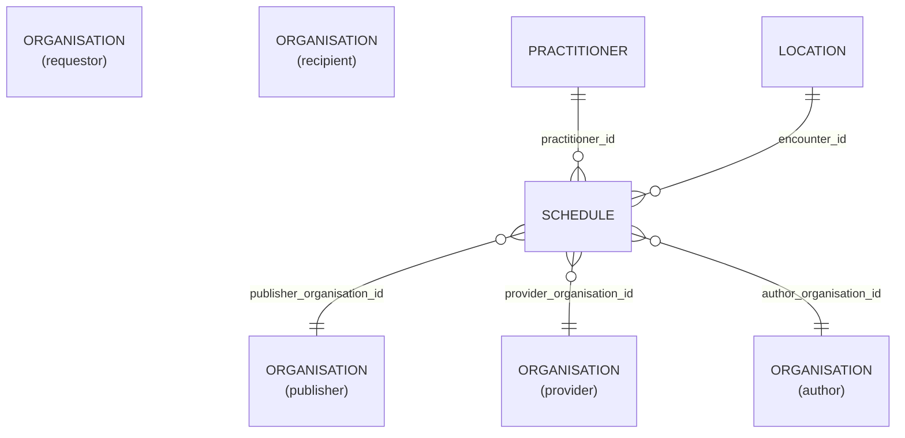

# Schedule

- [Schedule](#schedule)
  - [Overview](#overview)
  - [Columns](#columns)
  - [Entity Relationships](#entity-relationships)
  - [Notes](#notes)

## Overview

Related FHIR component: [Schedule](https://build.fhir.org/schedule.html)

A container for slots of time that may be available for booking appointments

Schedule resources provide a container for time-slots that can be booked using an appointment. It provides the window of time (period) that slots are defined for and what type of appointments can be booked.

The schedule does not provide any information about actual appointments. This separation greatly assists where access to the appointments would not be permitted for security or privacy reasons, while still being able to determine if an appointment might be available.

## Columns

| Column Name | Data Type (Size) | Description | PK/FK |
| --- | --- | --- | --- |
| `ID` | `UUID` | id. | PK |
| `LDS_SOURCE_RECORD_ID` | `UUID` | lds record id. | |
| `PUBLISHER_ORGANISATION_ID` | `UUID` | linked organisaiton id publisher. see [schema notes: publisher, provider, author](_schema_notes.md#provider-author-publisher-organisation-id) | FK -> [ORANGANISATION](Organisation.md).ID |
| `PROVIDER_ORGANISATION_ID` | `UUID` | linked organisaiton id provider. see [schema notes: publisher, provider, author](_schema_notes.md#provider-author-publisher-organisation-id) | FK -> [ORANGANISATION](Organisation.md).ID |
| `AUTHOR_ORGANISATION_ID` | `UUID` | linked organisaiton id author. see [schema notes: publisher, provider, author](_schema_notes.md#provider-author-publisher-organisation-id) | FK -> [ORANGANISATION](Organisation.md).ID |
| `LOCATION_ID` | `UUID` | location id. | FK -> [Location](Location.md).ID |
| `LOCATION_NAME` | `VARCHAR` | location. | |
| `PRACTITIONER_ID` | `UUID` | practitioner id. | FK -> [Practitioner](Practitioner.md).ID |
| `START_DATETIME` | `TIMESTAMP` | start date. | |
| `END_DATETIME` | `TIMESTAMP` | end date. | |
| `TYPE` | `VARCHAR` | type. | |
| `NAME` | `VARCHAR` | name. | |
| `IS_PRIVATE` | `BOOLEAN` | is private. | |
| `LDS_IS_DELETED` | `BOOLEAN` | lds is deleted. | |
| `PUBLISHER_ORGANISATION_CODE` | `VARCHAR` | record owner organisation code. | |
| `SOURCE_EXTRACTION_DATE` | `TIMESTAMP` | source extraction date. | |
| `LDS_TRANSFORM_DATETIME` | `TIMESTAMP_NTZ` | The timestamp when the record was transformed by LDS into OLIDS. | - |

## Entity Relationships

> [!NOTE]
> Diagrams below are currently indicative. The precise optional/mandatory nature of certain relationships remains to be clarified.

| Related Table | Relationship Type | Local Key | Related Key | Notes |
| --- | --- | --- | --- | --- |
| [Practitioner](Practitioner.md) | FK | PRACTITIONER_ID | ID | Derived from dbt relationship test or naming convention |
| [Location](Location.md) | FK | LOCATION_ID | ID | Derived from dbt relationship test or naming convention |
| [Organisation](Organisation.md) | FK | PUBLISHER_ORGANISATION_ID | ID | - |
| [Organisation](Organisation.md) | FK | PROVIDER_ORGANISATION_ID | ID | - |
| [Organisation](Organisation.md) | FK | AUTHOR_ORGANISATION_ID | ID | - |

## Notes
