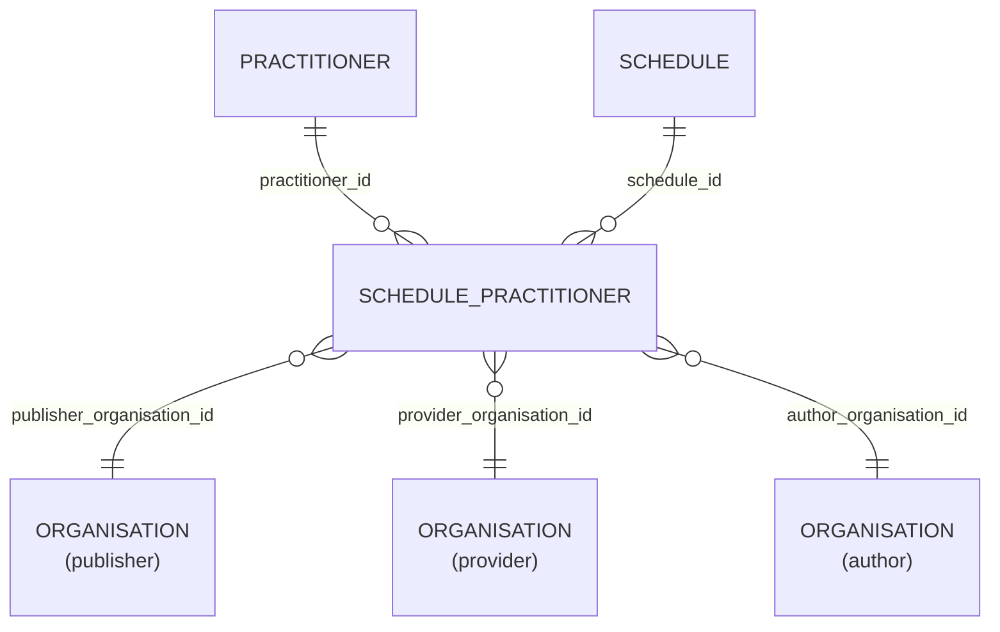

# Schedule_Practitioner

- [Schedule\_Practitioner](#schedule_practitioner)
  - [Overview](#overview)
  - [Columns](#columns)
  - [Entity Relationships](#entity-relationships)
  - [Notes](#notes)

## Overview

The schedule belongs to a single instance of a service or resource. This is normally a HealthcareService, Practitioner, Location or Device. In the case where a single resource can provide different services, potentially at different location, then the schedulable resource is considered the composite of the actors.

For example, if a practitioner can provide services at multiple locations, they might have one schedule per location, where each schedule includes both the practitioner and location actors. When booking an appointment with multiple schedulable resources, multiple schedules may need to be checked depending on the configuration of the system.

If an appointment has two practitioners, a specific medical device and a room then there could be a schedule for each of these resources that may need to be consulted to ensure that no collisions occur.
If the schedule needed to be consulted, then there would be one created covering the planning horizon for the time of the appointment.

## Columns

| Column Name | Data Type (Size) | Description | PK/FK | Compass Equivalent |
| --- | --- | --- | --- | --- |
| `ID` | `UUID` | id. | PK | -- |
| `LDS_SOURCE_RECORD_ID` | `UUID` | Unique record identifier including file row number for deduplication. |  | -- |
| `PUBLISHER_ORGANISATION_ID` | `UUID` | linked organisaiton id publisher. see [schema notes: publisher, provider, author](_schema_notes.md#provider-author-publisher-organisation-id) | FK -> [ORANGANISATION](Organisation.md).ID | `organization_id` |
| `PROVIDER_ORGANISATION_ID` | `UUID` | linked organisaiton id provider. see [schema notes: publisher, provider, author](_schema_notes.md#provider-author-publisher-organisation-id) | FK -> [ORANGANISATION](Organisation.md).ID | -- |
| `AUTHOR_ORGANISATION_ID` | `UUID` | linked organisaiton id author. see [schema notes: publisher, provider, author](_schema_notes.md#provider-author-publisher-organisation-id) | FK -> [ORANGANISATION](Organisation.md).ID | -- |
| `SCHEDULE_ID` | `UUID` | schedule id. | FK -> [Schedule](Schedule.md).ID | -- |
| `PRACTITIONER_ID` | `UUID` | practitioner id. | FK -> [Practitioner](Practitioner.md).ID | -- |
| `LDS_IS_DELETED` | `BOOLEAN` | lds is deleted. | | -- |
| `PUBLISHER_ORGANISATION_CODE` | `VARCHAR` | record owner organisation code. | | -- |
| `SOURCE_EXTRACTION_DATE` | `TIMESTAMP` | source extraction date. | | -- |
| `LDS_TRANSFORM_DATE_TIME` | `TIMESTAMP_LTZ` | lds transform date time. | | -- |

## Entity Relationships

> [!NOTE]
> Diagrams below are currently indicative. The precise optional/mandatory nature of certain relationships remains to be clarified.

| Related Table | Relationship Type | Local Key | Related Key | Notes |
| --- | --- | --- | --- | --- |
| [Practitioner](Practitioner.md) | FK | PRACTITIONER_ID | ID | |
| [Schedule](Schedule.md) | FK | SCHEDULE_ID | ID | |
| [Organisation](Organisation.md) | FK | PUBLISHER_ORGANISATION_ID | ID | - |
| [Organisation](Organisation.md) | FK | PROVIDER_ORGANISATION_ID | ID | - |
| [Organisation](Organisation.md) | FK | AUTHOR_ORGANISATION_ID | ID | - |

## Notes
