# EMIS source specification (version 8.0)

- [EMIS source specification (version 8.0)](#emis-source-specification-(version-8.0))
  - [Table inventory](#table-inventory)
  - [Table schema](#table-schema)
    - [Admin\_Location](#admin_location)
    - [Admin\_Organisation](#admin_organisation)
      - [Entity Relations: Admin\_Organisation](#entity-relations%3A-admin_organisation)
    - [Admin\_OrganisationLocation](#admin_organisationlocation)
    - [Admin\_Patient](#admin_patient)
      - [Entity Relations: Admin\_Patient](#entity-relations%3A-admin_patient)
    - [Admin\_PatientHistory](#admin_patienthistory)
    - [Admin\_UserInRole](#admin_userinrole)
      - [Entity Relations: Admin\_UserInRole](#entity-relations%3A-admin_userinrole)
    - [Agreements\_SharingOrganisation](#agreements_sharingorganisation)
      - [Entity Relations: Agrements\_SharingOrganisation](#entity-relations%3A-agrements_sharingorganisation)
    - [Appointment\_Session](#appointment_session)
      - [Entity Relations: Appointment\_Session](#entity-relations%3A-appointment_session)
    - [Appointment\_SessionUser](#appointment_sessionuser)
      - [Entity Relations: Appointment\_SessionUser](#entity-relations%3A-appointment_sessionuser)
    - [Appointment\_Slot](#appointment_slot)
      - [Entity relations: Appointment\_Slot](#entity-relations%3A-appointment_slot)
    - [Audit\_PatientAudit](#audit_patientaudit)
      - [Entity relations: Audit\_PatientAudit](#entity-relations%3A-audit_patientaudit)
    - [Audit\_RegistrationAudit](#audit_registrationaudit)
      - [Entity relations: Audit\_RegistrationAudit](#entity-relations%3A-audit_registrationaudit)
    - [CareRecord\_Consultation](#carerecord_consultation)
      - [Entity relations: CareRecord\_Consultation](#entity-relations%3A-carerecord_consultation)
    - [CareRecord\_Diary](#carerecord_diary)
      - [Entity relations: CareRecord\_Diary](#entity-relations%3A-carerecord_diary)
    - [CareRecord\_Observation](#carerecord_observation)
      - [Entity relations: CareRecord\_Observation](#entity-relations%3A-carerecord_observation)
    - [CareRecord\_ObservationReferral](#carerecord_observationreferral)
      - [Entity relations: CareRecord\_ObservationReferral](#entity-relations%3A-carerecord_observationreferral)
    - [CareRecord\_Problem](#carerecord_problem)
      - [Entity relations: CareRecord\_Problem](#entity-relations%3A-carerecord_problem)
    - [Coding\_ClinicalCode](#coding_clinicalcode)
    - [Coding\_DrugCode](#coding_drugcode)
    - [Prescribing\_DrugRecord](#prescribing_drugrecord)
      - [Entity relations: Prescribing\_DrugRecord](#entity-relations%3A-prescribing_drugrecord)
    - [Prescribing\_IssueRecord](#prescribing_issuerecord)
      - [Entity relations: Prescribing\_IssueRecord](#entity-relations%3A-prescribing_issuerecord)

---

## Table inventory

| Name |	Description |
| --- | --- |
| `Admin_Location` | Location details |
| `Admin_Organisation` | Organisation details and codes |
| `Admin_OrganisationLocation` | Links locations to an organisation |
| `Admin_Patient` | Demographic information relating to a patient such as name, date of birth, gender, primary address |
| `admin_PatientHistory` | History of the patient registration |
| `Admin_UserInRole` | Contains individuals that perform a role in clinical care and their details both internal and external to the patient’s registered organisation, e.g. doctor, nurse, hospital consultant |
| `Agreements_SharingOrganisation` | Lists all sharing organisations for the current agreement |
| `Appointment_Session` | All appointment session information |
| `Appointment_SessionUser` | All users associated to appointment sessions |
| `Appointment_Slot` | All patient appointments which have taken place |
| `Audit_PatientAudit` | All clinical update/deletes for a patient |
| `Audit_RegistrationAudit` | All demographic/registration update/deletes for a patient |
| `CareRecord_Consultation` | All consultations that take place within an organisation, or quick notes entered in a Community organisation  |
| `CareRecord_Diary` | All diary entries |
| `CareRecord_Observation` | All clinically coded observations including referrals, values and problems |
| `CareRecord_ObservationReferral` | All referral observations (extends CareRecord_Observation) |
| `CareRecord_Problem` | All clinical problems |
| `Coding_ClinicalCodes` | All clinical codes |
| `Coding_DrugCodes` | All drug codes |
| `Prescribing_DrugRecord` | All records of the current authorisation of a drug |
| `Prescribing_IssueRecord` | All drugs which have been issued to patients by the appropriate clinician |

[^ to top ^](#emis-source-specification-version-80)

---

## Table schema

### Admin_Location

| Column Name | Description | Example Data | Previous Location | Data Type | Max length | Is Nullable |
| --- | --- | --- | --- | --- | --- | --- |
| `LocationGuid` | Unique ID | {1858F0D1-7474-4537-8EFE-AD7697E421C3} | dbo.Location.GUID | uniqueidentifier | 38 | 0 |
| `LocationName` | Location name | The Hotton Surgery | dbo.Location.LocationName | varchar | 100 | 0 |
| `LocationTypeDescription` | Type of location | Main Surgery | dbo.LocationType.LocationTypeDescription | varchar | 50 | 0 |
| `ParentLocationGuid` | Parent location | {892243B2-8947-4371-B92F-7143A5A038AB} | dbo.Location.ParentLocationId | uniqueidentifier | 38 | 1 |
| `OpenDate` | Open Date | 2007-11-02 | dbo.Location.OpenDate | date | 3 | 0 |
| `CloseDate` | Close Date | 2007-11-02 | dbo.Location.CloseDate | date | 3 | 1 |
| `MainContactName` | Main contact name | Mrs B Smith | dbo.Location.MainContactName | varchar | 200 | 1 |
| `FaxNumber` | Fax number | 01132555888 | dbo.Location.FaxNumber | varchar | 100 | 1 |
| `EmailAddress` | Email adress | `thesurgery@nhs.co.uk` | dbo.Location.EmailAddress | varchar | 100 | 1 |
| `PhoneNumber` | Phone number | 01132555887 | dbo.Location.PhoneNumber | varchar | 100 | 1 |
| `HouseNameFlatNumber` | Address name/flat number | 2A | dbo.Address.HouseNameFlatNumber | varchar | 50 | 1 |
| `NumberAndStreet` | Address street | 27 Zak Lane | dbo.Address.NumberAndStreet | varchar | 50 | 1 |
| `Village` | Address village | Hotton | dbo.Address.Village | varchar | 50 | 1 |
| `Town` | Address town | Leeds | dbo.Address.Town | varchar | 50 | 1 |
| `County` | Address county | West Yorkshire | dbo.Address.Country | varchar | 50 | 1 |
| `Postcode` | Type of organisation | LS21 5MU | dbo.Address.PostCode | varchar | 7 | 1 |
| `Deleted` | Indicates whether the location has been deleted | False | dbo.Location.Deleted | boolean | 1 | 0 |
| `ProcessingId` | Sequentual identifier indicating the order to process the items | 1 | N/A | int | 4 | 0 |

---

### Admin_Organisation

| Column Name | Description | Example Data | Previous Location | Data Type | Max length | Is Nullable |
| --- | --- | --- | --- | --- | --- | --- |
| `OrganisationGuid` | Unique ID | {BED045C0-BC58-4934-8E11-2FC08F730060} | dbo.Organisation.GUID | uniqueidentifier | 38 | 0 |
| `CDB` | EMIS customer number | 50002 | dbo.Organisation.CDB | int | 4 | 1 |
| `OrganisationName` | Name of organisation | EMISWebCR1 50002 | dbo.Organisation.OrganisationName | varchar | 200 | 0 |
| `ODSCode` | ODS code | A00002 | dbo.Organisation.NationalPracticeCode | varchar | 20 | 1 |
| `ParentOrganisationGuid` | Link to Admin_Organisation.OrganisationGuid | {F4D020C6-EAFF-4528-83BA-E81A1CFD30DC} | dbo.Organisation.GUID | uniqueidentifier | 38 | 0 |
| `CCGOrganisationGuid` | Link to Admin_Organisation.OrganisationGuid | {F4D020C6-EAFF-4528-83BA-E81A1CFD30DC} | dbo.Organisation.GUID | uniqueidentifier | 38 | 1 |
| `OrganisationType` | Type of organisation | General Practice | dbo.OrganisationType.OrganisationTypeDescription | varchar | 50 | 1 |
| `OpenDate` | Date organisation opened | 2007-11-02 | dbo.Organisation.OpenDate | date | 3 | 0 |
| `CloseDate` | Date organisation closed | 2007-11-02 | dbo.Organisation.CloseDate | date | 3 | 1 |
| `MainLocationGuid` | Unique ID referencing Dimension.Location | {1858F0D1-7474-4537-8EFE-AD7697E421C3} | dbo.Location.GUID | uniqueidentifier | 38 | 0 |
| `ProcessingId` | Sequentual identifier indicating the order to process the items | 1 | N/A | int | 4 | 0 |

#### Entity Relations: Admin_Organisation

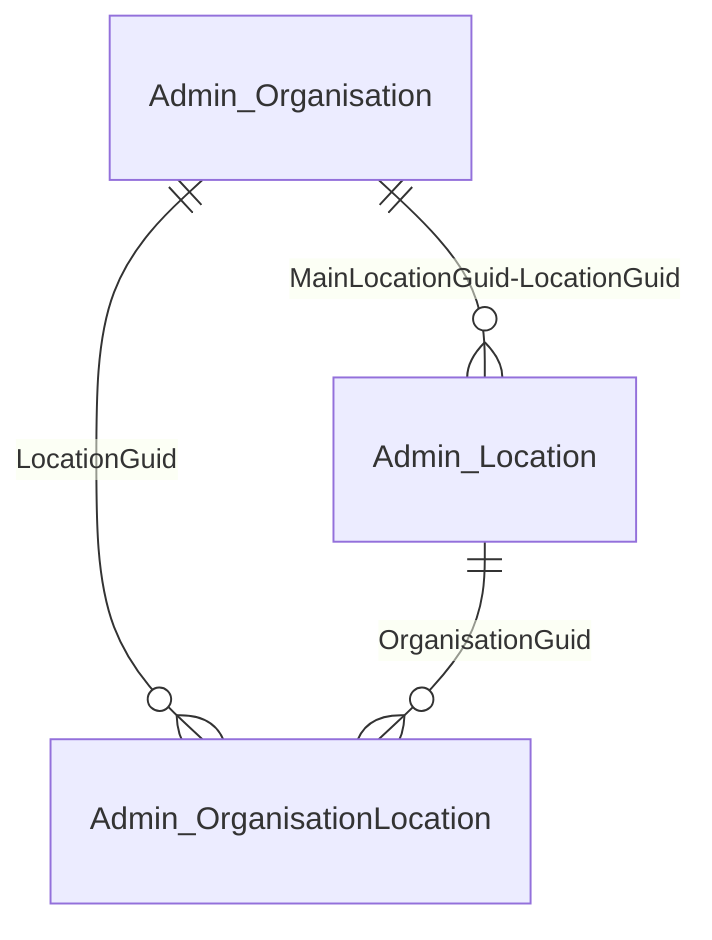

---

### Admin_OrganisationLocation

| Column Name | Description | Example Data | Previous Location | Data Type | Max length | Is Nullable |
| --- | --- | --- | --- | --- | --- | --- |
| `OrganisationGuid` | Link to Admin_Organisation.OrganisationGuid | {0F30B81C-D956-4A05-89DF-58CC877FD719} | dbo.Organisation.GUID | uniqueidentifier | 38 | 0 |
| `LocationGuid` | Link to Admin_Location.LocationGuid | {3A2D5FC2-2725-4EDF-946B-11AE5C5F8FE5} | dbo.Location.GUID | uniqueidentifier | 38 | 0 |
| `IsMainLocation` | Flag to indicate if this is the main location | TRUE | dbo.Location.IsMainLocation | bit | 1 | 1 |
| `Deleted` | Indicates whether the link has been deleted | FALSE | Computed | boolean | 1 | 0 |
| `ProcessingId` | Sequentual identifier indicating the order to process the items | 1 | N/A | int | 4 | 0 |

---

### Admin_Patient

| Column Name | Description | Example Data | Previous Location | Data Type | Max length | Is Nullable |
| --- | --- | --- | --- | --- | --- | --- |
| `PatientGuid` | Unique ID | {D77C65E1-E100-4272-9386-F4FC383D8759} | dbo.Patient.GUID | uniqueidentifier | 38 | 0 |
| `OrganisationGuid` | Link to Admin_Organisation.OrganisationGuid | {0F30B81C-D956-4A05-89DF-58CC877FD719} | dbo.Organisation.GUID | uniqueidentifier | 38 | 0 |
| `UsualGpUserInRoleGuid` | Link to Admin_UserInRole.UserInRoleGuid | {E93841BE-BD3D-469E-A2B3-03F6EEA7CD9A} | dbo.UserInRole.GUID | uniqueidentifier | 38 | 1 |
| `Sex` | Sex of patient | M | dbo.Patient.Sex | char | 1 | 0 |
| `DateOfBirth` | Date of birth | 2007-11-02 | dbo.Patient.DateOfBirth | date | 3 | 0 |
| `DateOfDeath` | Date of death | 2007-11-02 | dbo.Patient.DateOfDeath | date | 3 | 1 |
| `Title` | Title | Mr | dbo.Patient.Title | varchar | 50 | 0 |
| `GivenName` | Forename | Nicholas | dbo.Patient.GivenName | varchar | 40 | 0 |
| `MiddleNames` | Middle name | Andrew | dbo.Patient.MiddleNames | varchar | 256 | 0 |
| `Surname` | Surname  | Clarke | dbo.Patient.Surname | varchar | 100 | 0 |
| `DateOfRegistration` | Date of registration | 2007-11-02 | dbo.Patient.DateOfRegistration | date | 3 | 1 |
| `NhsNumber` | NHS number | 5108980949 | dbo.PatientIdentifier.Value | char | 10 | 1 |
| `PatientNumber` | Patient number | 1 | dbo.Patient.PatientNumber | int | 4 | 1 |
| `PatientTypeDescription` | Patient type | Regular | dbo.PatientType.PatientTypeDescription | varchar | 30 | 1 |
| `DummyType` | Is a dummy patient | FALSE | dbo.PatientType.DummyType | boolean | 1 | 1 |
| `HouseNameFlatNumber` | House name, flat no | 32 Greens | dbo.Address.HouseNameFlatNumber | varchar | 50 | 1 |
| `NumberAndStreet` | Number and street | 32 Mill Lane | dbo.Address.NumberAndStreet | varchar | 50 | 1 |
| `Village` | Village | Wooldale | dbo.Address.Village | varchar | 50 | 1 |
| `Town` | Town | Kirkheaton | dbo.Address.Town | varchar | 50 | 1 |
| `County` | County | West Yorkshire | dbo.Address.County | varchar | 50 | 1 |
| `Postcode` | Postcode | BD149XM | dbo.Address.Postcode | varchar | 7 | 1 |
| `ResidentialInstituteCode` | Residential institute code | 23456 | dbo.PatientProperties.ResidentialInstituteCode | char | 2 | 1 |
| `NHSNumberStatus` | PDS trace indicator |  | currently unavailble | char | 2 | 1 |
| `CarerName` | Name of carer | Samuel | dbo.PatientAssociate.DisplayName | varchar | 452 | 1 |
| `CarerRelation` | Carer relationship to patient | Uncle | dbo.PatientAssociateType.Description | varchar | 100 | 1 |
| `PersonGuid` | Globally unique GUID for the patient | {D77C65E1-E100-4272-9386-F4FC383D8759} | dbo.Person.PersonGUID | uniqueidentifier | 38 | 0 |
| `DateofDeactivation` | Date that the patient's registration became inactive | 2007-11-02 | Computed | date | 3 | 1 |
| `Deleted` | Indicates whether the patient has fallen out of scope | FALSE | Computed | boolean | 1 | 0 |
| `SpineSensitive` | Flag to indicate the patient has been marked as sensitive | TRUE | PDS.PatientFlags.Sensitive | boolean | 1 | 0 |
| `IsConfidential` | Flag to indicate patient is marked as confidential | TRUE | CareRecord.Consultation.ConfidentialityPolicyId | boolean | 1 | 1 |
| `EmailAddress` | Email address | `john.smith@gmail.com` | dbo.PatientContact.ContactInformation | varchar | 100 | 1 |
| `HomePhone` | Home phone | 0113123123 | dbo.PatientContact.ContactInformation | varchar | 100 | 1 |
| `MobilePhone` | Mobile phone | 07779123123 | dbo.PatientContact.ContactInformation | varchar | 100 | 1 |
| `ExternalUsualGPGuid` | Unique ID for External Usual GP | {E64541DE-AB4C-5863-A2B3-03F6EEA7CD9A} | dbo.ExternalUsualGPDetails.ExternalUsualGPGuid | uniqueidentifier | 38 | 1 |
| `ExternalUsualGP` | External Usual GP Name | Dr J Jones | dbo.ExternalUsualGPDetails.DisplayName | varchar | 263 | 1 |
| `ExternalUsualGPOrganisation` | Link to Admin_Organisation.OrganisationGuid | {D77C65E1-E100-4272-9386-F4FC383D8759} | dbo.Organisation.GUID | uniqueidentifier | 38 | 1 |
| `ContactComments` | Contact notes for the patient.  | mobile number for parent | dbo.patientContact.Notes | varchar | 200 | 1 |
| `ProcessingId` | Sequentual identifier indicating the order to process the items | 1 | N/A | int | 4 | 0 |

#### Entity Relations: Admin_Patient

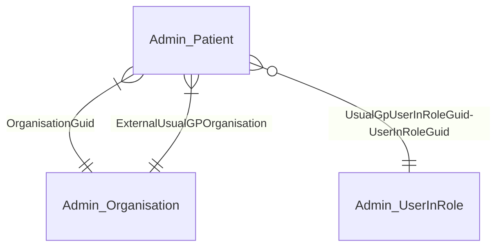

---

### Admin_PatientHistory

| Column Name | Description | Example Data | Previous Location | Data Type | Max Length | Is Null |
| --- | --- | --- | --- | --- | --- | --- |
| `PatientGuid` | Link to Admin_Patient.PatientGuid | {422BA762-D6F5-478D-81D5-BDEF1CD6065D} | dbo.Patient.GUID | uniqueidentifier | 38 | 0 |
| `OrganisationGuid` | Link to Admin_Organisation.OrganisationGuid | {414EC4FA-B42D-443E-BD8A-67EB69B33401} | dbo.Organisation.GUID | uniqueidentifier | 38 | 0 |
| `HistoryDate` | Modified date | 2007-11-02 | Audit.PatientAudit.DateStamp | date | 3 | 0 |
| `HistoryTime` | Modified time | 11:00:00 | Audit.PatientAudit.DateStamp | time | 5 | 0 |
| `StatusDescription` | Link to Admin_UserInRole.UserInRoleGuid | {CF1A5B91-D02D-49E4-9F52-9BC961628AAA} | dbo.UserInRole.GUID | uniqueidentifier | 38 | 1 |
| `ProcessingId` | Sequentual identifier indicating the order to process the items | 1 | N/A | int | 4 | 0 |

---

### Admin_UserInRole

| Column Name | Description | Example Data | Previous Location | Data Type | Max length | Is Nullable |
| --- | --- | --- | --- | --- | --- | --- |
| `UserInRoleGuid` | Unique ID | {E93841BE-BD3D-469E-A2B3-03F6EEA7CD9A} | dbo.UserInRole.GUID | uniqueidentifier | 38 | 0 |
| `OrganisationGuid` | Link to Admin_Organisation.OrganisationGuid | {0F30B81C-D956-4A05-89DF-58CC877FD719} | dbo.Organisation.GUID | uniqueidentifier | 38 | 0 |
| `Title` | Title | Dr | dbo.User.Title | varchar | 50 | 1 |
| `GivenName` | Forename | Robert | dbo.User.Forename | varchar | 108 | 1 |
| `Surname` | Surname | Burns | dbo.User.Surname | varchar | 100 | 1 |
| `JobCategoryCode` | Job category code | R0260 | AccessControl.JobCategory.JobCategoryCode | char | 5 | 0 |
| `JobCategoryName` | Job category name | General Medical Practitioner | AccessControl.JobCategory.JobCategoryDescription | varchar | 100 | 0 |
| `ContractStartDate` | Date contract started | 2007-11-02 | dbo.UserInRole.ContractStartDate | date | 3 | 0 |
| `ContractEndDate` | Date contract ended | 2007-11-02 | dbo.UserInRole.ContractEndDate | date | 3 | 1 |
| `RegistrationNumber` | User Registration Number | PA31136 | dbo.UserIdentifier.value | varchar | 50 | 1 |
| `ProcessingId` | Sequentual identifier indicating the order to process the items | 1 | N/A | int | 4 | 0 |

#### Entity Relations: Admin_UserInRole

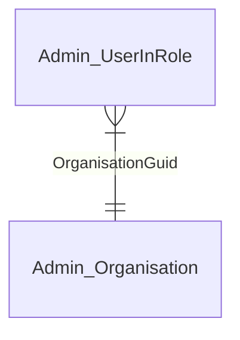

---

### Agreements_SharingOrganisation

| Column Name | Description | Example Data | Previous Location | Data Type | Max Length | Is Null |
| --- | --- | --- | --- | --- | --- | --- |
| `OrganisationGuid` | Unique ID | {9E3E1544-BCB1-44A2-B266-8F4961A3B4CB} | Agreements.Agreement.SharingOrganisationGuid | uniqueidentifier | 38 | 0 |
| `IsActivated` | Has the organisation activated their agreement | TRUE | Agreements.Agreement.Activated | boolean | 1 | 0 |
| `LastModifiedDate` | Date/Time of last modification | 2017-04-26 06:35:16 | Agreements.Agreement.LastModifiedDate | datetime | 8 | 0 |
| `Disabled` | Has the organisation been disabled | FALSE | Agreements.Agreement.Disabled | boolean | 1 | 0 |
| `Deleted` | Has the organisation been deleted | FALSE | Agreements.Agreement.Deleted | boolean | 1 | 0 |

#### Entity Relations: Agrements_SharingOrganisation

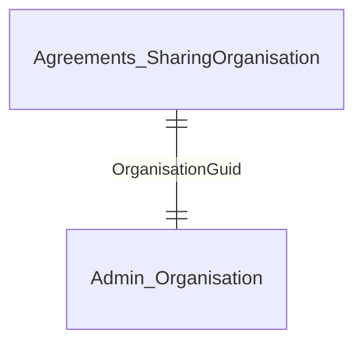

---

### Appointment_Session

| Column Name | Description | Example Data | Previous Location | Data Type | Max Length | Is Nullable |
| --- | --- | --- | --- | --- | --- | --- |
| `AppointmentSessionGuid` | Unique ID | {ADDDC665-72DD-42C7-85A9-C0ACF7F079B9} | Appointment.Session.GUID | uniqueidentifier | 38 | 0 |
| `Description` | Name of session | Session | Appointment.Session.Description | varchar | 100 | 0 |
| `LocationGuid` | Link to Admin_Location.LocationGUID | {0F30B81C-D956-4A05-89DF-58CC877FD719} | dbo.Location.GUID | uniqueidentifier | 38 | 0 |
| `SessionTypeDescription` | Session type | Timed appointments | Appointment.SessionType.Description | varchar | 50 | 0 |
| `SessionCategoryDisplayName` | Session category name | Default Non-List Category | Appointment.SessionCategory.DisplayName | varchar | 100 | 0 |
| `StartDate` | Start date  | 2007-11-02 | Appointment.Session.StartDateTime | date | 3 | 0 |
| `StartTime` | Start time | 11:00:00 | Appointment.Session.StartDateTime | time | 5 | 0 |
| `EndDate` | End date | 2007-11-02 | Appointment.Session.EndDateTime | date | 3 | 0 |
| `EndTime` | End time | 11:00:00 | Appointment.Session.EndDateTime | time | 5 | 0 |
| `Private` | Indicates whether the session is marked as private | FALSE | Appointment.Session.Private | boolean | 1 | 0 |
| `OrganisationGuid` | Link to Admin_Organisation.OrganisationGuid | {0F30B81C-D956-4A05-89DF-58CC877FD719} | dbo.Organisation.GUID | uniqueidentifier | 38 | 0 |
| `Deleted` | Indicates whether the appointment session has been deleted | FALSE | Appointment.Session.Deleted | boolean | 1 | 0 |
| `ProcessingId` | Sequentual identifier indicating the order to process the items | 1 | N/A | int | 4 | 0 |

#### Entity Relations: Appointment_Session

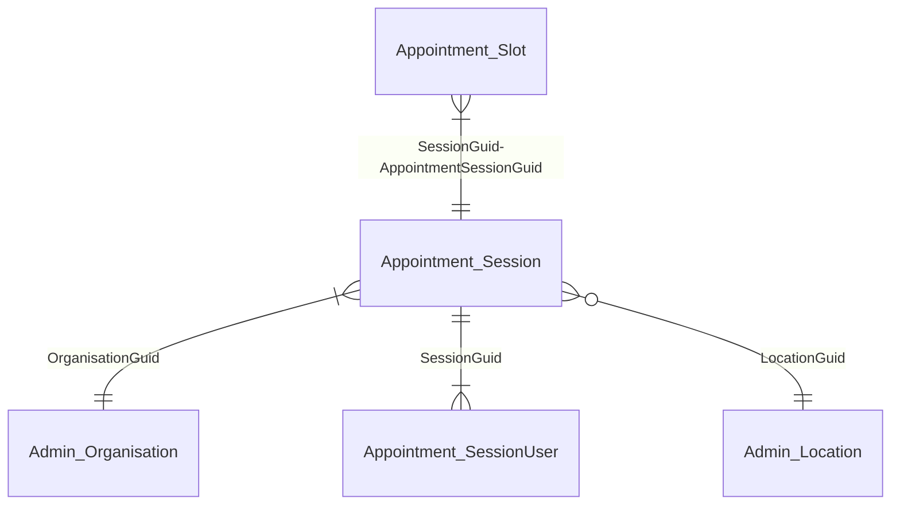

---

### Appointment_SessionUser

| Column Name | Description | Example Data | Previous Location | Data Type | Max length | Is Nullable |
| --- | --- | --- | --- | --- | --- | --- |
| `SessionGuid` | Link to Appointment_Session.AppointmentSessionGuid | {0F30B81C-D956-4A05-89DF-58CC877FD719} | Appointment.Session.GUID | uniqueidentifier | 38 | 0 |
| `UserInRoleGuid` | Link to Admin_UserInRole.UserInRoleGuid | {3A2D5FC2-2725-4EDF-946B-11AE5C5F8FE5} | dbo.UserInRole.GUID | uniqueidentifier | 38 | 0 |
| `Deleted` | Indicates whether the session user has been removed from the session | FALSE | Appointment.Session.Deleted | boolean | 1 | 0 |
| `ProcessingId` | Sequentual identifier indicating the order to process the items | 1 | N/A | int | 4 | 0 |

#### Entity Relations: Appointment_SessionUser

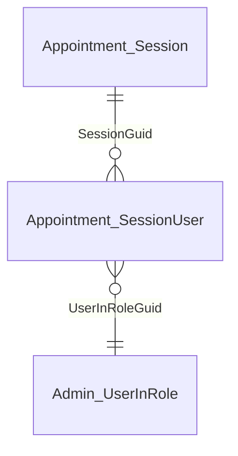

---

### Appointment_Slot

| Column Name | Description | Example Data | Previous Location | Data Type | Max Length | Is Null |
| --- | --- | --- | --- | --- | --- | --- |
| `SlotGuid` | Unique ID | {9E3E1544-BCB1-44A2-B266-8F4961A3B4CB} | Appointment.Slot.GUID | uniqueidentifier | 38 | 0 |
| `AppointmentDate` | Date of appointment | 2007-11-02 | Appointment.Slot.StartDateTime | date | 3 | 0 |
| `AppointmentStartTime` | Time of appointment | 0.458333333333333 | Appointment.Slot.StartDateTime | time | 5 | 0 |
| `PlannedDurationInMinutes` | Planned duration of appointment in minutes | 40 | Computed | smallint | 2 | 0 |
| `PatientGuid` | Link to Admin_Patient.PatientGuid | {422BA762-D6F5-478D-81D5-BDEF1CD6065D} | dbo.Patient.GUID | uniqueidentifier | 38 | 0 |
| `SendInTime` | Time patient was sent in | `11:00:00` | Appointment.SlotStatus.StatusDateTime | time | 5 | 1 |
| `LeftTime` | Time patient left | `11:00:00` | Appointment.SlotStatus.StatusDateTime | time | 5 | 1 |
| `DidNotAttend` | Did the patient attend Y/N | TRUE | Computed | boolean | 1 | 1 |
| `PatientWaitInMin` | How long the patient waited for from their time of arrival | 8 | Computed | int | 4 | 1 |
| `AppointmentDelayInMin` | How long the patient waited for from their appointment time | 8 | Computed | int | 4 | 1 |
| `ActualDurationInMinutes` | Actual duration of appointment in minutes | 10 | Computed | int | 4 | 1 |
| `OrganisationGuid` | Link to Admin_Organisation.OrganisationGuid | {414EC4FA-B42D-443E-BD8A-67EB69B33401} | dbo.Organisation.GUID | uniqueidentifier | 38 | 0 |
| `SessionGuid` | Link to Appointment_Session.AppointmentSessionGuid | {6F524690-08E3-4E2D-8467-CD7489C6F7BC} | Appointment.Session.GUID | uniqueidentifier | 38 | 0 |
| `DnaReasonCodeId` | Link to ClinicalCode.CodeId | 405044018 | Appointment.Slot.DNAReasonId | bigint | 8 | 1 |
| `BookedDate` | The date the appointment was booked | 44537 | Appointment.SlotStatus.StatusDateTime | date | 3 | 1 |
| `BookedTime` | The time that the appointment was booked | 0.604166666666667 | Appointment.SlotStatus.StatusDateTime | time | 5 | 1 |
| `SlotStatus` | Current status of the slot | Booked | Appointment.Status.Description | varchar | 20 | 1 |
| `SlotType` | Description of the slot type | Saturday Nurse Appointments | Appointment.SlotType.Description | varchar | 100 | 1 |
| `IsBookableOnline` | Indicates whether the slot is available for online booking | TRUE | appointment.Slot.Isbookableonline | boolean | 1 | 0 |
| `BookingMethod` | Method used to book the appointment | Practice | Appointment.bookingMethod.MethodDescription | varchar | 25 | 1 |
| `ExternalPatientGuid` | Cross organisation booking patient guid | {422BA762-D6F5-478D-81D5-BDEF1CD6065D} | appointment.Slot.ExternalPatientGuid | uniqueidentifier | 38 | 1 |
| `ExternalPatientOrganisation` | Cross oganisation booking organisation guid | {414EC4FA-B42D-443E-BD8A-67EB69B33401} | dbo.Organisation.GUID | uniqueidentifier | 38 | 1 |
| `ModeOfContact` | Slot mode of contact - e.g. telephone | Telephone | Appointment.StatusType.Description | varchar | 20 | 1 |
| `Deleted` | Indicates whether the appointment has been deleted | FALSE | Appointment.Slot.Deleted | boolean | 1 | 0 |
| `ProcessingId` | Sequentual identifier indicating the order to process the items | 1 | N/A | int | 4 | 0 |

#### Entity relations: Appointment_Slot

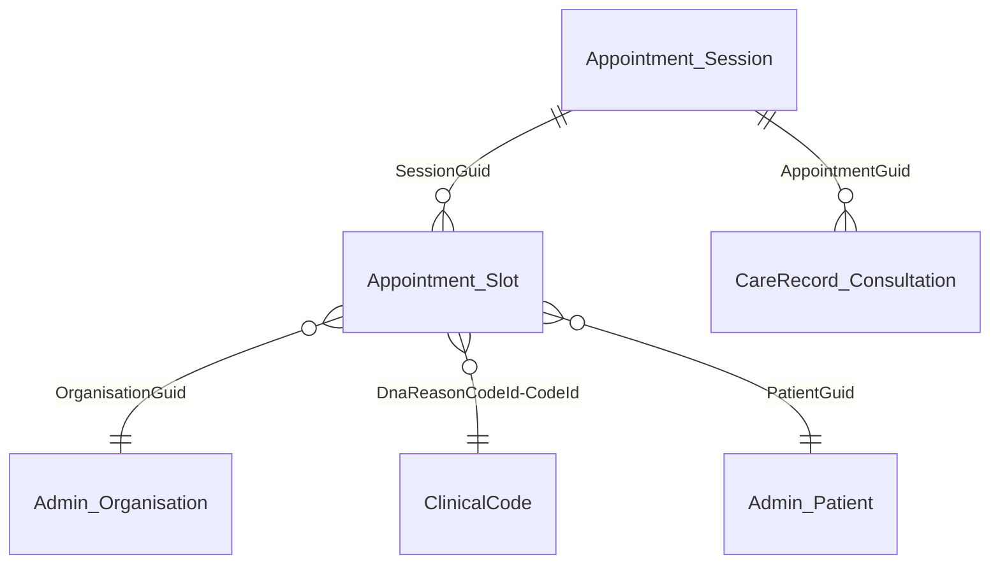

---

### Audit_PatientAudit

| Column Name | Description | Example Data | Previous Location | Data Type | Max Length | Is Null |
| --- | --- | --- | --- | --- | --- | --- |
| `ItemGuid` | Unique ID. Link to unique Id of associated item. (E.g DrugIssueGuid) | {9E3E1544-BCB1-44A2-B266-8F4961A3B4CB} | Audit.PatientAudit.ItemGuid | uniqueidentifier | 38 | 0 |
| `PatientGuid` | Link to Admin_Patient.PatientGuid | {422BA762-D6F5-478D-81D5-BDEF1CD6065D} | dbo.Patient.GUID | uniqueidentifier | 38 | 0 |
| `OrganisationGuid` | Link to Admin_Organisation.OrganisationGuid | {414EC4FA-B42D-443E-BD8A-67EB69B33401} | dbo.Organisation.GUID | uniqueidentifier | 38 | 0 |
| `ModifiedDate` | Modified date | 2007-11-02 | Audit.PatientAudit.DateStamp | date | 3 | 0 |
| `ModifiedTime` | Modified time | 11:00:00 | Audit.PatientAudit.DateStamp | time | 5 | 0 |
| `UserInRoleGuid` | Link to Admin_UserInRole.UserInRoleGuid | {CF1A5B91-D02D-49E4-9F52-9BC961628AAA} | dbo.UserInRole.GUID | uniqueidentifier | 38 | 1 |
| `ItemType` | Type of item modified | Drug Issue | Audit.ItemType.ItemTypeDescription | varchar | 200 | 0 |
| `ModeType` | Modification Type | Delete | Audit.ModeType.Description | varchar | 100 | 0 |
| `ProcessingId` | Sequentual identifier indicating the order to process the items | 1 | N/A | int | 4 | 0 |

#### Entity relations: Audit_PatientAudit

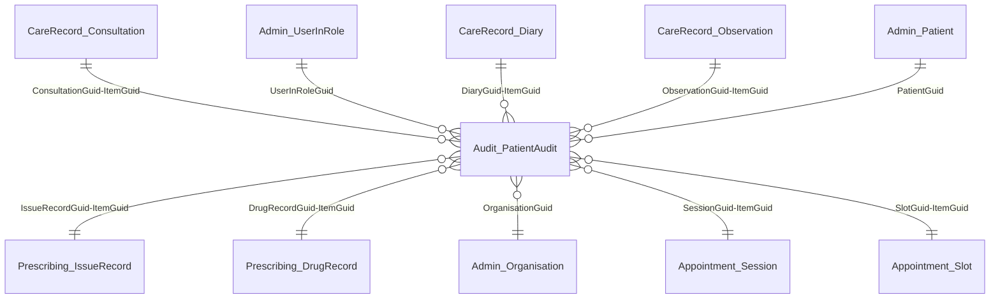

---

### Audit_RegistrationAudit

| Column Name | Description | Example Data | Previous Location | Data Type | Max Length | Is Null |
| --- | --- | --- | --- | --- | --- | --- |
| `PatientGuid` | Link to Admin_Patient.PatientGuid | {422BA762-D6F5-478D-81D5-BDEF1CD6065D} | dbo.Patient.GUID | uniqueidentifier | 38 | 0 |
| `OrganisationGuid` | Link to Admin_Organisation.OrganisationGuid | {414EC4FA-B42D-443E-BD8A-67EB69B33401} | dbo.Organisation.GUID | uniqueidentifier | 38 | 0 |
| `ModifiedDate` | Modified date | 2007-11-02 | Audit.RegistrationAudit.DateStamp | date | 3 | 0 |
| `ModifiedTime` | Modified time | 11:00:00 | Audit.RegistrationAudit.DateStamp | time | 5 | 0 |
| `UserInRoleGuid` | Link to Admin_UserInRole.UserInRoleGuid | {CF1A5B91-D02D-49E4-9F52-9BC961628AAA} | dbo.UserInRole.GUID | uniqueidentifier | 38 | 1 |
| `ModeType` | Modification Type | Delete | Audit.ModeType.Description | varchar | 100 | 0 |
| `ProcessingId` | Sequentual identifier indicating the order to process the items | 1 | N/A | int | 4 | 0 |

#### Entity relations: Audit_RegistrationAudit

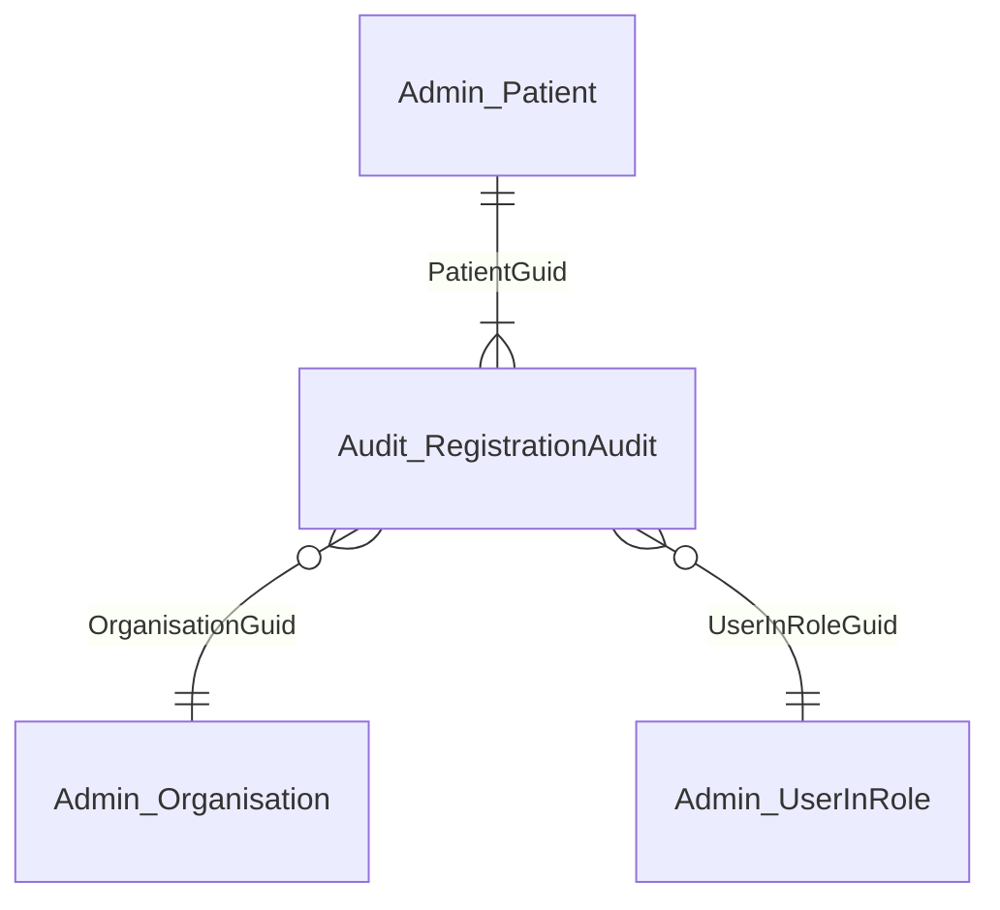

---

### CareRecord_Consultation

| Column Name | Description | Example Data | Pevious Location | Data Type | Max length | Is Nullable |
| --- | --- | --- | --- | --- | --- | --- |
| `ConsultationGuid` | Unique ID | {9C6C0ACA-5D2B-4637-B850-A6FE982E1C08} | CareRecord.Consultation.GUID | uniqueidentifier | 38 | 0 |
| `PatientGuid` | Link to Admin_Patient.PatientGuid | {7FCB62BC-6A95-474F-A063-30C36FACFE5E} | dbo.Patient.GUID | uniqueidentifier | 38 | 0 |
| `OrganisationGuid` | Link to Admin_Organisation.OrganisationGuid | {0F30B81C-D956-4A05-89DF-58CC877FD719} | dbo.Organisation.GUID | uniqueidentifier | 38 | 0 |
| `EffectiveDate` | Clinically effective date | 2007-11-02 | CareRecord.Consultation.EffectiveDate | date | 3 | 1 |
| `EffectiveDatePrecision` | Date accuracy | YMD | CareRecord.Consultation.EffectiveDatePart | varchar | 100 | 1 |
| `EnteredDate` | Entered date | 2007-11-02 | CareRecord.Consultation.AvailabilityTimeStamp | date | 3 | 1 |
| `EnteredTime` | Entered time | 11:00:00 | CareRecord.Consultation.AvailabilityTimeStamp | time | 5 | 1 |
| `ClinicianUserInRoleGuid` | Link to Admin_UserInRole.UserInRoleGuid | {CF1A5B91-D02D-49E4-9F52-9BC961628AAA} | dbo.UserInRole.GUID | uniqueidentifier | 38 | 1 |
| `EnteredByUserInRoleGuid` | Link to Admin_UserInRole.UserInRoleGuid | {CF1A5B91-D02D-49E4-9F52-9BC961628AAA} | dbo.UserInRole.GUID | uniqueidentifier | 38 | 1 |
| `AppointmentSlotGuid` | Link to Appointment_Slot.SlotGuid | {0061D928-858D-47A5-949B-D16FE450E89A} | Appointment.Slot.GUID | uniqueidentifier | 38 | 1 |
| `ConsultationSourceTerm` | Source of Consultation | Main Surgery | CareRecord.Consultation.ConsultationSourceOriginalTerm | varchar | 200 | 1 |
| `ConsultationSourceCodeId` | Link to ClinicalCode.CodeId | 1776011000006110 | CareRecord.Consultation.ConsultationSourceCodeId | bigint | 8 | 1 |
| `Complete` | Y/N | TRUE | CareRecord.Consultation.Complete | boolean | 1 | 1 |
| `ConsultationType` | Type of clinical consultation | Minor Surgery | ConsultationMode.ConsultationStyle.name | varchar | 200 | 1 |
| `Deleted` | Indicates whether the consultation has been deleted | FALSE | CareRecord.Consultation.Deleted | boolean | 1 | 0 |
| `IsConfidential` | Flag to indicate observation is marked as confidential | TRUE | CareRecord.Consultation.ConfidentialityPolicyId | boolean | 1 | 1 |
| `ProcessingId` | Sequentual identifier indicating the order to process the items | 1 | N/A | int | 4 | 0 |

#### Entity relations: CareRecord_Consultation

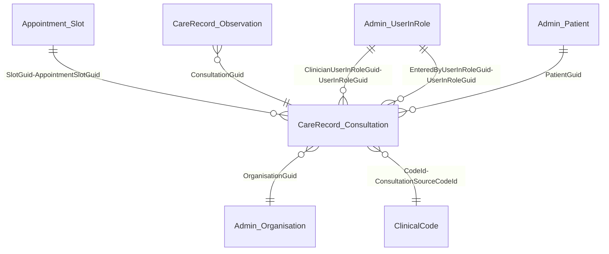

---

### CareRecord_Diary

| Column Name | Description | Example Data | Original Location | Data Type | Max length | Is Nullable |
| --- | --- | --- | --- | --- | --- | --- |
| `DiaryGuid` | Unique ID | {2E3B7F41-BEC8-4466-BFEC-6EA98547A6B5} | CareRecord.Diary.GUID | uniqueidentifier | 38 | 0 |
| `PatientGuid` | Link to Admin_Patient.PatientGuid | {4B3B60D4-5082-4447-AB64-3F1DD3593462} | dbo.Patient.GUID | uniqueidentifier | 38 | 0 |
| `OrganisationGuid` | Link to Admin_Organisation.OrganisationGuid | {0F30B81C-D956-4A05-89DF-58CC877FD719} | dbo.Organisation.GUID | uniqueidentifier | 38 | 0 |
| `EffectiveDate` | Clinically effective date | 2007-11-02 | CareRecord.Diary.EffectiveDate | date | 3 | 1 |
| `EffectiveDatePrecision` | Date accuracy | YMD | CareRecord.Diary.EffectiveDatePart | varchar | 100 | 1 |
| `EnteredDate` | Date entry was created | 2007-11-02 | CareRecord.Diary.AvailabilityTimeStamp | date | 3 | 1 |
| `EnteredTime` | Time entry was created | 11:00:00 | CareRecord.Diary.AvailabilityTimeStamp | time | 5 | 1 |
| `ClinicianUserInRoleGuid` | Link to Admin_UserInRole.UserInRoleGuid | {316D34EB-F495-4C91-B814-364C69B1A541} | dbo.UserInRole.GUID | uniqueidentifier | 38 | 1 |
| `EnteredByUserInRoleGuid` | Link to Admin_UserInRole.UserInRoleGuid | {316D34EB-F495-4C91-B814-364C69B1A541} | dbo.UserInRole.GUID | uniqueidentifier | 38 | 1 |
| `CodeId` | Link to ClinicalCode.CodeId | 284596015 | CareRecord.Diary.CodeId | bigint | 8 | 0 |
| `OriginalTerm` | The numeric value for result observations | Asthma Review | CareRecord.Diary.OriginalTerm | varchar | 200 | 0 |
| `DurationTerm` | Duration free text | 3 months | CareRecord.Diary.DurationTerm | varchar | 50 | 1 |
| `LocationTypeDescription` | Location type description | G.P.Surgery | dbo.LocationType.LocationTypeDescription | varchar | 50 | 1 |
| `Deleted` | Indicates whether the diary entry has been deleted | FALSE | CareRecord.Diary.Deleted | boolean | 1 | 0 |
| `IsConfidential` | Flag to indicate observation is marked as confidential | TRUE | CareRecord.Diary.ConfidentialityPolicyId | boolean | 1 | 1 |
| `IsActive` | Indicates whether the diary entry is currently active | TRUE | CareRecord.Diary.IsActive | boolean | 1 | 0 |
| `IsComplete` | Indicates whether the diary entry is complete | TRUE | CareRecord.Diary.Complete | boolean | 1 | 0 |
| `ConsultationGuid` | Link to CareRecord_Consultation.ConsultationGuid | {5E30A81C-D936-4D05-65EA-58CD877FD712} | CareRecord.Consultation.GUID | uniqueidentifier | 38 | 1 |
| `ProcessingId` | Sequentual identifier indicating the order to process the items | 1 | N/A | int | 4 | 0 |

#### Entity relations: CareRecord_Diary

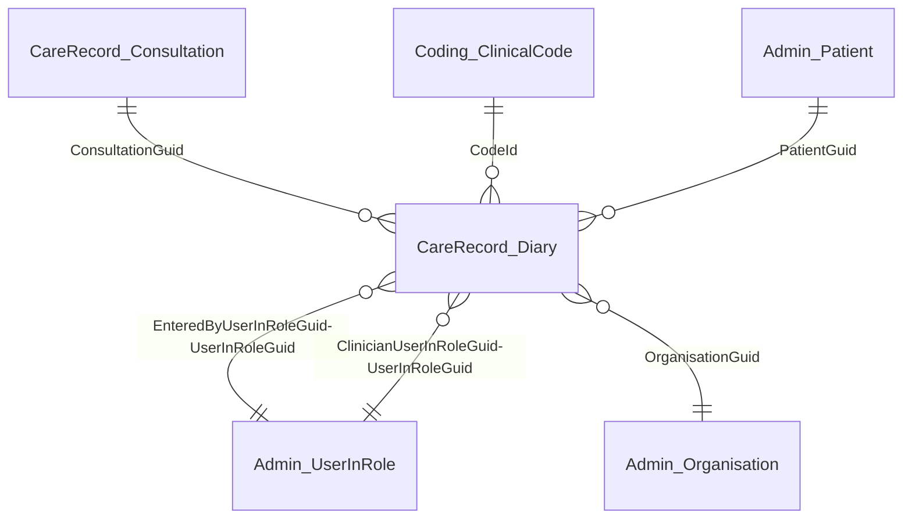

---

### CareRecord_Observation

| Column Name | Description | Example Data | Original Location | Data Type | Max length | Is Nullable |
| --- | --- | --- | --- | --- | --- | --- |
| `ObservationGuid` | Unique ID | {2E3B7F41-BEC8-4466-BFEC-6EA98547A6B5} | CareRecord.Observation.GUID | uniqueidentifier | 38 | 0 |
| `PatientGuid` | Link to Admin_Patient.PatientGuid | {4B3B60D4-5082-4447-AB64-3F1DD3593462} | dbo.Patient.GUID | uniqueidentifier | 38 | 0 |
| `OrganisationGuid` | Link to Admin_Organisation.OrganisationGuid | {0F30B81C-D956-4A05-89DF-58CC877FD719} | dbo.Organisation.GUID | uniqueidentifier | 38 | 0 |
| `EffectiveDate` | Clinically effective date | 2007-11-02 | CareRecord.Observation.EffectiveDate | date | 3 | 1 |
| `EffectiveDatePrecision` | Date accuracy | YMD | CareRecord.Observation.EffectiveDatePart | varchar | 100 | 0 |
| `EnteredDate` | Date entry was created | 2007-11-02 | CareRecord.Observation.AvailabilityTimeStamp | date | 3 | 0 |
| `EnteredTime` | Time entry was created | 11:00:00 | CareRecord.Observation.AvailabilityTimeStamp | time | 5 | 1 |
| `ClinicianUserInRoleGuid` | Link to Admin_UserInRole.UserInRoleGuid | {316D34EB-F495-4C91-B814-364C69B1A541} | dbo.UserInRole.GUID | uniqueidentifier | 38 | 0 |
| `EnteredByUserInRoleGuid` | Link to Admin_UserInRole.UserInRoleGuid | {316D34EB-F495-4C91-B814-364C69B1A541} | dbo.UserInRole.GUID | uniqueidentifier | 38 | 0 |
| `ParentObservationGuid` | If this observation has a parent code the link to the ParentObservationGuid is provided here | {59CF37C1-79C3-4A74-AA21-07553E4B195D} | CareRecord.Observation.GUID | uniqueidentifier | 38 | 0 |
| `CodeId` | Link to Coding_ClinicalCode.CodeId | 284596015 | CareRecord.Observation.CodeId | bigint | 8 | 0 |
| `ProblemGuid` | Link to CareRecord_Problem.ObservationGuid | {4D1D319C-7289-4CFB-9E87-11F89F97CC5C} | CareRecord.Observation.GUID | uniqueidentifier | 38 | 1 |
| `ConsultationGuid` | Link to CareRecord_Consultation.ConsultationGuid | {3E2D654D-5648-3DE3-3F45-32A75D98EE3D} | CareRecord.Consultation.GUID | uniqueidentifier | 38 | 1 |
| `Value` | The numeric value for result observations | 135 | CareRecord.Observation.NumericValue | decimal | 9 | 1 |
| `NumericUnit` | Unit  | 10*9/L | CareRecord.Observation.NumericUnits | varchar | 60 | 1 |
| `ObservationType` | Type of observation | Observation | CareRecord.ObservationType.TypeDescription | varchar | 20 | 1 |
| `NumericRangeLow` | Low Range | 31 | CareRecord.Range.Minimum | decimal | 9 | 1 |
| `NumericRangeHigh` | High Range | 31 | CareRecord.Range.Maximum | decimal | 9 | 1 |
| `DocumentGuid` | Unique ID for associated attachment | {6BD67363-AB3D-4F85-8D23-136ED6B76DD6} | CareRecord.Document.DocumentGUID | uniqueidentifier | 38 | 1 |
| `Qualifiers` | Free text limited to 8000 characters that shows qualifiying information for the observation | <qualifier><item><key codeId="0">Manufacturer</key><value>bexsero</value> | Carerecord.Observation.Qualifiers | varchar | 8000 | 1 |
| `Abnormal` | Flag to indicate if the observation was recorded as abnormal | TRUE | carerecord.observation.Abnormal | Boolean | 1 | 0 |
| `AbnormalReason` | Description of why the observation was recorded as abnormal | LO | Carerecord.Observation.AbnormalReason |  | 50 | 1 |
| `Episode` | Indicates the epicodicity of the observation | First | Carerecord.Observation.Episodicity | varchar | 10 | 0 |
| `Deleted` | Indicates whether the clinical observation has been deleted | FALSE | CareRecord.Observation.Deleted | boolean | 1 | 0 |
| `IsConfidential` | Flag to indicate observation is marked as confidential | TRUE | CareRecord.Observation.ConfidentialityPolicyId | boolean | 1 | 0 |
| `ProcessingId` | Sequentual identifier indicating the order to process the items | 1 | N/A | int | 4 | 0 |

#### Entity relations: CareRecord_Observation

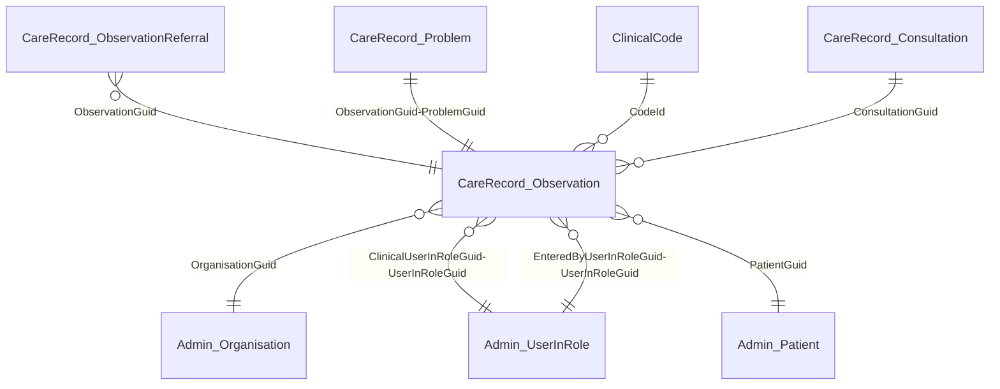

---

### CareRecord_ObservationReferral

| Column Name | Description | Example Data | Original Location | Data Type | Max length | Is Nullable |
| --- | --- | --- | --- | --- | --- | --- |
| `ObservationGuid` | Unique ID | {2E3B7F41-BEC8-4466-BFEC-6EA98547A6B5} | CareRecord.ObservationGUID | uniqueidentifier | 38 | 0 |
| `PatientGuid` | Link to Dimension.Patient.PatientGuid | {4B3B60D4-5082-4447-AB64-3F1DD3593462} | dbo.Patient.GUID | uniqueidentifier | 38 | 0 |
| `OrganisationGuid` | Link to Admin_Organisation.OrganisationGuid | {0F30B81C-D956-4A05-89DF-58CC877FD719} | dbo.Organisation.GUID | uniqueidentifier | 38 | 0 |
| `ReferralTargetOrganisationGuid` | Link to Admin_Organisation.OrganisationGuid | {6B776524-F038-4BEB-9CA7-0F354026EA34} | New column | uniqueidentifier | 38 | 0 |
| `ReferralUrgency` | Urgency of referral | Routine | ReferralManagement.Urgency.DisplayText | varchar | 50 | 1 |
| `ReferralServiceType` | Service type | Inbound | CareRecord.ServiceType.DisplayText | varchar | 100 | 1 |
| `ReferralMode` | Mode of referral | Written | CareRecord.ReferralMode.Description | varchar | 100 | 1 |
| `ReferralReceivedDate*` | Date referral was received |  | currently unavailble |  |  |  |
| `ReferralReceivedTime*` | Time referral was received |  | currently unavailble |  |  |  |
| `ReferralEndDate*` | Date referral was ended |  | currently unavailble |  |  |  |
| `ReferralSourceId*` | Link to ClinicalCode.CodeId |  | currently unavailble |  |  |  |
| `ReferralSourceOrganisationGuid*` | Link to Admin_Organisation.OrganisationGuid |  | currently unavailble |  |  |  |
| `ReferralUBRN` | Unique Booking Reference Number | 123456978965 | CareRecord.Referral.UBRN | char | 12 | 1 |
| `ReferralReasonCodeId*` | Link to ClinicalCode.CodeId |  | currently unavailble |  |  |  |
| `ReferringCareProfessionalStaffGroupCodeId*` | Link to ClinicalCode.CodeId |  | currently unavailble |  |  |  |
| `ReferralEpisodeRTTMeasurementTypeId*` | Link to ClinicalCode.CodeId |  | currently unavailble |  |  |  |
| `ReferralEpisodeClosureDate*` | Episode end date |  | currently unavailble |  |  |  |
| `ReferralEpisodeDischargeLetterIssuedDate*` | Discharge letter issued date |  | currently unavailble |  |  |  |
| `ReferralClosureReasonCodeId*` | Link to ClinicalCode.CodeId |  | currently unavailble |  |  |  |
| `TransportRequired` | Flag to show whether transport is required | TRUE | carerecord.Referral.Transport | Boolean | 1 | 0 |
| `ProcessingId` | Sequentual identifier indicating the order to process the items | 1 | N/A | int | 4 | 0 |

#### Entity relations: CareRecord_ObservationReferral

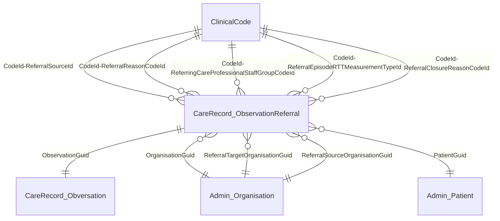

---

### CareRecord_Problem

| Column Name | Description | Example Data | Original Location | Data Type | Max length | Is Nullable |
| --- | --- | --- | --- | --- | --- | --- |
| `ObservationGuid` | Unique ID | {2E3B7F41-BEC8-4466-BFEC-6EA98547A6B5} | CareRecord.Observation.GUID | uniqueidentifier | 38 | 0 |
| `PatientGuid` | Link to Admin_Patient.PatientGuid | {4B3B60D4-5082-4447-AB64-3F1DD3593462} | dbo.Patient.GUID | uniqueidentifier | 38 | 0 |
| `OrganisationGuid` | Link to Admin_Organisation.OrganisationGuid | {0F30B81C-D956-4A05-89DF-58CC877FD719} | dbo.Organisation.GUID | uniqueidentifier | 38 | 0 |
| `ParentProblemObservationGuid` | If this observation has a parent code the link to the ParentObservationGuid is provided here | {59CF37C1-79C3-4A74-AA21-07553E4B195D} | CareRecord.Observation.GUID | uniqueidentifier | 38 | 1 |
| `Deleted` | Indicates whether a problem has been deleted | TRUE | CareRecord.ProblemDeletionHistory | boolean | 1 | 1 |
| `EndDate` | Problem end date | 2007-11-02 | CareRecord.Problem.EndDate | date | 3 | 1 |
| `EndDatePrecision` | Date accuracy | YMD | CareRecord.Problem.EffectiveDatePart | varchar | 100 | 0 |
| `ExpectedDuration` | Expected duration of problem | 28 | CareRecord.Problem.ExpecedDuration | smallint | 2 | 0 |
| `LastReviewDate` | Date Problem last reviewd | 2007-11-02 | CareRecord.Problem.LastReviewDate | date | 3 | 1 |
| `LastReviewDatePrecision` | Date accuracy | YMD | CareRecord.Problem.LastReviewDatePart | varchar | 100 | 1 |
| `LastReviewUserInRoleGuid` | Link to Admin_UserInRole.UserInRoleGuid | {316D34EB-F495-4C91-B814-364C69B1A541} | dbo.UserInRole.GUID | uniqueidentifier | 38 | 1 |
| `ParentProblemRelationship` | Relationship to parent problem | Grouped | CareRecord.Problem.ParentProblemRelationship | varchar | 20 | 1 |
| `ProblemStatusDescription` | Status of the problem | Active Problem | CareRecord.Problem.Status | varchar | 50 | 0 |
| `SignificanceDescription` | Problem significance | Minor Problem | CareRecord.Problem.Significance | varchar | 20 | 0 |
| `ProcessingId` | Sequentual identifier indicating the order to process the items | 1 | N/A | int | 4 | 0 |

#### Entity relations: CareRecord_Problem

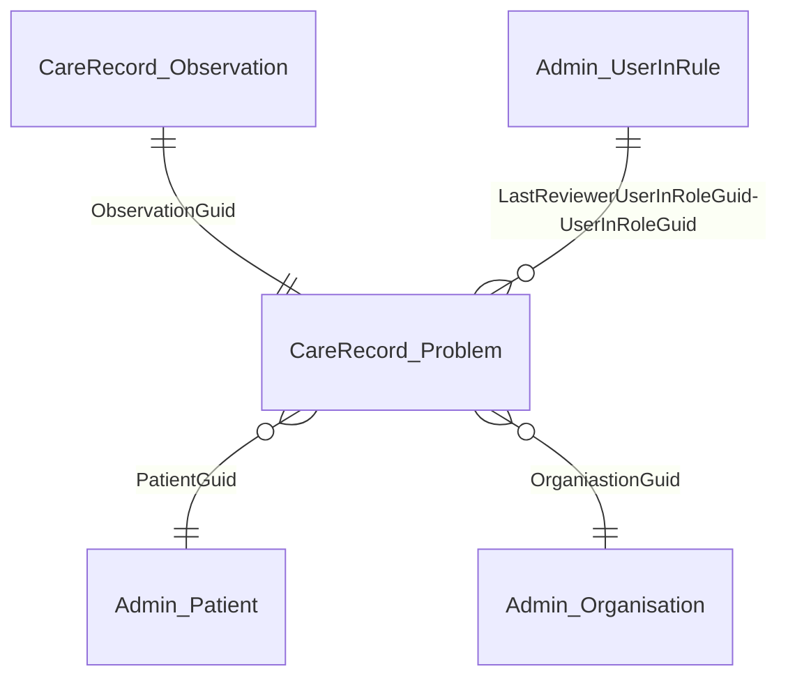

---

### Coding_ClinicalCode

| Column Name | Description | Example Data | Previous Location | Data Type | Max length | Is Nullable |
| --- | --- | --- | --- | --- | --- | --- |
| `CodeId` | Unique ID | 1777541000006110 | Variation.Code.CodeId | SCTID:bigint | 8 | 0 |
| `Term` | Code term | Activity location: Patient's home | Variation.Code.Term | varchar | 255 | 0 |
| `ReadTermId` | Read code | EMISNQAC724 | Variation.Code.OldCode | varchar | 200 | 1 |
| `SnomedCTConceptId` | Unique ID | 1777541000006100 | Variation.SnomedInteropOutgoing.ConceptId | SCTID:bigint | 8 | 0 |
| `SnomedCTDescriptionId` | Unique ID | 1777541000006110 | Variation.SnomedInteropOutgoing.DescriptionId | SCTID:bigint | 8 | 0 |
| `NationalCode` | National code | A01 | DataDictionary.NationalCode.DataDictionaryCode | varchar | 50 | 1 |
| `NationalCodeCategory` | Code category | ACTIVITY LOCATION TYPE CODE | DataDictionary.DataElement.Name | varchar | 100 | 1 |
| `NationalDescription` | National code description | Patients home | DataDictionary.NationalCode.Description | varchar | 255 | 1 |
| `EmisCodeCategoryDescription` | EMIS Code Category Description | Biochemistry | Variation.EmisCodeCategory.Description | varchar | 64 | 0 |
| `ParentCodeID` | Unique ID | 506031000006117 | Variation.HierarchyDown.ParentCodeId | SCTID:bigint | 8 | 1 |
| `ProcessingId` | Sequentual identifier indicating the order to process the items | 1 | N/A | int | 4 | 0 |

---

### Coding_DrugCode

| Column Name | Description | Example Data | Previous Location | Data Type | Max length | Is Nullable |
| --- | --- | --- | --- | --- | --- | --- |
| `CodeId` | Drug code ID | 1026041000033110 | New column | bigint | 8 | 0 |
| `Term` | Name of drug | Oxprenolol 160mg modified-release tablets | Coding.Code.Term | varchar | 255 | 0 |
| `DmdProductCodeId` | DM&D ID | 318507003 | Mapping.DmdPreparation | bigint | 8 | 1 |
| `BNFChapterRef` | The BNF chapter reference | 19.1 | Bnf.Hier.ChapterRef | varchar | 50 | 1 |
| `ProcessingId` | Sequentual identifier indicating the order to process the items | 1 | N/A | int | 4 | 0 |

---

### Prescribing_DrugRecord

| Column Name | Description | Example Data | Previous Location | Data Type | Max length | Is Nullable |
| --- | --- | --- | --- | --- | --- | --- |
| `DrugRecordGuid` | Unique ID | {10EBFA6C-C6E0-481B-B8B7-106173D649DD} | Prescribing,DrugRecord.GUID | uniqueidentifier | 38 | 0 |
| `PatientGuid` | Link to Admin_Patient.PatientGuid | {7AE77416-038A-4761-9F6A-8D77B4C7ABCF} | dbo.Patient.GUID | uniqueidentifier | 38 | 0 |
| `OrganisationGuid` | Link to Admin_Organisation.OrganisationGuid | {0F30B81C-D956-4A05-89DF-58CC877FD719} | dbo.Organisation.GUID | uniqueidentifier | 38 | 0 |
| `EffectiveDate` | Clinically effective date | 2007-11-02 | Prescribing.DrugRecord.EffectiveDate | date | 3 | 1 |
| `EffectiveDatePrecision` | Date accuracy | YMD | Prescribing.DrugRecord.EffectiveDatePart | varchar | 100 | 0 |
| `EnteredDate` | Date entered | 2007-11-02 | Prescribing.DrugRecord.AvailabilityTimeStamp | date | 3 | 0 |
| `EnteredTime` | Time entry was created | 11:00:00 | Prescribing.DrugRecord.AvailabilityTimeStamp | time | 5 | 1 |
| `ClinicianUserInRoleGuid` | Link to Admin_UserInRole.UserInRoleGuid | {E93841BE-BD3D-469E-A2B3-03F6EEA7CD9A} | dbo.UserInRole.GUID | uniqueidentifier | 38 | 0 |
| `EnteredByUserInRoleGuid` | Link to Admin_UserInRole.UserInRoleGuid | {E93841BE-BD3D-469E-A2B3-03F6EEA7CD9A} | dbo.UserInRole.GUID | uniqueidentifier | 38 | 0 |
| `CodeId` | Link to DrugCode.CodeId | 17141000033112 | Prescribing.DrugRecord.CodeId | bigint | 8 | 0 |
| `Dosage` | Dosage | TAKE ONE DAILY | Prescribing.DrugRecord.Dosage | varchar | 400 | 0 |
| `Quantity` | Quantity | 28 | Prescribing.DrugRecord.Quantity | decimal | 5 | 0 |
| `QuantityUnit` | Unit | tablet(s) | Prescribing.DrugRecord.QuantityUnit | varchar | 60 | 0 |
| `ProblemObservationGuid` | Link to CareRecord_Observation.ProblemGuid | {8EEA30CA-1E1E-42A3-8F06-AC8A151078BF} | New column | uniqueidentifier | 38 | 0 |
| `PrescriptionType` | Type of prescription | Repeat | Prescribing.DrugRecord.TypeDescription | varchar | 20 | 0 |
| `IsActive` | Is this still active | TRUE | Prescribing.DrugRecord.DrugStatus | boolean | 1 | 0 |
| `CancellationDate` | Date of Cancellation | 2007-11-02 | Prescribing.DrugRecordCancellation.CancellationDateTime | date | 3 | 1 |
| `NumberOfIssues` | No. of times drug has been issued on current authorisation | 6 | Prescribing.DrugRecord.NoOfIssues | tinyint | 1 | 1 |
| `NumberOfIssuesAuthorised` | No. of issues authorised | 6 | Prescribing.DrugRecord.NumberOfIssuesAuthorised | tinyint | 1 | 1 |
| `IsConfidential` | Flag to indicate observation is marked as confidential | TRUE | Prescribing.DrugRecord.ConfidentialityPolicyId | boolean | 1 | 0 |
| `Deleted` | Indicates whether the drug has been deleted | FALSE | Prescribing.DrugRecord.Deleted | boolean | 1 | 0 |
| `ProcessingId` | Sequentual identifier indicating the order to process the items | 1 | N/A | int | 4 | 0 |

#### Entity relations: Prescribing_DrugRecord

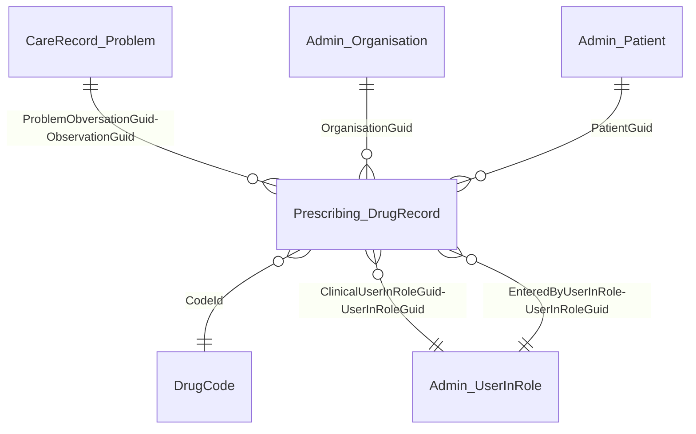

### Prescribing_IssueRecord

| Column Name | Description | Example Data | Previous Location | Data Type | Max length | Is Nullable |
| --- | --- | --- | --- | --- | --- | --- |
| `IssueRecordGuid` | Unique ID | {94C45BF4-F71D-4A42-A7F1-6BFA9CF2B227} | Prescribing.IssueRecord.GUID | uniqueidentifier | 38 | 0 |
| `PatientGuid` | Link to Admin_Patient.PatientGuid | {97BBBC3C-FB67-4D88-9572-2C317C952F5C} | dbo.Patient.GUID | uniqueidentifier | 38 | 0 |
| `OrganisationGuid` | Link to Admin_Organisation.OrganisationGuid | {0F30B81C-D956-4A05-89DF-58CC877FD719} | dbo.Organisation.GUID | uniqueidentifier | 38 | 0 |
| `DrugRecordGuid` | Link to Prescribing_DrugRecord.DrugRecordGuid | {4EF066F4-B040-4169-B0C1-C41D727A792F} | Prescribing,DrugRecord.GUID | uniqueidentifier | 38 | 0 |
| `EffectiveDate` | Clinically effective date | 2007-11-02 | Prescribing.IssueRecord.EffectiveDate | date | 3 | 1 |
| `EffectiveDatePrecision` | Date accuracy | YMD | Prescribing.IssueRecord.EffectiveDatePart | varchar | 100 | 0 |
| `EnteredDate` | Entered date | 2007-11-02 | Prescribing.IssueRecord.AvailabiliyTimeStamp | date | 3 | 0 |
| `EnteredTime` | Time entry was created | 11:00:00 | Prescribing.IssueRecord.AvailabilityTimeStamp | time | 5 | 1 |
| `ClinicianUserInRoleGuid` | Link to Admin_UserInRole.UserInRoleGuid | {893001D7-07FA-42D8-A303-C61FD99C874B} | dbo.UserInRole.GUID | uniqueidentifier | 38 | 0 |
| `EnteredByUserInRoleGuid` | Link to Admin_UserInRole.UserInRoleGuid | {893001D7-07FA-42D8-A303-C61FD99C874B} | dbo.UserInRole.GUID | uniqueidentifier | 38 | 0 |
| `CodeId` | Link to DrugCode.CodeId | 2261441000033110 | Prescribing.IssueRecord.CodeId | bigint | 8 | 0 |
| `Dosage` | Dosage | 1 AT NIGHT | Prescribing.IssueRecord.Dosage | varchar | 400 | 0 |
| `Quantity` | Quantity | 56 | Prescribing.IssueRecord.Quantity | decimal | 5 | 0 |
| `QuantityUnit` | Unit | tablet(s) | New column | varchar | 60 | 0 |
| `ProblemObservationGuid` | Link to CareRecord_Observation.ProblemGuid | {148781FC-7F33-4314-BDF5-655A99BE91A8} | New column | uniqueidentifier | 38 | 0 |
| `CourseDurationInDays` | Number of days the course was due to last (where known) | 30 | Prescribing.IssueRecord.CourseDurationInDays | int | 4 | 0 |
| `EstimatedNhsCost` | Estimated NHS cost | 13.14 | New column | smallmoney | 4 | 0 |
| `IsConfidential` | Flag to indicate observation is marked as confidential | TRUE | Prescribing.IssueRecord.ConfidentialityPolicyId | boolean | 1 | 0 |
| `EmisCode` | Legacy code associated with the issue record | AMCA17511NEMIS | Prescribing.IssueRecord.LegacyCode | varchar | 50 | 1 |
| `PatientMessage` | Free text message to the patient | Please book appointment with nurse after test | Prescribing.IssueRecord.PatientMessage | varchar | 8000 | 1 |
| `ScriptPharmacyStamp` | Details of the pharmacy | Asda Pharmacy | Prescribing.IssueRecord.ScriptPharmacyStamp | varchar | 255 | 1 |
| `Compliance` | Compliance rating | 0.417720228 | PrescribingIssueRecord.Compliance | decimal | 5 | 1 |
| `AverageCompliance` | Average compliance rating | 0.417720228 | prescribing.IssueRecord.AverageCompliance | decimal | 5 | 1 |
| `IsPrescribedAsContraceptive` | flag to indicate whether the prescription is a contraceptive | FALSE | prescribing.IssueRecord.PrescribedAsContraceptive | Boolean | 1 | 0 |
| `IsPrivatelyPrescribed` | flag to indicate a private prescription | TRUE | Prescribing.IssueRecord.PrivatelyPrescribed | Boolean | 1 | 0 |
| `PharmacyMessage` | free text message to the pharmacy.  Limited to 8000 characters | Please make an appointment for BP  | Prescribing.IssueRecord.PharamcyMessage | varchar | 8000 | 1 |
| `PharmacyText` | free text information provided to the pharmacy.  Limited to 8000 characters | qty reduced as review overdue | prescribing.IssueRecord.PharmacyText | varchar | 8000 | 1 |
| `ConsultationGuid` | Link to Carerecord_Consulation.ConsultationGuid | {E93841BE-BD3D-469E-A2B3-03F6EEA7CD9A} | carerecord.consultation.guid | uniqueidentifier | 38 | 1 |
| `Deleted` | Indicates whether the drug issue has been deleted | FALSE | Prescribing.IssueRecord.Deleted | boolean | 1 | 0 |
| `ProcessingId` | Sequentual identifier indicating the order to process the items | 1 | N/A | int | 4 | 0 |

#### Entity relations: Prescribing_IssueRecord

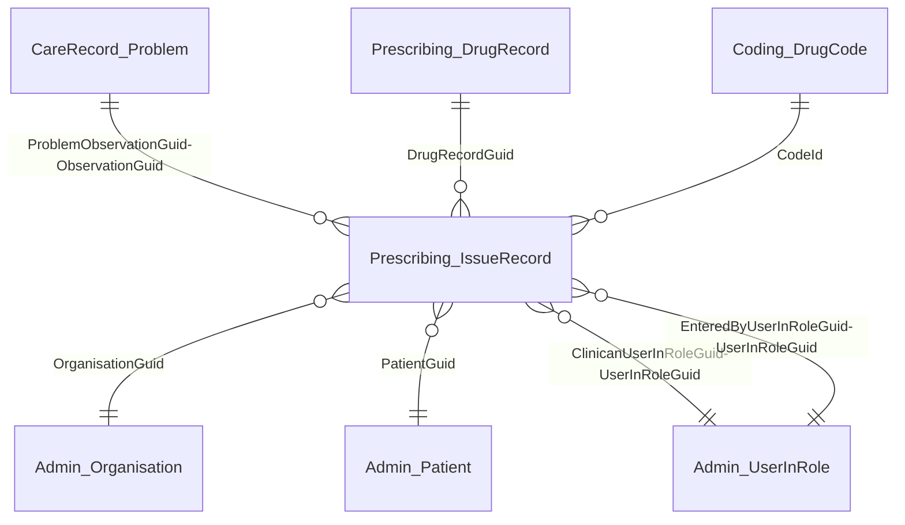
