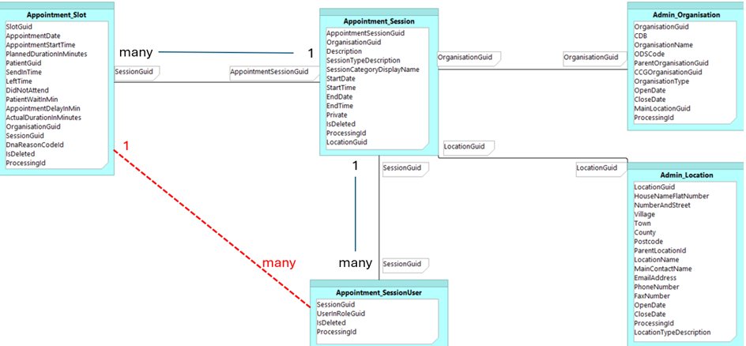

# Optum EMIS data: questions and answers

## Contents

- [Data content - operational](#data-content---operational)
    - [Q: Are rebulks required to capture transferred patient-history](#question-are-rebulks-required-to-capture-patient-history-of-transferred-patients)
    - [Q: Patients covered by EMIS IM1 feeds](#question-patients-covered-by-emis-im1-feeds)
    - [Q: Are schema changes applied simultaneously]

## Data content - operational

### Question: are rebulks required to capture patient-history of transferred patients

_(answer last updated: 2025-12-08)_

If a patient transfers from one GP to another, will we need to rebulk at the new practice? Or will the historic records for the transferred patient appear in the daily deltas? Will this include the full history of the patient?

Response from Optum:

> _The patient will be included in the new site as the deltas just include any changes since the last delta, so the day after they registered at their new practice they'd be included in the delta and they would provide the full record just not straight away, but once the full record has been received via GP2GP or scanned in or anything it'll then be included._

**Interpretted answer**: The London Data Service would recieve the new transferred patient through the normal delta update process. The full patient historic will be delivered via those same deltas as soon as the GPs have completed all work to transfer the patient over successfully - this may take some time depending on the workflow procedures of the deducting and receiving practices.

### Question: Patients covered by EMIS IM1 feeds

_(answer last updated: 2023-10-31)_

How much data is available for inclusion in the IM1 feeds? / Will extracts from the IM1 feed include patients who have left the practice or been recorded as deceased?

**Response from EMIS:** 
> On the set-up of live extracts, recipients can select whether they wish to include inactive patients, and the time period for these – this is available to a maximum of 5 years.

### Question: Upon a schema change, are all practices transferred to the new schema simultaneously?

_(answer last updated: 2024-12-10)_

When a new specification is released, is it applied to all extracts on the same day, and from that point all extracts are shifted over to the new spec? Or is there a period over which individual EMIS systems are gradually upgraded and switched over to the new spec?

**Response from EMIS:**
> When a schema update is made to the files it applies to everything at once. Prior to any schema update NHSE or EMIS will share the details of the changes well in advance and an updated version of the schema will be available in the test environment.
>
> In general schema changes are only additions and not changes/deletions to columns (where possible) We don’t make changes very often – try and limit schema level changes to once a year if we can

## Data content - technical

### Question: Does the data supplied use UTF8?

_(answer last updated: 2023-12-05)_

Are you able to please confirm if the data extracted / data source requires or otherwise includes characters beyond ASCII (i.e. Unicode / UTF8 exclusive chars)

**Response from EMIS:**
> We can confirm that the data should always be in UTF-8 by the time it gets to the extract

### Question: Is data updated asynchronously?

_(answer last updated: 2023-06-26)_

Do tables within the IM1 feed change asynchronously from one-another? For example, if a record changes in the ‘Admin Patient’ table, will this trigger a re-extraction of all related records from tables that use the ‘Admin Patient’ Identifier as a foreign key?

**Response from EMIS**:
>The delta for each table is calculated independently so if an attribute of an organisation is changed then you will see a row in the organisation delta table but as the organisation guid hasn’t changed then you won’t see any corresponding record in the patient delta. if anything changes within a consultation even though the guid stays the same then a record will be present in the delta. Each day we calculate a bulk for every table. We then compare that bulk with the bulk created on the previous day and the differences are published as the delta file. As such the deltas are handled independently from each other table

### Question: Cardinality between `Appointment_Session` and `Appointment_SessionUser`

The Entity Relationship Diagrams for the extract specifications show that there is:

- one-to-many relationship from Appointment-Session to Appointment-Slot, i.e. one session can have many slots
- one-to-many relationship from Appointment-Session to Appointment-SessionUser, indicating that one session can have many users.

The output specification that we’re attempting to emulate and transform this data into, requires us to directly relate the appointment-slots to the sessionUsers. Please see the red line in the diagram below. As such we’re using the ERD to inform what the relationship cardinality would be. The table relationships infer that each Appointment-Slot can have many SessionUsers.

This makes logical sense both in terms of the ERD and in real world scenarios, as it is possible for multiple clinical staff could be present in, or required for, a single appointment slot. But as this cardinality is causing us a little bit of a headache with the data mart we need to transform the data into, so I thought I’d reach out to double check and make sure that this cardinality isn’t constrained in other ways within the application layer of EMIS to force each appointment-slot to have only one SessionUser?

I expect that the overwhelming majority of appointment-slots actually only have a single session-User associated to them, but unless it’s constrained in the UI somewhere, then the table ERD infers that there will probably be edge cases where multiple users are involved in a single slot.

**Response:**
> _No response received_

### Question: Reference object repetition

Regarding the “Coding_ClinicalCode” table, I’m unsure how this will be presented in the case of an extract covering multiple practices. If each practice can independently modify their copy of the data that populates the “Coding_ClinicalCode” table, how will I know which records are for one practice and which are for another within the same extract?

Are practices limited to adding/amending local code values only? and prevented from editing the existing default options? Is there anything that prevents Practice X entering a local clinical code value with one set of properties, that overlaps with Practice Y, who use the same local clinical code value but with a slightly different set of properties? Our design will be pooling the data from each extract group at a fairly early stage of processing, and there isn’t anything naturally occurring in the coding tables that delineates which records are applicable to which practice, so if there is a risk of overlap across extract groups then we may have to force in the extract group ID or practice ID to ensure each code is unique. But this alone doesn’t resolve the problem of overlaps/conflicts within the same extract group.

Also just for clarity, as the documentation state that these tables should be completely replaced, can I assume therefore that within each delta extract for a given extract group, we will be issued with full copies of the “Coding_” tables, but conversely that for the Organisation/Location tables we just get upserts (new/updated records)

**Response from EMIS:**

> [!IMPORTANT]
> The clinical code table is taken from a central reference source and is not altered or updated by individual practices.
>
>As for the organisation and location tables, these will only include organisations and locations covered in the extracted data. E.g. if you had an extract covering 3 organisations, then only these 3 would appear in the extract table, so these would not be duplicated (unless you had 2 extract agreements which had the same site on).

### Question: uniqueness of 'globally' unique identifiers

Are we safe to presume that GUIDs provided are globally/universally unique across all extracted groups, or are they only unique within the practice/extract group? can there be conflicting overlaps? For example a LocationGUID for Practice X that means Location A, but the same LocationGUID for Practice Y means Location B

**Response from EMIS:**

> [!WARNING]
>The guids are **not** guaranteed to be globally unique – the only way to ensure they are a unique key is by joining the record’s guid with the organisation guid

### Question: Content of "Admin_PatientHistory"

_(answered: 2024-07-12)_

Our sample/dummy data provided from yourselves, seems to imply that the history of changes tracked by the table ‘Admin_PatientHistory’ table may only go back so far.
Is there any known limitation on this history? Or a time from when this table was first implemented, and hence earlier changes are not captured?

We have dummy record examples of patients that registered before 2011, but there’s no corresponding PatientHistory record noting that initial registration as a change.

**Response from EMIS:**
> In the live environment you’ll be able to define a period of time for deceased/deregistered patients. This can then define how far in the past you can see their data for. As far as I’m aware in the live environment this patient history should go back to whenever changes have actually been made (in the original bulk) and then further changes will come through in any deltas that include them. Our test environment 28962, while having some consultations from a long time ago, was technically created mid last year and so may not have full access to history due to that setup date

> [!IMPORTANT]
> From Emis specification v8.3 the `Admin_PatientHistory` object is known to include all history when rebulked. The history is limited to the same 'deducted and deceased' window limitations. So any history for patients who have left more than 5 years ago will be absent, but the history of patients currently registered (or have been registered at some point in the past 5 years) will be provided in full.