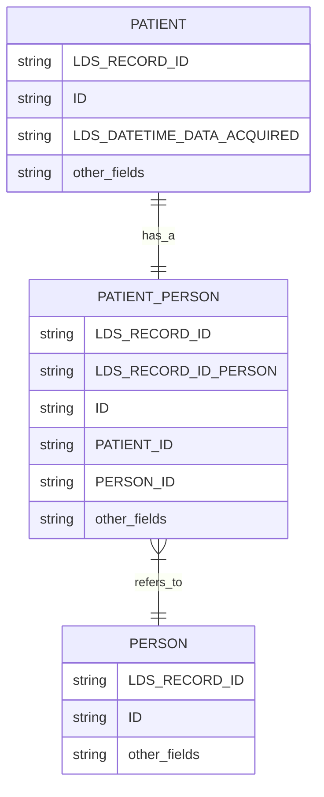
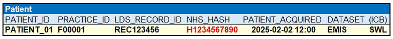
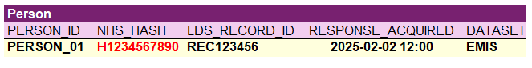
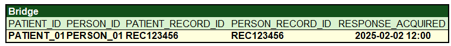
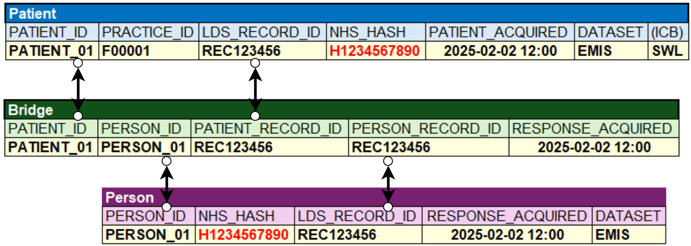

# Transforming patients to persons

- [Transforming patients to persons](#transforming-patients-to-persons)
  - [Overview](#overview)
  - [Sources](#sources)
    - [Why use PDS](#why-use-pds)
  - [Constraints and requirements](#constraints-and-requirements)
    - [Asynchornous response management and PERSON "Stubs"](#asynchornous-response-management-and-person-%22stubs%22)
    - [PDS response types](#pds-response-types)
    - [Allocation](#allocation)
    - [Visibility of PDS responses for departed patients](#visibility-of-pds-responses-for-departed-patients)
  - [`PERSON` construction general process](#%60person%60-construction-general-process)
  - [General linking process](#general-linking-process)
  - [Allocation logic](#allocation-logic)
  - [Scenarios](#scenarios)
    - [scenario 1: simple pathway of a new patient with eventual PDS "matched" response](#scenario-1%3A-simple-pathway-of-a-new-patient-with-eventual-pds-%22matched%22-response)


## Overview

This document explains the processes used to generate `PERSON` records and link them through `PATIENT_PERSON` to the set of `PATIENT` records captured by the service.

## Sources

The service will accumulate records from source systems; currently this includes:

- Primary Care Data sourced from practices using Egton Medical Information Systems (EMIS) run by Optum.
- Primary Care Data sourced from practices using The Phoenix Partnership (TPP) systems.

The service will additionally perform a Person Demographics Service (PDS) trace of the recieved patient details, and asynchronously recieve a response into the service from that trace. The results of this trace can then be used to present as the `PERSON`.

### Why use PDS

The Personal Demographics Service (PDS) is the source of truth for patient identity information within the NHS in England, Wales, and the Isle of Man. It is the master database for core demographic details like the NHS number, name, address, and date of birth. Healthcare systems use the PDS to confirm patient identity, link them to their records, and support other services like referrals and prescribing

Key functions of PDS include:

- Master database: It acts as the central, authoritative repository for patient demographic data, ensuring consistent information across the NHS
- Identity verification: PDS is used to reliably identify patients and trace them using key information like name, date of birth, and NHS number
- Record linkage: It links patients to their health records, which is crucial for care coordination and managing different services
- Patient contact: It supports patient communication by maintaining up-to-date contact information, including registered GP and nominated pharmacy
- National identity: It contains the national health identity for all NHS users and is essential for services like the Summary Care Record.

How PDS works:

- Data management: Information is managed to ensure it is accurate and high-quality. 
- Updates: Changes to a patient's information, such as address changes, are typically made at their GP practice and automatically fed into the PDS.
- Births and deaths: New births are registered onto the PDS, and deaths are updated via a data feed from the Office for National Statistics (ONS).
- Access control: Access to the PDS is tightly controlled and restricted to authorized health and care staff. Records can also have restricted access settings, which can be removed upon patient or GP request.

For more information on PDS please see the [NHS Digital documentation](https://digital.nhs.uk/services/personal-demographics-service)

The Data Engine has chosen to use PDS as the source of truth for person identity, as this is the golden standard for the wider NHS. Any incorrect information present in the PDS record should be rectified to ensure that all healthcare services are working with the correct data.

## Constraints and requirements

There are a number of constraints and requirements that the OneLondon Data Engine must consider in constructing the person generation process.

### Asynchornous response management and PERSON "Stubs"

The processes used by the Data Engine raise a request with PDS and do not wait for responses to be recieved. In this manner, `PATIENT` records can be presented to subscribers before a PDS response is received or processed by the engine. However a requirement exists that all `PATIENT` records **must have** an associated `PERSON` record. As such we have implemented the concept of 'Stub `PERSONS`' which are based upon the available information present in the `PATIENT` record.

This process operates on a specific condition that stubs are only generated where the `PATIENT` does not already link to a PDS response. Any existing PDS response will always take presendence and become the preferred `PERSON` record over a stub `PERSON` - even if that response states that no match is found.

### PDS response types

PDS has a number of different response types, explained in the PDS MESH dictionary as below:

| Response constant | Error or success code | Description |
| :--- | :--- | :--- |
| SUCCESS | 00 | A match is found |
| SUCCESS_SUPERCEDED | 90 | When a record is matched by cross check trace but has a superseding record, the details for the superseding record are returned. (A superseding record is a new PDS record, with a new NHS number which replaces an old PDS record.) |
| INVALID | 91 | Record tracing completed successfully, and a match was found, but the record has confidentiality status set to 'I' (invalid). For invalid records, all details of the patient are suppressed, including the NHS number, so the response looks like the following: <br> `02403456-031f-11e7-a926-080027a2de00,9991112758,,,,,,,,,,,,,,,,91,0000000000,1,0,0,0,0,0,` <br> where `02403456-031f-11e7-a926-080027a2de00` is the unique reference. |
| SENSITIVE | 92 | When a record is marked as sensitive, location sensitive information is not returned in queries. This includes address, GP practice identifier, contact details (phone, email) and related person details. <br> Can be used by any NHS patient who feels that their location details should not be accessible by the NHS, or in other situations where vulnerable NHS patients request restricted access. Access restrictions can be requested by the patient or agencies such as social services, parole boards, probation services, or the police. |
| NOT_ENOUGH_DATA | 96 | There are multiple exact matches.<br> Too little data has been provided to provide a meaningful match, so it's not possible to distinguish between the possible matches. For example, John Smith, male where multiple people have the same date of birth, but no address or NHS number was provided.<br> MPT generates response code 96 when top two records have the same score of 100 percent and either date of birth or postcode is unavailable in the request message. |
| MULTIPLE_CLOSE_MATCHES | 97 | There are multiple matches with very close match scores and no meaningful way to distinguish them apart. |
| NOT_FOUND | 98 | There is no match for the combination of data in the input |
| LEGACY_UNDER_BUSINESS_INVESTIGATION | 95 |  n/a |

In populating the `PERSON` table the London Data Engine must consider the various response scenarios above. For the most part, the response handling is unchanged based on the response type.

- For successful responses where a match is found (codes: `00` and `90`): the PDS response can be used to inform the content of the `PERSON` record.
- For confidential responses (codes: `91`, `92`, `95`): the PDS response can be used to inform the content of the `PERSON` record.
- For non-matching responses (codes: `96`, `97`, `98`): the PDS response can be used to inform the content of the `PERSON` record on the basis that it informs us that the content within the corresponding `PATIENT` record does not match to a single PDS record. This information is helpful as it advises us that the `PATIENT` record may require further updates by the source publisher to correctly match to PDS.

### Allocation

The allocation of `PERSON` records must operate in such a way that updated PDS responses are visible to subscribers who are in receipt of _active_ `PATIENT` records that describe these persons, but must similarly ensure that subscribers who have not received an updated `PATIENT` record do not see the updated PDS response added to a `PERSON` record. 

In essence once a patient has moved on from a given region, the subscribers access to PDS information about that corresponding person must freeze, and existing record-versions must remain visible to them, whilst ensuring that new record-versions must are not visible to them. This complexity forces us to use a slowly changing data (type 2) approach.

### Visibility of PDS responses for departed patients

Under the same operational principles as above, subscribers have raised a question of whether the bulk load of historical patients should be handled differently such that inactive patients are not subject to a PDS trace, and will only be provided with "stub" persons, as any response from PDS would provide the patients current information, which may not be appropriate for commissioners to view given that the patient has subsequently moved out of the area.

This principle may be further complicated by movements between areas for departed patients, i.e. where a patient has left North-West London to join South East London, and consequently as an active patient in that area will be subject to a PDS trace.

This points us towards a princple that allocation of `PERSON` record-versions must considerate of which `PATIENT` records are visible to the subscriber, and only versions of `PERSONS` that are prior to the latest `PATIENT` record-version accessible to the subscriber should be passed on to that subscriber. Put another way, if a subscriber cannot see the `PATIENT` record that led to a particular PDS response, then that subscriber should not see that PDS response.

## `PERSON` construction general process

The `PERSON` construction process is performed using the following steps:

1. A `PATIENT` source record (i.e. in its EMIS or TPP schema) is received and processed within the common-modelling service to form a common-modelled `PATIENT` record.
1. As part of populating the `PATIENT` common-model record, the process identifies whether a corresponding `PERSON` record already exists for this patient.
   1. The `PERSON_ID` is constructed from the available `PATIENT` information based on the logic below
   1. if the corresponding `PERSON` record, matched on this identifier, does not exist, a "stub" `PERSON` record is created based on corresponding information from the `PATIENT` record. A `PERSON` unique identifier is constructed based upon the digest of the hashed NHS number.
   1. if the corresponding `PERSON` record exists, matched on this identifier, but only from other supplier fed data (i.e. not from PDS), then a new "stub" `PERSON` can be created if the record-hash for the new record would differ from this existing record (i.e. a new stub with new information would be created).
   1. if the corresponding `PERSON` record exists, matched on this identifier, and is sourced from PDS, then regardless of whether the `PATIENT` record is newer, it will not be used to create a "stub" `PERSON` record. This is because the PDS sourced information is considered the 'source of truth', and until a newer PDS response is recieved it is the latest PDS-based 'truth' for that patient.
1. The "bridging" table `PATIENT_PERSON` is then updated to note the link between the added `PERSON` record to the corresponding `PATIENT` record.

The `PERSON_ID` logic is based on:

- where a NHS number hash-digest is populated, a deterministic calculation on the hash is used to form a unique identifier
- where the NHS number hash-digest is not present, a deterministic calculation on the supplied patient identifier is used to form a unique identifier,

## General linking process

The process by which subscribers can join `PATIENT` to `PERSON` is shown below. The links used demostrate how the bridging table works to point the user to the correct record-version for the `PERSON`.



The table below shows the key relationships:

| joining tables | joining keys |
| :--- | :--- |
| `PATIENT` to `PATIENT_PERSON` | `PATIENT.ID = PATIENT_PERSON.PATIENT_ID AND PATIENT.LDS_RECORD_ID = PATIENT_PERSON.LDS_RECORD_ID` |
| `PERSON` to `PATIENT_PERSON` | `PERSON.ID = PATIENT_PERSON.PERSON_ID AND PERSON.LDS_RECORD_ID = PATIENT_PERSON.LDS_RECORD_ID_PERSON` |

## Allocation logic

The logic for allocating `PATIENT` and `PATIENT_PERSON` records is unchanged and equivalent to the logic used for all other OLIDS tables; allocation data links to these tables on `LDS_RECORD_ID` and can be distributed based on the pre-computed allocations.

Typically this will follow a pattern such as the below:

```sql
SELECT * 
FROM PATIENT AS T
WHERE EXISTS
    (
    SELECT 1
    FROM ALLOCATION AS A
    WHERE 
    T.LDS_RECORD_ID = A.LDS_RECORD_ID
    AND A.SUBSCRIBER_CODE = '<SUBSCRIBER_CODE>'
    --optionally
    AND A.LDS_SOURCE_DATASET_OBJECT_ID IN ('<Array of source objects applicable for target table>')
    )
```

The logic for allocating `PERSON` will require a different logic that ensures that each subscriber recieves only the subset of `PERSON` record-versions applicable to their set of `PATIENT` records. This can be deduces by joining onto the bridging table `PATIENT_PERSON`.

The Logic will be of the form:

```sql
SELECT * 
FROM PERSON AS P
WHERE EXISTS
    (
    SELECT 1
    FROM PATIENT_PERSON AS B
    WHERE P.ID = B.PERSON_ID
    AND P.LDS_RECORD_ID = B.LDS_RECORD_ID_PERSON
    AND EXISTS
        (
        SELECT 1
        FROM ALLOCATION AS A
        WHERE A.LDS_RECORD_ID = B.LDS_RECORD_ID_PATIENT
        AND A.SUBSCRIBER_CODE = '<SUBSCRIBER_CODE>'
       --optionally
        AND A.LDS_SOURCE_DATASET_OBJECT_ID IN ('<Array of source objects applicable for target table>')
        )
    )
```

Due to the nature of the behaviour of the exists clause, this can be condensed to:

```sql
SELECT * 
FROM PERSON AS P
WHERE EXISTS
    (
    SELECT 1
    FROM PATIENT_PERSON AS B
    INNER JOIN ALLOCATION AS A
        ON B.LDS_RECORD_ID_PATIENT = A.LDS_RECORD_ID
    WHERE
        P.ID = B.PERSON_ID
    AND P.LDS_RECORD_ID = B.LDS_RECORD_ID_PERSON
    AND A.SUBSCRIBER_CODE = '<SUBSCRIBER_CODE>'
    --optionally
    AND A.LDS_SOURCE_DATASET_OBJECT_ID IN ('<Array of source objects applicable for target table>')
    )
```

## Scenarios

This section describes in detail the process to construct `PERSON` entities in a given scenario.

### scenario 1: simple pathway of a new patient with eventual PDS "matched" response

In this scenario we will be:

- recieving a new patient record from a publisher, 
- processing that record into the common model
- adding a corresponding stub record
- adding a corresponding bridging (`PATIENT_PERSON` record)
- receiving a PDS response after some time
- updating the `PERSON` table with this response
- updating the `PATIENT_PERSON` with this response

We will use an EMIS Patient record as our supplied record in this example, but the same logic would apply to any source system record.

| step | table |
| :--- | :--- |
| First we begin by recieving a patient record from EMIS. This record will have a Patient identifier, an NHS number hash-digest, and a supplied or acquired datetime for sequencing |  |
| As we do not have any person records for this patient at this time, and the PDS response is not yet available, we will then use this patient information to generate a "stub". This will use the NHS-number hash-digest as the Person identifier, and will identify that the source is EMIS. |  |
| We will then insert a record into the bridge table `PATIENT_PERSON` to show the link between this patient and person |  |


Stage 1: first witness of patient
- First we begin by recieving a patient record from EMIS. This record will have a Patient identifier, an NHS number hash-digest, and a supplied or acquired datetime for sequencing  

- As we do not have any person records for this patient at this time, and the PDS response is not yet available, we will then use this patient information to generate a "stub". This will use the NHS-number hash-digest as the Person identifier, and will identify that the source is EMIS.

- We will then insert a record into the bridge table `PATIENT_PERSON` to show the link between this patient and person


When transmitted at this point, the links will allow subscribers to see that `PATIENT_01` relates to `PERSON_01`
