# Transforming patients to persons

- [Transforming patients to persons](#transforming-patients-to-persons)
  - [📖 Overview](#%F0%9F%93%96-overview)
  - [➡️ Sources](#%E2%9E%A1%EF%B8%8F-sources)
    - [❓ Why use PDS](#%E2%9D%93-why-use-pds)
  - [⛓️ Constraints and requirements](#%E2%9B%93%EF%B8%8F-constraints-and-requirements)
    - [🔃 Asynchronous response management and PERSON "Stubs"](#%F0%9F%94%83-asynchronous-response-management-and-person-%22stubs%22)
    - [👁️‍🗨️ PDS response types](#%F0%9F%91%81%EF%B8%8F%E2%80%8D%F0%9F%97%A8%EF%B8%8F-pds-response-types)
    - [📚 Allocation](#%F0%9F%93%9A-allocation)
    - [👥 Visibility of PDS responses for departed patients](#%F0%9F%91%A5-visibility-of-pds-responses-for-departed-patients)
  - [🏗️ `PERSON` construction general process](#%F0%9F%8F%97%EF%B8%8F-%60person%60-construction-general-process)
  - [🔗 General linking process](#%F0%9F%94%97-general-linking-process)
  - [📚 Allocation logic](#%F0%9F%93%9A-allocation-logic)
  - [🎞️ Scenarios](#%F0%9F%8E%9E%EF%B8%8F-scenarios)
    - [1️⃣ scenario 1: simple pathway of a new patient with eventual PDS "matched" response](#%31%EF%B8%8F%E2%83%A3%2D%73%63%65%6E%61%72%69%6F%2D%31%3A%2D%73%69%6D%70%6C%65%2D%70%61%74%68%77%61%79%2D%6F%66%2D%61%2D%6E%65%77%2D%70%61%74%69%65%6E%74%2D%77%69%74%68%2D%65%76%65%6E%74%75%61%6C%2D%70%64%73%2D%22%6D%61%74%63%68%65%64%22%2D%72%65%73%70%6F%6E%73%65)
    - [2️⃣ scenario 2: patient receives a PDS response with a differing NHS number](#%32%EF%B8%8F%E2%83%A3%2D%73%63%65%6E%61%72%69%6F%2D%32%3A%2D%70%61%74%69%65%6E%74%2D%72%65%63%65%69%76%65%73%2D%61%2D%70%64%73%2D%72%65%73%70%6F%6E%73%65%2D%77%69%74%68%2D%61%2D%64%69%66%66%65%72%69%6E%67%2D%6E%68%73%2D%6E%75%6D%62%65%72)
    - [3️⃣ scenario 3: PDS response returns a 'NO MATCH' response type](#%33%EF%B8%8F%E2%83%A3%2D%73%63%65%6E%61%72%69%6F%2D%33%3A%2D%70%64%73%2D%72%65%73%70%6F%6E%73%65%2D%72%65%74%75%72%6E%73%2D%61%2D%27%6E%6F%2D%6D%61%74%63%68%27%2D%72%65%73%70%6F%6E%73%65%2D%74%79%70%65)
    - [4️⃣ scenario 4: Patient moves practice](#%34%EF%B8%8F%E2%83%A3%2D%73%63%65%6E%61%72%69%6F%2D%34%3A%2D%70%61%74%69%65%6E%74%2D%6D%6F%76%65%73%2D%70%72%61%63%74%69%63%65)

## 📖 Overview

This document explains the processes used to generate `PERSON` records and link them through `PATIENT_PERSON` to the set of `PATIENT` records captured by the service.

>[!NOTE]
> this document frequently refers to "**record-versions**". This is used to describe records within a table that share a common business identifier - for example a "PERSON_ID" but are stored as different rows in the table with a unique record version identifier (`LDS_RECORD_ID`) to allow for a contiguous view of that business identifiers attributes over time as new information arrives. This also allows for data to be processed out of order, due to blocks in the process, or delays in receipt of data from publishers.

## ➡️ Sources

The service will accumulate records from source systems; currently this includes:

- Primary Care Data sourced from practices using Egton Medical Information Systems (EMIS) run by Optum.
- Primary Care Data sourced from practices using The Phoenix Partnership (TPP) systems.

The service will additionally perform a Person Demographics Service (PDS) trace of the received patient details, and asynchronously receive a response into the service from that trace. The results of this trace can then be used to present as the `PERSON`.

### ❓ Why use PDS

The Personal Demographics Service (PDS) is the source of truth for patient identity information within the NHS in England, Wales, and the Isle of Man. It is the master database for core demographic details like the NHS number, name, address, and date of birth. Healthcare systems use the PDS to confirm patient identity, link them to their records, and support other services like referrals and prescribing

Key functions of PDS include:

- Master database: It acts as the central, authoritative repository for patient demographic data, ensuring consistent information across the NHS
- Identity verification: PDS is used to reliably identify patients and trace them using key information like name, date of birth, and NHS number
- Record linkage: It links patients to their health records, which is crucial for care coordination and managing different services
- Patient contact: It supports patient communication by maintaining up-to-date contact information, including registered GP and nominated pharmacy
- National identity: It contains the national health identity for all NHS users and is essential for services like the Summary Care Record.

How PDS works:

- Data management: Information is managed to ensure it is accurate and high-quality. 
- Updates: Changes to a patient's information, such as address changes, are typically made at their GP practice and automatically fed into the PDS.
- Births and deaths: New births are registered onto the PDS, and deaths are updated via a data feed from the Office for National Statistics (ONS).
- Access control: Access to the PDS is tightly controlled and restricted to authorized health and care staff. Records can also have restricted access settings, which can be removed upon patient or GP request.

For more information on PDS please see the [NHS Digital documentation](https://digital.nhs.uk/services/personal-demographics-service)

The Data Engine has chosen to use PDS as the source of truth for person identity, as this is the golden standard for the wider NHS. Any incorrect information present in the PDS record should be rectified to ensure that all healthcare services are working with the correct data.

## ⛓️ Constraints and requirements

There are a number of constraints and requirements that the OneLondon Data Engine must consider in constructing the person generation process.

### 🔃 Asynchronous response management and PERSON "Stubs"

The processes used by the Data Engine raise a request with PDS and do not wait for responses to be received. In this manner, `PATIENT` records can be presented to subscribers before a PDS response is received or processed by the engine. However a requirement exists that all `PATIENT` records **must have** an associated `PERSON` record. As such we have implemented the concept of 'Stub `PERSONS`' which are based upon the available information present in the `PATIENT` record.

This process operates on a specific condition that stubs are only generated where the `PATIENT` does not already link to a PDS response. Any existing PDS response will always take precedence and become the preferred `PERSON` record over a stub `PERSON` - even if that response states that no match is found.

### 👁️‍🗨️ PDS response types

PDS has a number of different response types, explained in the PDS MESH dictionary as below:

| Response constant | Error or success code | Description |
| :--- | :--- | :--- |
| SUCCESS | 00 | A match is found |
| SUCCESS_SUPERCEDED | 90 | When a record is matched by cross check trace but has a superseding record, the details for the superseding record are returned. (A superseding record is a new PDS record, with a new NHS number which replaces an old PDS record.) |
| INVALID | 91 | Record tracing completed successfully, and a match was found, but the record has confidentiality status set to 'I' (invalid). For invalid records, all details of the patient are suppressed, including the NHS number, so the response looks like the following: <br> `02403456-031f-11e7-a926-080027a2de00,9991112758,,,,,,,,,,,,,,,,91,0000000000,1,0,0,0,0,0,` <br> where `02403456-031f-11e7-a926-080027a2de00` is the unique reference. |
| SENSITIVE | 92 | When a record is marked as sensitive, location sensitive information is not returned in queries. This includes address, GP practice identifier, contact details (phone, email) and related person details. <br> Can be used by any NHS patient who feels that their location details should not be accessible by the NHS, or in other situations where vulnerable NHS patients request restricted access. Access restrictions can be requested by the patient or agencies such as social services, parole boards, probation services, or the police. |
| NOT_ENOUGH_DATA | 96 | There are multiple exact matches.<br> Too little data has been provided to provide a meaningful match, so it's not possible to distinguish between the possible matches. For example, John Smith, male where multiple people have the same date of birth, but no address or NHS number was provided.<br> MPT generates response code 96 when top two records have the same score of 100 percent and either date of birth or postcode is unavailable in the request message. |
| MULTIPLE_CLOSE_MATCHES | 97 | There are multiple matches with very close match scores and no meaningful way to distinguish them apart. |
| NOT_FOUND | 98 | There is no match for the combination of data in the input |
| LEGACY_UNDER_BUSINESS_INVESTIGATION | 95 |  n/a |

In populating the `PERSON` table the London Data Engine must consider the various response scenarios above. For the most part, the response handling is unchanged based on the response type.

- For successful responses where a match is found (codes: `00` and `90`): the PDS response can be used to inform the content of the `PERSON` record.
- For confidential responses (codes: `91`, `92`, `95`): the PDS response can be used to inform the content of the `PERSON` record.
- For non-matching responses (codes: `96`, `97`, `98`): the PDS response can be used to inform the content of the `PERSON` record on the basis that it informs us that the content within the corresponding `PATIENT` record does not match to a single PDS record. This information is helpful as it advises us that the `PATIENT` record may require further updates by the source publisher to correctly match to PDS.

### 📚 Allocation

The allocation of `PERSON` records must operate in such a way that updated PDS responses are visible to subscribers who are in receipt of _active_ `PATIENT` records that describe these persons, but must similarly ensure that subscribers who have not received an updated `PATIENT` record do not see the updated PDS response added to a `PERSON` record. 

In essence once a patient has moved on from a given region, the subscribers access to PDS information about that corresponding person must freeze, and existing record-versions must remain visible to them, whilst ensuring that new record-versions must are not visible to them. This complexity forces us to use a slowly changing data (type 2) approach.

### 👥 Visibility of PDS responses for departed patients

Under the same operational principles as above, subscribers have raised a question of whether the bulk load of historical patients should be handled differently such that inactive patients are not subject to a PDS trace, and will only be provided with "stub" persons, as any response from PDS would provide the patients current information, which may not be appropriate for commissioners to view given that the patient has subsequently moved out of the area.

This principle may be further complicated by movements between areas for departed patients, i.e. where a patient has left North-West London to join South East London, and consequently as an active patient in that area will be subject to a PDS trace.

This points us towards a principle that allocation of `PERSON` record-versions must considerate of which `PATIENT` records are visible to the subscriber, and only versions of `PERSONS` that are prior to the latest `PATIENT` record-version accessible to the subscriber should be passed on to that subscriber. Put another way, if a subscriber cannot see the `PATIENT` record that led to a particular PDS response, then that subscriber should not see that PDS response.

## 🏗️ `PERSON` construction general process

The `PERSON` construction process is performed using the following steps:

>[!NOTE]
>Note that the logic used to calculate the value of `PERSON_ID` is based on the below:
>- where a NHS number hash-digest is populated, a deterministic calculation on the hash is used to form a unique identifier
>- where the NHS number hash-digest is not present, a deterministic calculation on the supplied patient identifier is used to form a unique identifier,<br>


1. A `PATIENT` source record (i.e. in its EMIS or TPP schema) is received and processed within the common-modelling service to form a common-modelled `PATIENT` record.
1. As part of populating the `PATIENT` common-model record, the process identifies whether a corresponding `PERSON` record already exists for this patient.
   1. The `PERSON_ID` is constructed from the available `PATIENT` information based on the logic described above
   1. if the corresponding `PERSON` record, matched on this identifier, does not exist, a "stub" `PERSON` record is created based on corresponding information from the `PATIENT` record. A `PERSON` unique identifier is constructed based upon the digest of the hashed NHS number.
   2. if the corresponding `PERSON` record exists, matched on this identifier, but only from other supplier fed data (i.e. not from PDS), then a new version of that "stub" `PERSON` record can be created if the record-hash for the new record would differ. (i.e. a new stub with new information would be created).
   3. if the corresponding `PERSON` record exists, matched on this identifier, and is sourced from PDS, then regardless of whether the `PATIENT` record is newer, it will **not** be used to create a new version of the "stub" `PERSON` record. This is because the PDS sourced information is considered the 'source of truth', and until a newer PDS response is received it is the latest PDS-based 'truth' for that patient.
1. The "bridging" table `PATIENT_PERSON` is then updated to note the link between the added `PERSON` record-version to the corresponding `PATIENT` record-version.

## 🔗 General linking process

The process by which subscribers can join `PATIENT` to `PERSON` is shown below. The links used demonstrate how the bridging table works to point the user to the correct record-version for the `PERSON`.

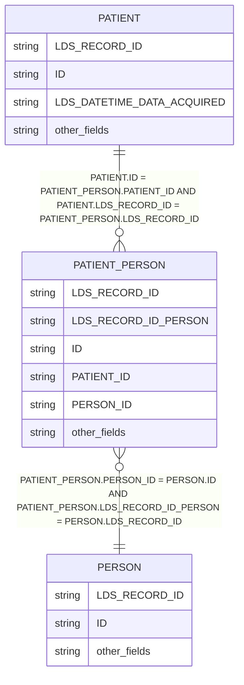
```mermaid
erDiagram
PATIENT ||--o{ PATIENT_PERSON: "PATIENT.ID = PATIENT_PERSON.PATIENT_ID AND PATIENT.LDS_RECORD_ID = PATIENT_PERSON.LDS_RECORD_ID"
PATIENT {
    string LDS_RECORD_ID
    string ID
    string LDS_DATETIME_DATA_ACQUIRED
    string other_fields
}
PATIENT_PERSON {
    string LDS_RECORD_ID
    string LDS_RECORD_ID_PERSON
    string ID
    string PATIENT_ID
    string PERSON_ID
    string other_fields
}
PATIENT_PERSON }o--|| PERSON: "PATIENT_PERSON.PERSON_ID = PERSON.ID AND PATIENT_PERSON.LDS_RECORD_ID_PERSON = PERSON.LDS_RECORD_ID"
PERSON {
    string LDS_RECORD_ID
    string ID
    string other_fields
}
```

The table below shows the key relationships:

| joining tables | joining keys |
| :--- | :--- |
| `PATIENT` to `PATIENT_PERSON` | `PATIENT.ID = PATIENT_PERSON.PATIENT_ID AND PATIENT.LDS_RECORD_ID = PATIENT_PERSON.LDS_RECORD_ID` |
| `PERSON` to `PATIENT_PERSON` | `PERSON.ID = PATIENT_PERSON.PERSON_ID AND PERSON.LDS_RECORD_ID = PATIENT_PERSON.LDS_RECORD_ID_PERSON` |

## 📚 Allocation logic

The logic for allocating `PATIENT` and `PATIENT_PERSON` records is unchanged and equivalent to the logic used for all other OLIDS tables; allocation data links to these tables on `LDS_RECORD_ID` and can be distributed based on the pre-computed allocations.

Typically this will follow a pattern such as the below:

```sql
SELECT * 
FROM PATIENT AS T
WHERE EXISTS
    (
    SELECT 1
    FROM ALLOCATION AS A
    WHERE 
    T.LDS_RECORD_ID = A.LDS_RECORD_ID
    AND A.SUBSCRIBER_CODE = '<SUBSCRIBER_CODE>'
    --optionally
    AND A.LDS_SOURCE_DATASET_OBJECT_ID IN ('<Array of source objects applicable for target table>')
    )
```

The logic for allocating `PERSON` will require a different logic that ensures that each subscriber receives only the subset of `PERSON` record-versions applicable to their set of `PATIENT` records. This can be deduces by joining onto the bridging table `PATIENT_PERSON`.

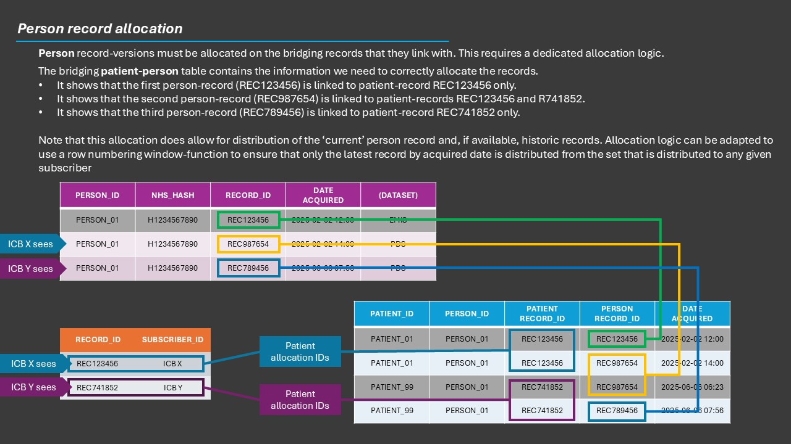]

The Logic will be of the form:

```sql
SELECT * 
FROM PERSON AS P
WHERE EXISTS
    (
    SELECT 1
    FROM PATIENT_PERSON AS B
    WHERE P.ID = B.PERSON_ID
    AND P.LDS_RECORD_ID = B.LDS_RECORD_ID_PERSON
    AND EXISTS
        (
        SELECT 1
        FROM ALLOCATION AS A
        WHERE A.LDS_RECORD_ID = B.LDS_RECORD_ID_PATIENT
        AND A.SUBSCRIBER_CODE = '<SUBSCRIBER_CODE>'
       --optionally
        AND A.LDS_SOURCE_DATASET_OBJECT_ID IN ('<Array of source objects applicable for target table>')
        )
    )
```

Due to the nature of the behaviour of the exists clause, this can be condensed to:

```sql
SELECT * 
FROM PERSON AS P
WHERE EXISTS
    (
    SELECT 1
    FROM PATIENT_PERSON AS B
    INNER JOIN ALLOCATION AS A
        ON B.LDS_RECORD_ID_PATIENT = A.LDS_RECORD_ID
    WHERE
        P.ID = B.PERSON_ID
    AND P.LDS_RECORD_ID = B.LDS_RECORD_ID_PERSON
    AND A.SUBSCRIBER_CODE = '<SUBSCRIBER_CODE>'
    --optionally
    AND A.LDS_SOURCE_DATASET_OBJECT_ID IN ('<Array of source objects applicable for target table>')
    )
```

## 🎞️ Scenarios

This section describes in detail the process to construct `PERSON` entities in a given scenario.

### 1️⃣ scenario 1: simple pathway of a new patient with eventual PDS "matched" response

In this scenario we will be:

- receiving a new patient record from a publisher
- processing that record into the common model
- adding a corresponding stub person record based on the patient details
- adding a corresponding bridging (`PATIENT_PERSON`) record, which points the patient to the stub-person
- receiving a PDS response after some time delay asynchronously
- adding a new record to the `PERSON` table with this PDS response
- adding a new record to the `PATIENT_PERSON` table, pointing the patient record to this new PDS-based entry

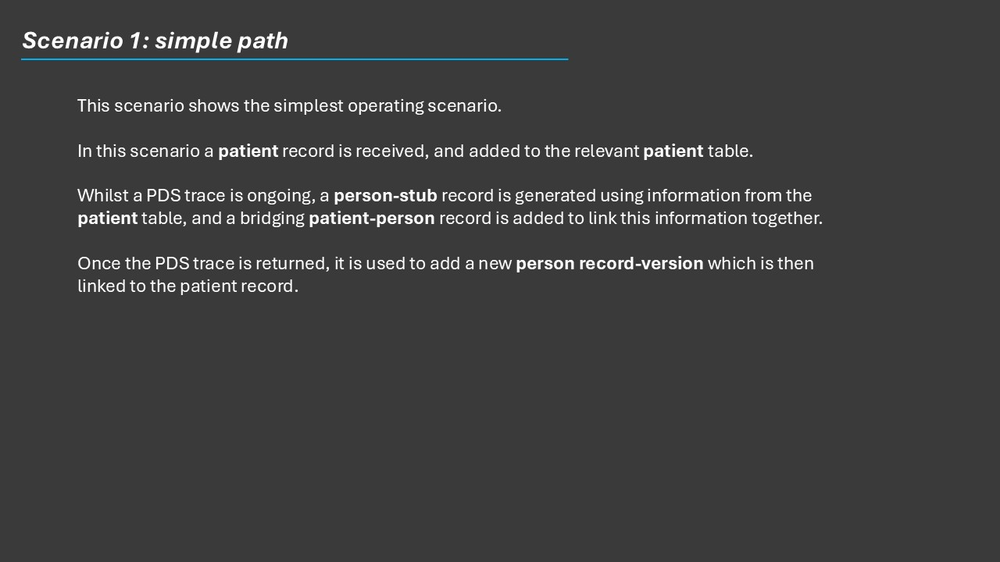

> [!NOTE]
> We will use an EMIS Patient record as our supplied record in this example, but the same logic would apply to any source system record.

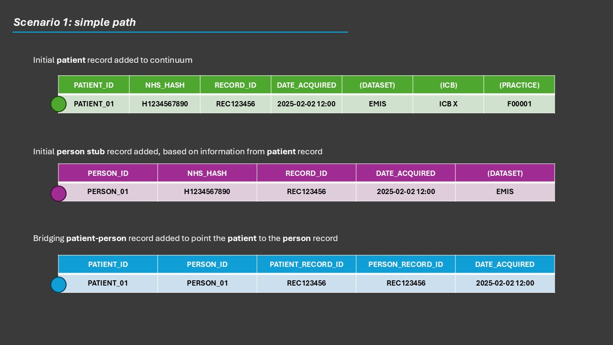

At first we will receive a `PATIENT` record, which we add into the corresponding table. We identify that the hashed NHS number does not match any existing `PERSON` record, we then use the data and attributes attached to this record to construct a "stub" `PERSON` record using the `PATIENT` information. We then add a bridging `PATIENT-PERSON` record that points the `PATIENT` record to the corresponding `PERSON` record.

A PDS trace would have already been requested prior to the processing of this data, but may not have yet been responded to and/or processed by the common modelling service. The next phase of the process would be to process this PDS response (once received) and relate it to the patient. We assume in this scenario that the response is a "MATCH" response that shares the same NHS number as the originally received `PATIENT` record.

The outcome of this initial phase is that the subscriber would have:

- A `patient` record
- A `person` record generated from information present in the `patient` record
- A "bridging" `patient_person` record that links these two entities together


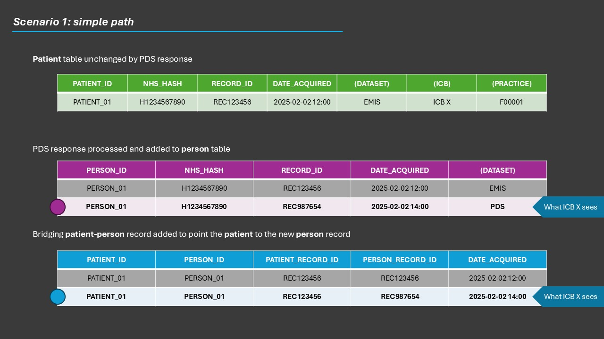

Next we receive the asynchronous Person Demographics Service (PDS) response that confirms the `PERSON` details based on the `PATIENT` information that was used to trace the individual. This information is added to the `PERSON` table, and the associated NHS number in the PDS response is used to return the same corresponding `PERSON_ID` value. Once the person is added, a corresponding bridging `PATIENT-PERSON` record is added that points the pre-existing `PATIENT` record to the new `PERSON` record.

Upon extraction and transmission the older `PATIENT-PERSON` record is overwritten by the newer record with the same `PATIENT_ID` and `PATIENT_RECORD_ID` values. The older `PERSON` record may remain in the historically transmitted data, but will become orphaned. This is intentional to ensure that other recipients with permission to view that historical picture only continue to have access to it.

The outcome of this phase is that the subscriber would have:

- No changes to the `patient` record
- A new `person` record generated from information returned in the PDS response
- A new "bridging" `patient_person` record that links these two entities together, and replaces the old bridging record.

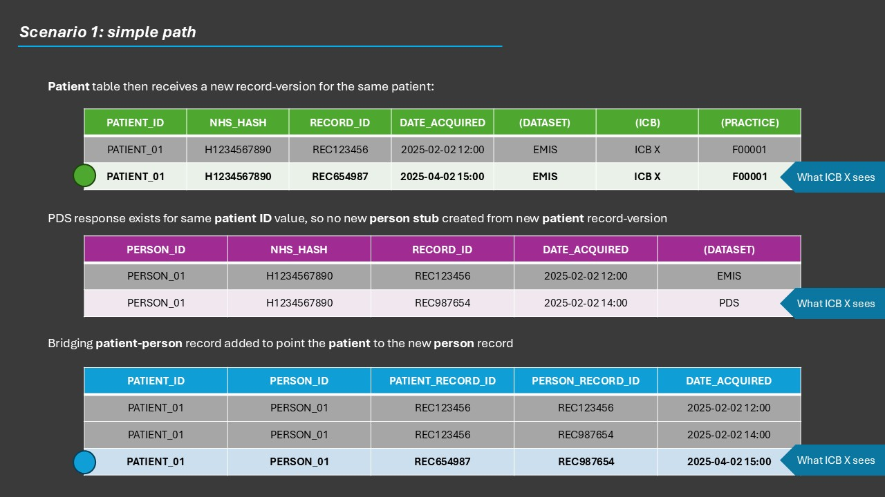

When the `PATIENT` record is next updated, a new record-version of the same `PATIENT` business ID will be added to the patient table. The process will **not** add a new `PERSON` stub-record at that time, as there already exists a PDS response for that same NHS number hash value. A new bridging record in `PATIENT-PERSON` is added to point this new `PATIENT` record-version to the same pre-existing `PERSON` record.

Upon extraction and transmission the older `PATIENT-PERSON` record is overwritten by the newer record with the same `PATIENT_ID` and `PATIENT_RECORD_ID` values.

The outcome of this final phase is that the subscriber would have:

- A new `patient` record-version that replaces the old one.
- No new `person` records
- A new "bridging" `patient_person` record that links the new `patient` record-version to the PDS `person` record, and replaces the old bridging record.

### 2️⃣ scenario 2: patient receives a PDS response with a differing NHS number

In this scenario we will explore the outcome of a scenario in which the PDS response generated from a given `PATIENT` record contains a NHS number value that differs to the original `PATIENT` record. This response indicates that the information held by the data publisher matches to a different NHS number than the one that they have recorded for this patient. This may be due to a simple keystroke error in recording the patient, or some other error in recording the patients details.

The expected outcome of the process will be to surface to the subscriber the initial "stub" `PERSON` record based on the supplied `PATIENT` information initially, before replacing this with a PDS-based `PERSON` record that contains the corresponding PDS match with a differing NHS number. This match will then be retained by any subsequent update to the `PATIENT` record until a subsequent PDS based response is processed and used to generate another `PERSON` record.

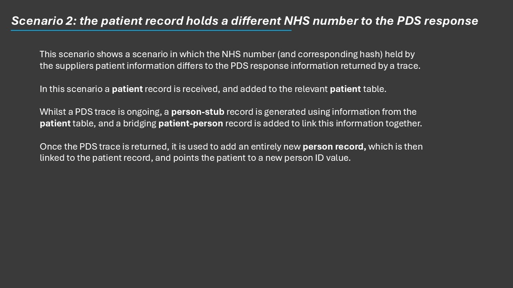

The initial steps are unchanged from Scenario 1:

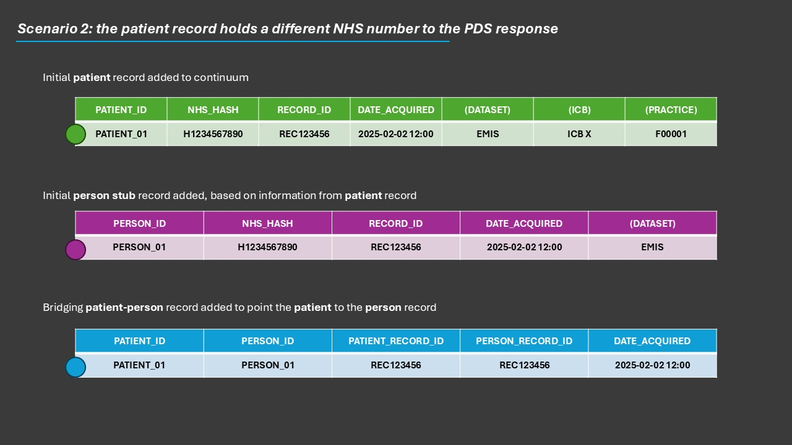

At first we will receive a `PATIENT` record, which we add into the corresponding table. We identify that the hashed NHS number does not match any existing `PERSON` record, we then use the data and attributes attached to this record to construct a "stub" `PERSON` record using the `PATIENT` information. We then add a bridging `PATIENT-PERSON` record that points the `PATIENT` record to the corresponding `PERSON` record.

A PDS trace would have already been requested prior to the processing of this data, but may not have yet been responded to and/or processed by the common modelling service. The next phase of the process would be to process this PDS response (once received) and relate it to the patient. We assume in this scenario that the response is a "MATCH" response that shares the same NHS number as the originally received `PATIENT` record.

The outcome of this initial phase is that the subscriber would have:

- A `patient` record
- A `person` record generated from information present in the `patient` record
- A "bridging" `patient_person` record that links these two entities together

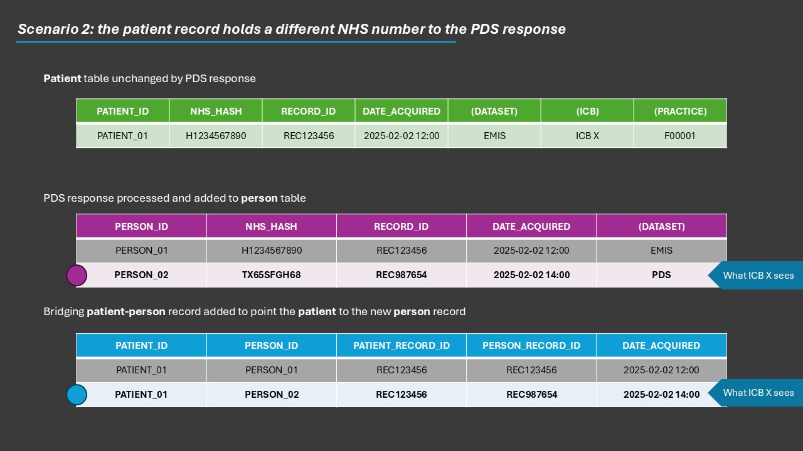

In this scenario the PDS response received will contain a different NHS number - and as a direct result will calculate to a different `PERSON_ID` - this new person should then be linked to the original `PATIENT` record-version, and a new bridging record be created to direct the relationship to the new person.

We use the PDS response to generate the new `PERSON` record with a different `PERSON_ID` value. We then add a new bridging `PATIENT-PERSON` record that points the original `PATIENT_ID` to this new `PERSON_ID`.

Upon extraction and transmission the older `PATIENT-PERSON` record is overwritten by the newer record with the same `PATIENT_ID` and `PATIENT_RECORD_ID` values. The older `PERSON` record may remain in the historically transmitted data, but will become orphaned. This is intentional to ensure that other recipients with permission to view that historical picture only continue to have access to it.

The outcome of this phase is that the subscriber would have:

- No new `patient` records
- A new `person` record generated from information present in the PDS response, that uses a different `PERSON_ID` value
- A "bridging" `patient_person` record that links these two entities together, and replaces the old one.

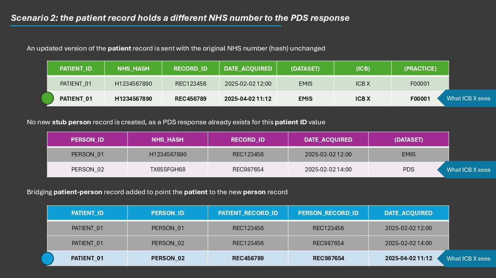

When an update to the patient record is acquired, a new record-version for the `PATIENT` table will be added. However the process will identify that the Business ID for this patient already has an assigned `PERSON_ID` from PDS. As such it will not create a new `PERSON_ID` from stub information present in the patient record.

A new bridging `PATIENT-PERSON` record is added that points the new record-version in `PATIENT` to the PDS response based `PERSON` record received in step 2.

Upon extraction and transmission the older `PATIENT-PERSON` record is overwritten by the newer record with the same `PATIENT_ID` and `PATIENT_RECORD_ID` values. The older `PERSON` record may remain in the historically transmitted data, but will become orphaned. This is intentional to ensure that other recipients with permission to view that historical picture only continue to have access to it.

The outcome of this phase is that the subscriber would have:

- The new `patient` record-version, which replaces the older record-version
- No new `person` records
- A new "bridging" `patient_person` record that links these two entities together, and replaces the old one.

As a result the subscriber accessing the patient record-version will be in receipt of the second of the person record-versions, and the bridging record that pointed this patient to the person record will only point to the second person, having been overwritten in the delta lake.

Scenario 2 is therefore safely covered by the person generation process.

### 3️⃣ scenario 3: PDS response returns a 'NO MATCH' response type

In this scenario we will run through a model in which a patient record is received and upon trace the information within the patient record returns a "No Match" response type from PDS.

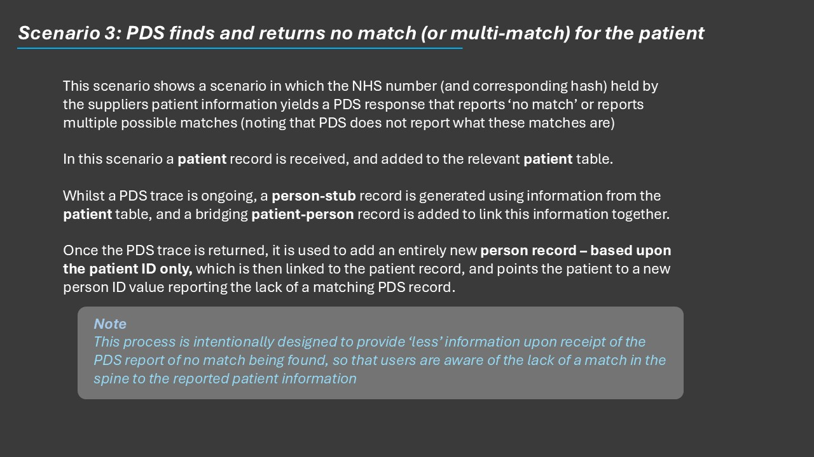

The PDS response codes may be one of the response codes below:

| Response constant | Error or success code | Description |
| :--- | :--- | :--- |
| NOT_ENOUGH_DATA | 96 | There are multiple exact matches.<br> Too little data has been provided to provide a meaningful match, so it's not possible to distinguish between the possible matches. For example, John Smith, male where multiple people have the same date of birth, but no address or NHS number was provided.<br> MPT generates response code 96 when top two records have the same score of 100 percent and either date of birth or postcode is unavailable in the request message. |
| MULTIPLE_CLOSE_MATCHES | 97 | There are multiple matches with very close match scores and no meaningful way to distinguish them apart. |
| NOT_FOUND | 98 | There is no match for the combination of data in the input |

These type of responses indicate that the information contained within the patient record does not allow PDS to identify a matching person within the national spine system. This in turn indicates that there is a likelihood that the NHS number (if valid and complete) within the patient record does not match with the patient information provided.

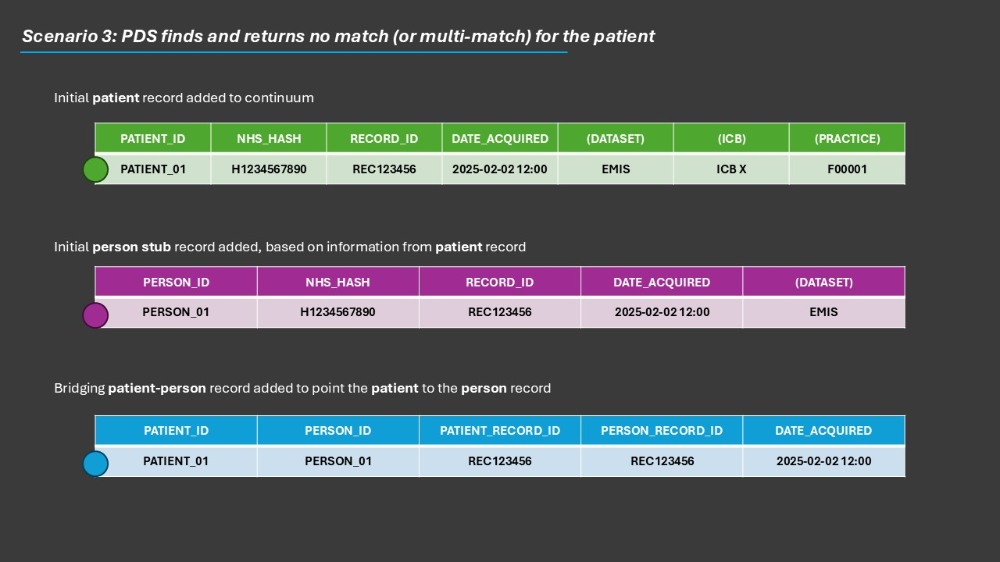

First we begin by receiving a patient record from EMIS. This record will have a Patient identifier, an NHS number hash-digest, and a supplied or acquired datetime for sequencing. As we do not have any person records for this patient at this time, and the PDS response is not yet available, we will then use this patient information to generate a "stub". This will use the NHS-number hash-digest as the Person identifier, and will identify that the source is EMIS. We will then insert a record into the bridge table `PATIENT_PERSON` to show the link between this patient and person

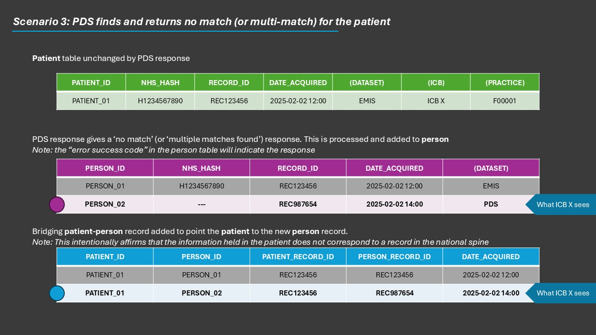

However in this scenario the PDS response received will contain a "No match found" type response - This will be used to generate a new 'unknown' `PERSON_ID` which will be based upon the requesting `PATIENT` records business key value - this new person will then be linked to the original `PATIENT` record-version, and a new bridging record be created to redirect the relationship to the new person.

We process the PDS response containing the matched information pointing to an unknown person. As the "no match" response does not contain any NHS number value (or hash), this generates a new `PERSON_ID` value based on the requesting `PATIENT_ID` value, and attributes in the PERSON record will be empty/null as a result. We add a new `PATIENT_PERSON` bridging record that points the original `PATIENT` record-version to the new `PERSON`. 

Once this step completes we will update our Delta Lake store of information using configured business identifiers to merge in changes:

- No new `PATIENT` record-versions are added during this second stage, and as such no new delta lake changes are made
- A new `PERSON` record is added to the common model, and this is correspondingly appended to the delta lake store of all `PERSON` record-versions.
- A new `PATIENT_PERSON` record-version is added to the common model, and is used to target an overwrite to the delta lake on the `PATIENT_ID` value. The previous `PATIENT_PERSON` record that existed in the delta lake is in effect overwritten by this new record-version and redirects the relationship coming from 

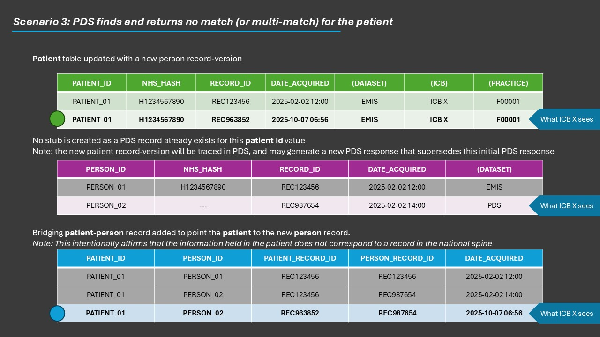

In the event that a new `PATIENT` record-version arrives, it will be added to the patient table, but no new `PERSON` record will be created as a stub. This is because the BusinessID for this patient is already mapped to a person record that is based upon a PDS response. A new bridging record is still created to link this new patient record-version to the previously acquired person record based on the PDS response. A new person record may subsequently be added once the PDS response for this new patient record-version is processed.

The outcome of this phase is that the subscriber would have:

- The new `patient` record-version, which replaces the older record-version
- No new `person` records
- A new "bridging" `patient_person` record that links these two entities together, and replaces the old one.

### 4️⃣ scenario 4: Patient moves practice

In this scenario we will run through a situation in which a patient begins at one practice and subsequently moves to a different practice. We will in this scenario see that the person will appear as two different 'patient' records, each with a distinct `PATIENT_ID`. This is due to the independence of each clinical system. Furthermore, we will see how the solution to generate and track `PERSON` record-versions will ensure that the PDS trace results returned about the person will be tied only to the new patient, and not to the patient that has left the practice.

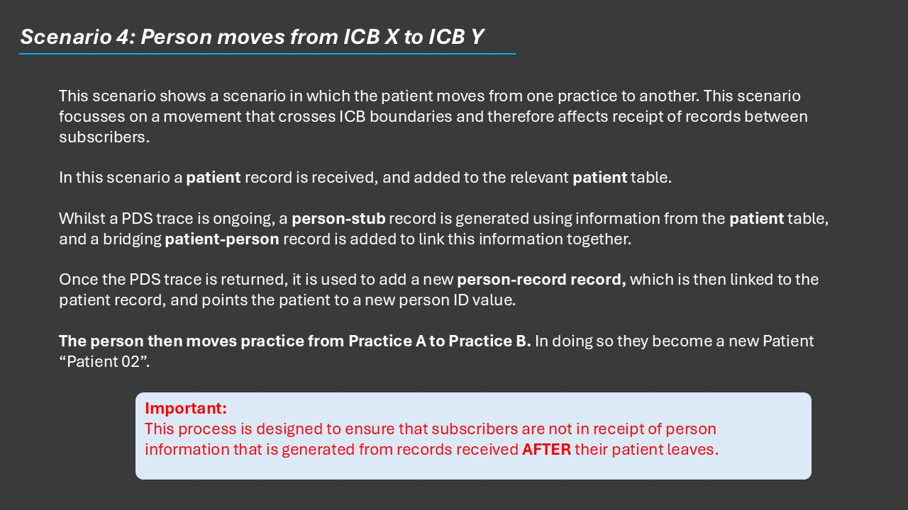

The first phase of this scenario follows the same pattern as before:

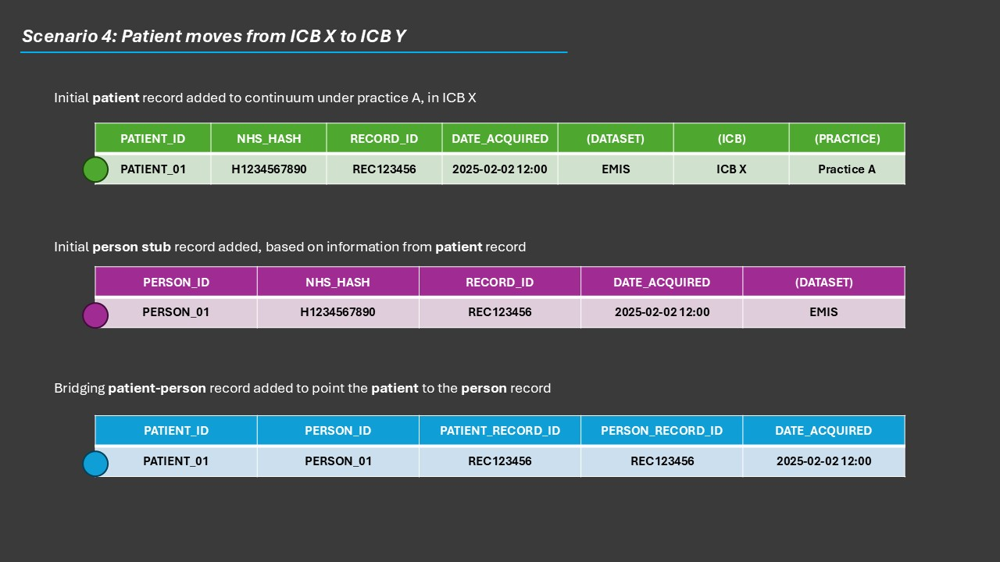

First we begin by receiving a patient record from EMIS. This record will have a Patient identifier, an NHS number hash-digest, and a supplied or acquired datetime for sequencing. As we do not have any person records for this patient at this time, and the PDS response is not yet available, we will then use this patient information to generate a "stub". This will use the NHS-number hash-digest as the Person identifier, and will identify that the source is EMIS. We will then insert a record into the bridge table `PATIENT_PERSON` to show the link between this patient and person.

We also still receive a PDS response containing the matched information. This can either be a "match" or "no match" response.

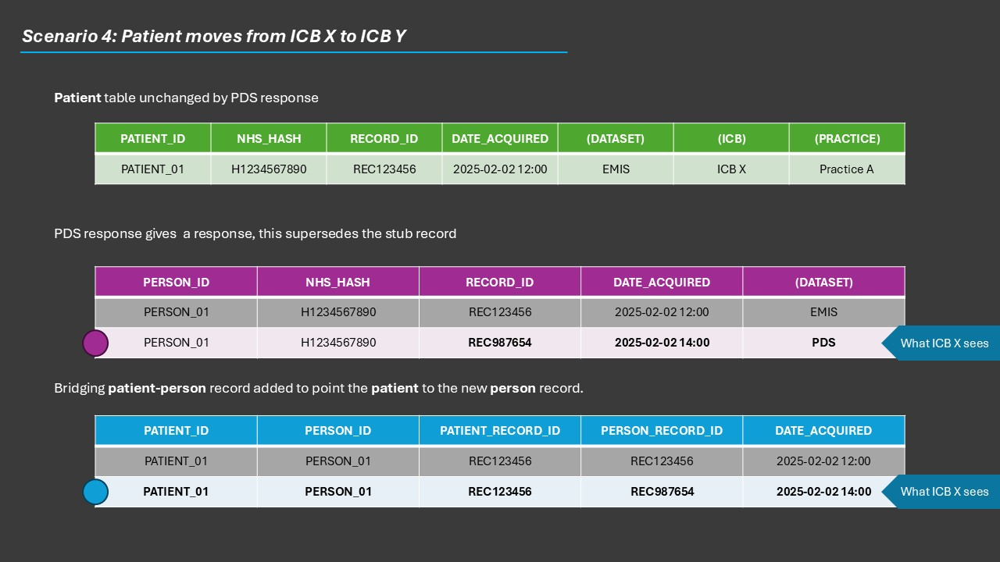

The PDS response is received into the common-modelling service. The data is used to add a new record-version to the `PERSON` table. 

If the response contains the same NHS number hash-digest as the requesting record, this will contain the same `PERSON_ID` as the "stub" record-version created previously. 

The bridging `PATIENT_PERSON` table is then updated with the new PDS response for this first patient. The bridge points the `PATIENT_ID` to the new record-version for `PERSON`.

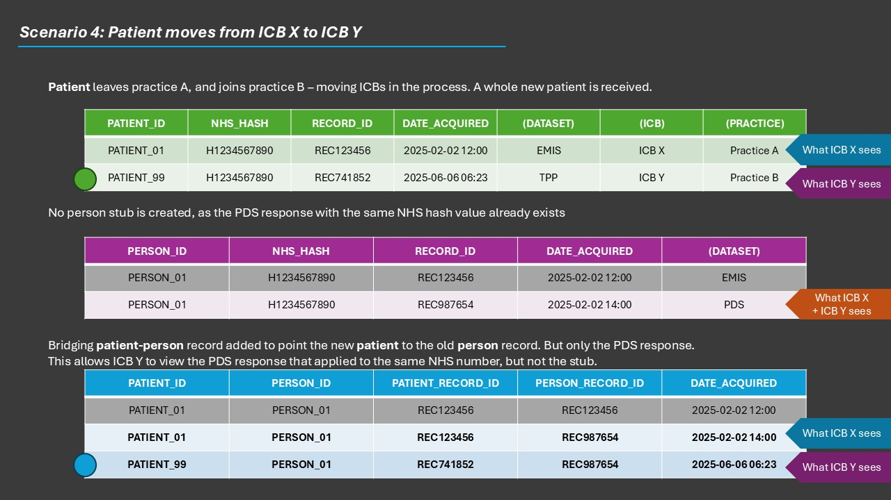

**now the patient moves practice.** The patient moves from Practice A to Practice B. A new patient record is received with a new `PATIENT_ID`, but containing the same NHS number as the previous patient. This record is added to `PATIENT`. 

As the patient shares the same NHS number, no new "stub" `PERSON` is created. Instead the existing `PERSON` record-version is linked to this new `PATIENT` by an additional record in the bridging `PATIENT_PERSON` table.

At this stage a PDS trace is underway but as yet unprocessed. At this point a subscriber in receipt of data from the new practice would be in receipt of:

- the new `PATIENT` record,
- the PDS response `PERSON` record that was generated as a result of the first PDS request
- the bridging `PATIENT_PERSON` record that points the patient record to that person record-version.

A subscriber in receipt of data for the previous practice would be in receipt of the previous `PATIENT` record, the associated PDS response represented as the `PERSON` record, and the corresponding `PATIENT_PERSON` record that points the patient to that persons record-version.

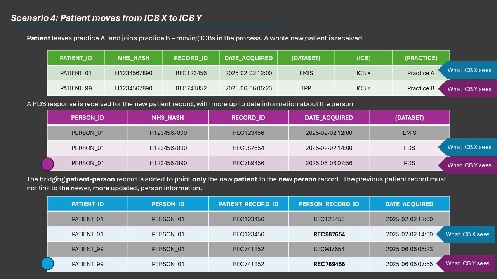

Once the PDS trace for the new Patient record is performed and the information processed through common-model, the following steps will take place:

- The returned PDS information is used to add a new `PERSON` record-version. Assuming this information shares the same NHS number hash-digest, it will be linked on the same `PERSON_ID`, otherwise it will be assigned a new `PERSON_ID`.
- A new bridging record is added to `PATIENT_PERSON` to point the new `PATIENT_ID` to the new `PERSON_ID` record-version. **However, the existing bridging records for the previous `PATIENT_ID` are not similarly altered to point to the new `PERSON_ID` record-version**. As such these records remain linked to the older information about that `PERSON`.

Using the same delta lake importer conditions, the following records will then be present in the OLIDS dataset

- the latest record-version for `PATIENT_ID = PATIENT_01`
- the latest record-version for `PATIENT_ID = PATIENT_02`
- **all** record-versions for `PERSON_ID = PERSON_01`
- the following bridging records
  - `PATIENT_ID = PATIENT_01` pointing to `PERSON_ID = PERSON_01` and `LDS_RECORD_ID_PERSON = REC123456` (bridging record A)
  - `PATIENT_ID = PATIENT_02` pointing to `PERSON_ID = PERSON_01` and `LDS_RECORD_ID_PERSON = REC987654` (bridging record B)

The allocation of `PERSON` records will then be determined by the visibility of the corresponding bridging records, which in turn are allocated by the publisher of the `PATIENT` record. As such:

- subscribers permitted to view `PATIENT_01` will also be permitted to view:
  - the bridging record `PATIENT_ID = PATIENT_01` pointing to `PERSON_ID = PERSON_01` and `LDS_RECORD_ID_PERSON = REC123456` (bridging record A)
  - the person record version `PERSON_ID = PERSON_01` where **`LDS_RECORD_ID_PERSON = REC123456`**
- subscribers permitted to view `PATIENT_02` will also be permitted to view:
  - the bridging record `PATIENT_ID = PATIENT_01` pointing to `PERSON_ID = PERSON_01` and `LDS_RECORD_ID_PERSON = REC987654` (bridging record A)
  - the person record version `PERSON_ID = PERSON_01` where **`LDS_RECORD_ID_PERSON = REC987654`**

This ensures that the subscriber is only sighted on the version of the person record that is appropriate for their access.

> [!NOTE]
> This process is dependent on the extract dates of the records rather than a clinical effective date or registration date. As such it is still possible that a subscriber will be in receipt of an updated PDS record where a historic rebulk is taking place that then creates a scenario in which the extract date of these records has re-triggered a PDS request.

> [!NOTE]
> A fix is being planned to limit PDS trace requests to active patients only. Once implemented, this change would reduce the likelihood of a scenario in which a rebulk would allow a PDS trace of historically deducted patients to become visible to the subscriber of that publishers data.
