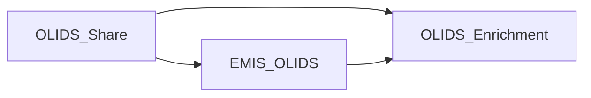

# OLIDS Release Notes

This location provides a single place to review changes across the OLIDS delivery stack.

## Latest releases:

- OLIDS_Share: [v1.1.0](./1_OLIDS_Share/v1.1.0.md)
- EMIS_OLIDS: [v1.1.0](./2_EMIS_OLIDS/v1.1.0.md)
- OLIDS_Enrichment: [v1.1.0](./3_OLIDS_Enrichment/v1.1.0.md)

## Structure

Release notes are grouped by repository as OLIDS is delivered as a linked set of dbt projects with package dependencies:

- **1_OLIDS_Share**: Core engine repository containing shared macros and common components.
- **2_EMIS_OLIDS**: Dataset-specific repository containing logic to ingest, sequence, and model EMIS data into the OLIDS structure.
- **3_OLIDS_Enrichment**: Collation repository where datasets are combined and enriched with:
	- PDS (Personal Demographics Service) responses
	- UPRN (Unique Property Reference Number) matches
	- National Data Opt-Out outcomes

## Release Note Source

Release notes are auto-generated in the delivery repositories and then copied into the relevant sub-folder here.

Where available, entries should include traceability links (for example PRs and work items). Users may not be able to access these links until such time as we are able to make the source repositories public.

## Publishing Cadence

During the current UAT period, releases are expected multiple times per week as fixes are implemented.
